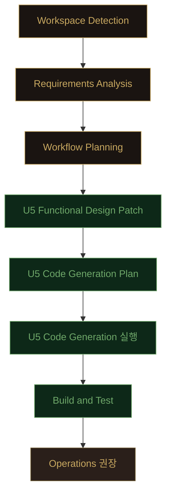

# Iteration 6 Execution Plan — Noir UI 시각 재설계

**Status**: Draft — 사용자 승인 대기
**Date**: 2026-04-29
**Approved Requirements**: `aidlc-docs/inception/requirements/iteration6-requirements.md` (사용자 승인 2026-04-29T07:55Z)

---

## 1. 단계 실행 결정 매트릭스

| Phase / Stage | 실행 | 깊이 | 사유 |
|---|---|---|---|
| 🔵 Workspace Detection | ✅ 완료 | — | Brownfield 식별, Iteration 5 산출물 보존 |
| 🔵 Reverse Engineering | ⏭ SKIP | — | 기존 산출물 활용 (5번 반복으로 코드/도메인 충분히 문서화) |
| 🔵 Requirements Analysis | ✅ 완료 | Standard | 사용자 승인 (FR 8 + NFR 6 + Q&A 4) |
| 🔵 User Stories | ⏭ SKIP | — | 단일 인프라/시각 작업, PUBLIC + PLAYER 페르소나 변동 없음 |
| 🔵 Workflow Planning | 🔄 본 문서 | Standard | 단계 결정 + 산출 |
| 🔵 Application Design | ⏭ SKIP | — | 컴포넌트 추가/제거 없음, 5단위 인터페이스 변경 없음 |
| 🔵 Units Generation | ⏭ SKIP | — | 5단위 구조 유지 (U1~U5), U5 단독 변경 |
| 🟢 U1 Game Core | ⏭ SKIP | — | Go 변경 없음 |
| 🟢 U2 Session/Persistence/Announce | ⏭ SKIP | — | Go 변경 없음 |
| 🟢 U3 Realtime Transport | ⏭ SKIP | — | Go 변경 없음 |
| 🟢 U4 HTTP Bootstrap | ⏭ SKIP | — | embed 디렉터리는 vite build 출력 (Go 코드 변경 없음) |
| 🟢 **U5 Web Frontend** | ✅ 실행 | Standard | 본 Iteration 핵심 |
| 🟢 U5 Functional Design Patch | ✅ 실행 | Minimal | 본 plan 의 §3 으로 갈음 (FR 매핑 명시) |
| 🟢 U5 NFR Requirements | ⏭ SKIP | — | NFR 변동 없음 (NFR-I6-1~6 은 plan 내 NFR 영향 분석으로 갈음) |
| 🟢 U5 NFR Design | ⏭ SKIP | — | 변동 없음 |
| 🟢 U5 Infrastructure Design | ⏭ SKIP | — | 단일 바이너리, 인프라 없음 |
| 🟢 U5 Code Generation | ✅ 실행 | Standard | 본 plan §5 의 단계별 산출 |
| 🟢 Build and Test | ✅ 실행 | Standard | npm test/build + go test/build |
| 🟡 Operations | ⏭ PLACEHOLDER | — | 사용자 트리거 권장 (Chrome DevTools MCP 회귀) |

## 2. 단계 흐름 (Mermaid)



## 3. U5 Functional Design Patch (Iteration 6)

본 §3 으로 별도 functional-design 문서 작성을 갈음한다 (Minimal 깊이). 기능 변경 없음.

### 3.1 신규 파일
| 파일 | 목적 | 예상 크기 |
|---|---|---|
| `web/src/styles/noir.css` | 디자인 토큰 + 유틸리티 클래스 | ~12 KB |
| `web/public/assets/background.webp` | 압축 배경 이미지 | ~150~400 KB |

### 3.2 수정 파일 (시각만 변경, 동작 보존)

**진입/세팅**:
- `web/src/main.tsx`: `import "./styles/noir.css"` 추가
- `web/index.html`: Google Fonts preconnect (선택)
- `web/src/styles/global.css`: 기존 변수 → noir 토큰 매핑

**PublicView 트리 (8 파일)**:
- `PublicView.tsx`, `HostControls.tsx`, `PauseBadge.tsx`, `PhaseHeader.tsx`, `PlayersGrid.tsx`, `SubtitleArea.tsx`, `TimerBar.tsx`, `VoiceToggle.tsx`, `PublicView.module.css`

**PlayerView 트리 (12 파일)**:
- `PlayerView.tsx`, `LobbyView.tsx`, `IntroView.tsx`, `DiscussionView.tsx`, `NightInputs.tsx`, `MafiaPicker.tsx`, `DoctorPicker.tsx`, `PolicePicker.tsx`, `VoteForm.tsx`, `EndScreen.tsx`, `YourInfoCard.tsx`, `PlayerView.module.css`

**Components (4 파일)**:
- `ConnectionBadge.tsx`, `NicknameForm.tsx`, `PlayerPicker.tsx`, `ToastList.tsx`

**총 파일 수**: 신규 2 + 수정 27 = 29 파일

### 3.3 디자인 토큰 정의 (CSS 변수)

핸드오프 `styles.css` §`:root` 그대로 채택. 단 `--bg`, `--fg`, `--accent`, `--card`, `--border`, `--info`, `--emphasis` 등 기존 변수는 호환을 위해 noir 토큰으로 매핑하여 유지.

```css
:root {
  /* Noir base */
  --ink: #0a0807;  --ink-2: #110d0b;  --ink-3: #1a1411;
  --char: #2a1f1a; --leather: #3a2418; --oxblood: #3a0e0e;
  --paper: #e8d9b5; --paper-2: #c9b58a; --paper-dim: #8a7752;
  --gold: #c9a961; --gold-2: #b08e3a; --gold-dim: #6e5a2e;
  --gold-glow: rgba(201, 169, 97, 0.18);
  --red: #c0392b; --red-deep: #8a1c10; --red-glow: rgba(192, 57, 43, 0.22);
  --alive: #6fa86a; --dead: #5a4a44; --warn: #d68a3a;
  --font-display: 'Cinzel', 'Noto Serif KR', serif;
  --font-serif:   'Crimson Text', 'Noto Serif KR', Georgia, serif;
  --font-kr:      'Noto Serif KR', 'Crimson Text', serif;
  --font-mono:    'JetBrains Mono', ui-monospace, monospace;

  /* Legacy alias (Iteration 1~5 호환) */
  --bg: var(--ink);   --fg: var(--paper);
  --fg-muted: var(--paper-dim);
  --info: var(--paper-2);
  --emphasis: var(--gold);
  --accent: var(--gold);
  --card: var(--ink-3);
  --border: var(--gold-dim);
}
```

### 3.4 화면별 시각 전환 매핑

| 화면 (현재) | 핵심 노이르 적용 |
|---|---|
| `PublicView` 호스트 클레임 화면 | `noir-bg crop-table` 배경, `mafia-title sm`, `eyebrow.red`, `center-card` |
| `PublicView` 방 개설 (옵션 입력) | `gold-frame` 패널, `btn-noir.primary` "방 개설", number input 노이르 스타일 |
| `PublicView` 호스트 점유 차단 | `center-card` + `eyebrow.red` |
| `PublicView` LOBBY (게임 진행 중) | HostBadge `♣ HOST CONSOLE` 좌상단, slot 그리드, ROOM ID `mono` 큰 표시 |
| `PublicView` NIGHT/DAY/VOTE | omniscient view, vote-tile 그리드, role 컬러, NIGHT LOG 또는 SUBTITLE |
| `PauseBadge` | yellow → ink 검정 + gold border + paused gold pulse |
| `PhaseHeader` | `mafia-title sm` + `eyebrow` "DAY 02" |
| `PlayersGrid` | vote-tile + avatar + slot-num |
| `TimerBar` | `mono` large + gold accent, danger=red, paused=mute |
| `SubtitleArea` | `serif italic` + severity 색상 (INFO=paper-2, EMPHASIS=gold, WARN=red) |
| `HostControls` | `btn-noir` (sm/primary/ghost), force-end=red |
| `VoiceToggle` | `btn-noir` toggle 스타일 (on=alive, off=ghost) |
| `PlayerView` 닉네임 화면 | `noir-bg dim crop-table`, `mafia-title sm`, `center-card`, NicknameForm noir 입력 + `btn-noir.primary` |
| `PlayerView` 재접속 안내 | `center-card` + `serif italic` |
| `LobbyView` | 호스트 분리 모더레이터 배너 + 5/N 슬롯 그리드 + 모바일 1 컬럼 |
| `IntroView` | 발언자 spotlight `avatar.lg` + `serif italic` 키워드 + `btn-noir` "내 자기소개 종료" |
| `NightInputs/Mafia/Doctor/PolicePicker` | vote-tile 그리드, target border, 마피아 동료 표식 ●, disabled grayscale |
| `DiscussionView` | TimerBar + `serif italic` 안내문 (채팅 미구현이라 chat UI 생략) |
| `VoteForm` | vote-tile + 빨간 vote-bar (디자인의 단순화된 표 시각) |
| `EndScreen` | `mafia-title.stone lg` "MAFIA WINS"/"CITIZENS WIN" + final dossier (마피아 red border) |
| `YourInfoCard` | role-card 5:7 비율 + DiamondSeal + PASSPHRASE keyword `mono gold` |
| `ConnectionBadge` | `tag` 스타일 (gold/red/warn) |
| `NicknameForm` | noir text input + `btn-noir.primary` |
| `PlayerPicker` | vote-tile mini, target border |
| `ToastList` | oxblood/red border + `serif italic` |

### 3.5 가정에 따른 시각만 처리 (실 동작 없음)

- 디자인 mockup 의 채팅 입력창: 시각만 placeholder (`disabled` 입력)
- Host Lobby 의 강퇴 버튼: 시각만 표시 (wire 미지원)
- Host Day 의 +30초/-30초 버튼: 생략 (동선 혼란 방지)
- Host Lobby 의 옵션 패널 ±/토글: 기존 maxPlayers/mafiaCount input 만 노이르 스타일로

## 4. 자산 처리 절차 (Q1=D)

```
Step A. 디자인 핸드오프 background.png (1.9 MB) → /tmp 임시 복사
Step B. macOS sips 또는 cwebp 로 변환:
        sips -s format jpeg -s formatOptions 75 --resampleWidth 1280 \
             input.png --out web/public/assets/background.jpg
        또는
        cwebp -q 75 -resize 1280 0 input.png \
             -o web/public/assets/background.webp
Step C. 결과 크기 검증 (목표 < 500 KB)
Step D. host.png/room.png 는 임베드하지 않음 (CSS 그라디언트로 대체)
```

## 5. U5 Code Generation — 단계별 체크리스트

### Stage A. 토큰 + 자산
- [ ] A1. `web/src/styles/noir.css` 신규 작성 — 토큰 + 유틸 클래스
- [ ] A2. `web/src/styles/global.css` legacy alias 매핑 갱신
- [ ] A3. `web/src/main.tsx` 에 `import "./styles/noir.css"` 추가
- [ ] A4. `background.png` → `background.jpg` (또는 .webp) 압축 후 `web/public/assets/` 배치
- [ ] A5. `web/index.html` Google Fonts preconnect 추가

### Stage B. PublicView 트리
- [ ] B1. `PublicView.tsx` — 호스트 클레임/방 개설/호스트 점유 차단/게임 진행 4 분기 모두 noir 적용
- [ ] B2. `PhaseHeader.tsx` — mafia-title sm + eyebrow
- [ ] B3. `TimerBar.tsx` — mono large + gold accent (paused/danger 분기 보존)
- [ ] B4. `PauseBadge.tsx` — ink + gold border + pulse
- [ ] B5. `SubtitleArea.tsx` — serif italic + severity 컬러
- [ ] B6. `PlayersGrid.tsx` — vote-tile + avatar + 사망 ✕ + LOBBY "대기 중"
- [ ] B7. `HostControls.tsx` — btn-noir 시리즈 + Pause/Resume + force-end red
- [ ] B8. `VoiceToggle.tsx` — toggle btn-noir
- [ ] B9. `PublicView.module.css` — severity 스타일 잔존만 유지

### Stage C. PlayerView 트리
- [ ] C1. `PlayerView.tsx` — 닉네임/재접속/방 개설 대기 분기 noir 적용
- [ ] C2. `YourInfoCard.tsx` — role-card 5:7
- [ ] C3. `LobbyView.tsx` — slot 그리드 + 호스트 분리 (props 로 hostId 받음)
- [ ] C4. `IntroView.tsx` — spotlight + serif italic + btn-noir
- [ ] C5. `NightInputs.tsx` — 사망 안내 + 역할 분기 wrapper
- [ ] C6. `MafiaPicker.tsx` — vote-tile 그리드 + 동료 cohort 분리
- [ ] C7. `DoctorPicker.tsx` — vote-tile 그리드 + self-heal flag
- [ ] C8. `PolicePicker.tsx` — vote-tile 그리드 + 조사 history 누적 표
- [ ] C9. `DiscussionView.tsx` — TimerBar + serif italic
- [ ] C10. `VoteForm.tsx` — vote-tile + 기권 버튼
- [ ] C11. `EndScreen.tsx` — mafia-title.stone WIN + dossier
- [ ] C12. `PlayerView.module.css` — alive/dead utility 유지

### Stage D. Components
- [ ] D1. `ConnectionBadge.tsx` — tag 스타일
- [ ] D2. `NicknameForm.tsx` — noir input + btn-noir.primary (테스트 호환 유지)
- [ ] D3. `PlayerPicker.tsx` — vote-tile mini
- [ ] D4. `ToastList.tsx` — oxblood/red border + serif italic

### Stage E. 검증
- [ ] E1. `npm run typecheck` (tsc --noEmit) PASS
- [ ] E2. `npm test` 45 PASS
- [ ] E3. `npm run build` 성공, gzip JS < 80 KB
- [ ] E4. `go build -o /tmp/mafia-game-iter6 ./cmd/mafia-game` 성공
- [ ] E5. `go test ./... -count=1` 6 패키지 PASS
- [ ] E6. `aidlc-docs/construction/build-and-test/iteration6-test-results.md` 작성

## 6. NFR 영향 분석

| NFR | 영향 | 검증 |
|---|---|---|
| NFR-I6-1 빌드 사이즈 | JS gzip +5~8 KB (noir.css), 자산 +200~400 KB | `npm run build` 출력 확인 |
| NFR-I6-2 테스트 호환 | reducer 테스트는 wire 만 테스트 → 영향 없음. NicknameForm 테스트는 텍스트/role 만 단언 → 영향 없음 | `npm test` 45 PASS |
| NFR-I6-3 백엔드 영향 없음 | Go 코드/테스트 건드리지 않음 | `go test ./... -count=1` |
| NFR-I6-4 폰트 fallback | `serif`/`monospace`/`sans-serif` chain 보장 | 시각 회귀로 확인 |
| NFR-I6-5 접근성 | paper(#e8d9b5) on ink(#0a0807) ≈ 13.5:1 (WCAG AAA) | 자동 검사 N/A, 수동 |
| NFR-I6-6 데스크탑 + 모바일 | PublicView 1280px / PlayerView 32rem max + flex-wrap | DevTools resize 회귀 |

## 7. 회귀 영향 분석

- **WebSocket 프로토콜**: 변경 없음
- **상태 reducer**: 변경 없음
- **TTS 큐**: 변경 없음
- **Token 저장**: 변경 없음
- **백엔드 6 패키지**: 변경 없음
- **테스트 45건**: reducer/useToken/useTTSQueue/NicknameForm 모두 비주얼 비의존

## 8. 위험 (Risks)

| 위험 | 영향 | 완화 |
|---|---|---|
| Google Fonts 차단 환경 | 폰트 fallback 시각 다름 | font-family chain 마지막에 시스템 폰트 명시 |
| 압축 후 자산 화질 저하 | 노이르 분위기 약화 | sips q=75 로 시작 → 필요 시 q=85 재변환 |
| 기존 페이지 인라인 스타일 잔존 | 시각 일관성 깨짐 | 모든 view 의 인라인 스타일 검수 후 클래스로 교체 |
| PublicView LOBBY 가 PUBLIC 인 경우 host 토큰 없는 관전자 | HostBadge 가 잘못 표시되면 안 됨 | `ctx.isHost` 분기로만 표시 |

## 9. 다음 단계

1. **본 plan 사용자 승인 게이트** ← 현재
2. (승인 후) Code Generation Plan 별도 작성 없이 본 §5 의 체크리스트로 직접 실행
3. Stage A → B → C → D → E 순차 진행
4. Build and Test 사용자 승인 게이트
