# Iteration 7 — Execution Plan (호스트 첫 페이지 / Host Main Menu)

- **버전**: v1.0
- **작성일**: 2026-04-29
- **유형**: Brownfield Patch
- **추적 입력**: `inception/requirements/iteration7-requirements.md` v1.0 (사용자 승인 2026-04-29)

## 1. 변환 범위 (Transformation Scope)

- **유형**: 단일 컴포넌트 위주 변경 (UI 진입점 분리) + 보조 wire 메시지 1건 추가
- **주요 변경**: 호스트 진입 화면을 단일 폼에서 메인 메뉴 + 별도 설정 라우트로 분리. 클라이언트 localStorage 영속화. 신규 wire `host:save-options`(incoming)로 서버 호스트 옵션 사전 저장.
- **연관 컴포넌트**: U5(Web Frontend) 큼 / U2(Session/Persistence/Announce) 보통 / U3(Realtime Transport) 보통 / U1, U4 영향 미미 또는 없음.

## 2. 영향 분석 (Change Impact Assessment)

| 영역 | 영향 | 설명 |
|---|---|---|
| User-facing | Yes | 호스트 첫 화면이 메뉴 → (게임 시작 / 설정) 분리. 설정 화면에 9개 필드 노출. |
| Structural | Yes (소) | React Router 라우트 1개 추가 (`/public/settings`). |
| Data Model | No | `Options` 타입은 불변. localStorage 직렬화 키 신설(`mafia.options.v1`). |
| API / Wire | Yes | incoming wire 1건 추가 (`host:save-options`). 기존 `host:open-room` 페이로드는 그대로 유지. |
| NFR | Soft | 기존 noir.css 토큰 재사용, 빌드 사이즈 ≈ +1~2 KB gzip 예상 (라우트 1개 + 폼 1개). |

## 3. 컴포넌트 관계 (Component Relationships)

- **Primary Component**: U5 — 메인 메뉴(`HostHomeView`) + 설정(`HostSettingsView`) + `localStorage` 모듈
- **Direct Dependents**:
  - U3 — 새 wire `host:save-options`의 deserialize/dispatch 추가
  - U2 — 호스트 옵션 보관소(인메모리) + dispatch handler 추가; 호스트 토큰 검증 재사용
- **Supporting Components**:
  - U1 — 변경 없음 (Options validation은 host:open-room 경로에서 그대로 유효)
  - U4 — 변경 없음 (정적 자산 자동 갱신)

## 4. 단계 결정 (Phase Determination)

### 🔵 INCEPTION

| Stage | Decision | Rationale |
|---|---|---|
| Workspace Detection | ✅ COMPLETED | Brownfield 재개. |
| Reverse Engineering | ⏭ SKIP | 기존 산출물(Iteration 1~6) 활용. |
| Requirements Analysis | ✅ COMPLETED | v1.0 사용자 승인. |
| User Stories | ⏭ SKIP | 단일 호스트 페르소나, 작은 UX 분리. |
| **Workflow Planning** | 🟧 EXECUTE (현재) | 본 문서. |
| Application Design | ⏭ SKIP | 신규 컴포넌트는 U5 Tier 내부(View 추가)이며 도메인/서비스 인터페이스 신규 없음. wire 1건 추가는 U3 functional design patch에서 다룸. |
| Units Generation | ⏭ SKIP | 5단위 구조 유지. |

### 🟢 CONSTRUCTION (Per-Unit Loop)

진행 순서: **U2 → U3 → U5** (U2의 옵션 보관소가 U3 dispatch의 의존성. U5는 wire 협의 후 작업해야 안전.) U1, U4는 SKIP.

#### U1 Game Core
| Stage | Decision | Rationale |
|---|---|---|
| 모든 단계 | ⏭ SKIP | Options 타입 변경 없음, 도메인 핸들러 변경 없음. |

#### U2 Session/Persistence/Announce
| Stage | Decision | Rationale |
|---|---|---|
| Functional Design (Patch) | 🟧 EXECUTE | 호스트 옵션 보관소(`HostOptionsStore`) + dispatch entry. |
| NFR Requirements | ⏭ SKIP | 기존 보안/안정성 정책 동일. |
| NFR Design | ⏭ SKIP | 동일. |
| Infrastructure Design | ⏭ SKIP | 인프라 변경 없음. |
| Code Generation | 🟧 EXECUTE | 인메모리 store + handler 단위 테스트 추가. |

#### U3 Realtime Transport
| Stage | Decision | Rationale |
|---|---|---|
| Functional Design (Patch) | 🟧 EXECUTE | wire 신규 `host:save-options` 정의 + protocol/dispatch 변경. |
| NFR Requirements | ⏭ SKIP | 변경 없음. |
| NFR Design | ⏭ SKIP | 동일. |
| Infrastructure Design | ⏭ SKIP | 동일. |
| Code Generation | 🟧 EXECUTE | `protocol.go` deserialize, `dispatch.go` 핸들러, 통합 테스트 추가. |

#### U4 HTTP Bootstrap
| Stage | Decision | Rationale |
|---|---|---|
| 모든 단계 | ⏭ SKIP | 라우트/정적 자산 변경 없음(빌드 산출만 갱신). |

#### U5 Web Frontend
| Stage | Decision | Rationale |
|---|---|---|
| Functional Design (Patch) | 🟧 EXECUTE | 신규 라우트/뷰 2개 + GameContext 옵션 캐시 + localStorage 모듈 + 기존 PublicView 진입 분기 변경. |
| NFR Requirements | ⏭ SKIP | 기존 NFR 문서 적용. |
| NFR Design | ⏭ SKIP | 동일. |
| Infrastructure Design | ⏭ SKIP | 동일. |
| Code Generation | 🟧 EXECUTE | 신규 파일 + 변경 파일 + vitest 케이스 추가. |

#### 공통
| Stage | Decision | Rationale |
|---|---|---|
| Build and Test | 🟧 EXECUTE | `go test ./...` + `go build` + `npm test` + `npm run build` 회귀 + iteration7-test-results.md. |

### 🟡 OPERATIONS

| Stage | Decision | Rationale |
|---|---|---|
| Operations | ⏳ PLACEHOLDER | 운영 단계는 본 이터레이션 범위 외. 사용자가 트리거하는 Chrome DevTools MCP 다중 컨텍스트 회귀를 권장. |

## 5. 패키지 변경 시퀀스 (Package Update Sequence)

1. **U2 Session** — `HostOptionsStore` (인메모리) + dispatch entry 정의
2. **U3 Realtime Transport** — wire `host:save-options` 추가, U2 dispatch entry 호출
3. **U5 Web Frontend** — `localStorage` 모듈 + Context 옵션 캐시 + 메인/설정 뷰 + 라우트 / 송신 흐름 + `PublicView` 진입 분기 변경
4. **공통 Build and Test**

## 6. 워크플로우 시각화

```mermaid
flowchart TD
    Start(["사용자 요청"])

    subgraph INCEPTION["🔵 INCEPTION"]
        WD["Workspace Detection<br/><b>COMPLETED</b>"]
        RE["Reverse Engineering<br/><b>SKIP</b>"]
        RA["Requirements Analysis<br/><b>COMPLETED</b>"]
        US["User Stories<br/><b>SKIP</b>"]
        WP["Workflow Planning<br/><b>EXECUTE</b>"]
        AD["Application Design<br/><b>SKIP</b>"]
        UG["Units Generation<br/><b>SKIP</b>"]
    end

    subgraph CONSTRUCTION["🟢 CONSTRUCTION"]
        U2FD["U2 Functional Design<br/><b>EXECUTE</b>"]
        U2CG["U2 Code Generation<br/><b>EXECUTE</b>"]
        U3FD["U3 Functional Design<br/><b>EXECUTE</b>"]
        U3CG["U3 Code Generation<br/><b>EXECUTE</b>"]
        U5FD["U5 Functional Design<br/><b>EXECUTE</b>"]
        U5CG["U5 Code Generation<br/><b>EXECUTE</b>"]
        BT["Build and Test<br/><b>EXECUTE</b>"]
    end

    subgraph OPERATIONS["🟡 OPERATIONS"]
        OPS["Operations<br/><b>PLACEHOLDER</b>"]
    end

    Start --> WD --> RE --> RA --> US --> WP --> AD --> UG
    UG --> U2FD --> U2CG --> U3FD --> U3CG --> U5FD --> U5CG --> BT
    BT --> End(["완료"])

    style WD fill:#4CAF50,stroke:#1B5E20,stroke-width:3px,color:#fff
    style RA fill:#4CAF50,stroke:#1B5E20,stroke-width:3px,color:#fff
    style WP fill:#FFA726,stroke:#E65100,stroke-width:3px,stroke-dasharray: 5 5,color:#000
    style U2FD fill:#FFA726,stroke:#E65100,stroke-width:3px,stroke-dasharray: 5 5,color:#000
    style U2CG fill:#FFA726,stroke:#E65100,stroke-width:3px,stroke-dasharray: 5 5,color:#000
    style U3FD fill:#FFA726,stroke:#E65100,stroke-width:3px,stroke-dasharray: 5 5,color:#000
    style U3CG fill:#FFA726,stroke:#E65100,stroke-width:3px,stroke-dasharray: 5 5,color:#000
    style U5FD fill:#FFA726,stroke:#E65100,stroke-width:3px,stroke-dasharray: 5 5,color:#000
    style U5CG fill:#FFA726,stroke:#E65100,stroke-width:3px,stroke-dasharray: 5 5,color:#000
    style BT fill:#4CAF50,stroke:#1B5E20,stroke-width:3px,color:#fff
    style RE fill:#BDBDBD,stroke:#424242,stroke-width:2px,stroke-dasharray: 5 5,color:#000
    style US fill:#BDBDBD,stroke:#424242,stroke-width:2px,stroke-dasharray: 5 5,color:#000
    style AD fill:#BDBDBD,stroke:#424242,stroke-width:2px,stroke-dasharray: 5 5,color:#000
    style UG fill:#BDBDBD,stroke:#424242,stroke-width:2px,stroke-dasharray: 5 5,color:#000
    style OPS fill:#FFF59D,stroke:#F57F17,stroke-width:2px,color:#000
    style Start fill:#CE93D8,stroke:#6A1B9A,stroke-width:3px,color:#000
    style End fill:#CE93D8,stroke:#6A1B9A,stroke-width:3px,color:#000
    linkStyle default stroke:#333,stroke-width:2px
```

## 7. 위험 평가 (Risk Assessment)

- **Risk Level**: Low
- **Rollback Complexity**: Easy — UI 변경 위주. wire 추가는 단순 추가형.
- **Testing Complexity**: Simple — 기존 회귀 + 신규 vitest/Go 단위 테스트.

### 위험 항목
- **R-1 wire 호환성**: 기존 클라이언트는 신규 wire를 보내지 않으므로 서버는 알 수 없는 message 안전 무시 또는 명시적 거부 필요. (functional design 단계에서 protocol 가드 결정)
- **R-2 localStorage 비활성/만료**: 안전하게 기본값으로 페일백. NFR-3에 명시.
- **R-3 권장 가이드 표시 일관성**: Iteration 6 노이르 톤 유지를 위해 `noir-input`/`btn-noir.primary` 재사용.

## 8. 산출물 및 품질 게이트

- 신규 산출물:
  - `aidlc-docs/construction/u2-session-persistence-announce/functional-design/iteration7-patch.md`
  - `aidlc-docs/construction/u3-realtime-transport/functional-design/iteration7-patch.md`
  - `aidlc-docs/construction/u5-web-frontend/functional-design/iteration7-patch.md`
  - `aidlc-docs/construction/build-and-test/iteration7-test-results.md`
- 코드:
  - U2: 신규 `host_options_store.go` (또는 적합 위치) + 핸들러 변경 + `iteration7_test.go`
  - U3: `protocol.go`/`dispatch.go` 변경 + `iteration7_test.go`
  - U5: 신규 `views/PublicView/HostHome.tsx`, `views/PublicView/HostSettings.tsx`, `lib/optionsStorage.ts`(또는 동등 위치), `App.tsx` 라우트 추가, `PublicView.tsx` 진입 분기 정리, `context/GameContext.tsx` 옵션 캐시 노출 보강, vitest 추가.
- 품질 게이트:
  - `go test ./... -count=1` PASS
  - `go build` PASS
  - `npm test` PASS (신규 케이스 포함)
  - `npm run build` PASS

## 9. 성공 기준 (Success Criteria)

- Requirements §5 AC-1 ~ AC-8 모두 만족.
- 회귀: 기존 vitest 45 PASS / Go 6 패키지 PASS 유지.
- 빌드 사이즈 회귀 ≤ +3 KB gzip.

## 10. 사용자 승인 (Approval Gate)

본 실행 계획을 검토하시고 다음 중 하나로 응답해 주십시오.

- **승인** — Construction 단계로 진행 (시퀀스: U2 → U3 → U5 → Build/Test)
- **수정** — 추가/제외할 단계 또는 시퀀스 변경 사항을 알려주시면 v1.1로 갱신
