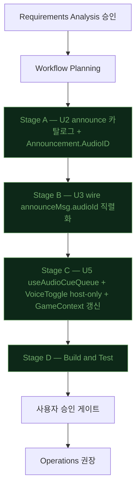

# Iteration 7 Execution Plan — Voice 개편 (사전 녹음 MP3 + 호스트 한정)

**Status**: Draft — 사용자 승인 대기
**Date**: 2026-04-29
**Approved Requirements**:
- `aidlc-docs/inception/requirements/iteration7-requirements-patch.md` v7.0-patch (사용자 승인 2026-04-29T18:25Z)
- `aidlc-docs/inception/requirements/iteration7-voice-script.md` v1.0 (사용자 승인 2026-04-29T18:25Z)

---

## 1. 단계 실행 결정 매트릭스

| Phase / Stage | 실행 | 깊이 | 사유 |
|---|---|---|---|
| 🔵 Workspace Detection | ✅ 완료 | — | Brownfield, Iteration 1~6 산출물 보존 |
| 🔵 Reverse Engineering | ⏭ SKIP | — | 6회 반복으로 도메인/코드 충분 문서화 |
| 🔵 Requirements Analysis | ✅ 완료 | Standard | 사용자 승인 (FR-8 v7.0-patch + Voice Script v1.0) |
| 🔵 User Stories | ⏭ SKIP | — | 단일 인프라 변경(엔진 교체), 페르소나/시나리오 변동 없음 |
| 🔵 Workflow Planning | 🔄 본 문서 | Standard | 단계 결정 + 산출 |
| 🔵 Application Design | ⏭ SKIP | — | 컴포넌트 추가/제거 없음, U2 `Announcement` 구조 1 필드 추가/1 필드 폐기 |
| 🔵 Units Generation | ⏭ SKIP | — | 5단위 구조 유지 |
| 🟢 U1 Game Core | ⏭ SKIP | — | 도메인 이벤트 변경 없음 |
| 🟢 **U2 Session/Persistence/Announce** | ✅ 실행 | Standard | `Announcement.AudioID` + 카탈로그 audioId 발급 + Eliminated 분기 + Speech 폐기 |
| 🟢 U2 Functional Design Patch | ✅ 실행 | Minimal | 본 plan §3.1 으로 갈음 |
| 🟢 U2 NFR Requirements / Design / Infrastructure | ⏭ SKIP | — | 변동 없음 |
| 🟢 **U3 Realtime Transport** | ✅ 실행 | Standard | `announceMsg.audioId` 직렬화 + `Speech` 필드 제거 + 테스트 |
| 🟢 U3 Functional Design Patch | ✅ 실행 | Minimal | 본 plan §3.2 으로 갈음 |
| 🟢 U3 NFR Requirements / Design / Infrastructure | ⏭ SKIP | — | 변동 없음 |
| 🟢 U4 HTTP Bootstrap | ⏭ SKIP | — | 정적 자산은 vite build 산출물 → embed FS 가 자동 서빙 (검증만 §6) |
| 🟢 **U5 Web Frontend** | ✅ 실행 | Standard | `useTTSQueue` 폐기 → `useAudioCueQueue` 도입, VoiceToggle host-only, IntroView TTS 의존 제거, GameContext/wire/reducer 갱신 |
| 🟢 U5 Functional Design Patch | ✅ 실행 | Minimal | 본 plan §3.3 으로 갈음 |
| 🟢 U5 NFR Requirements / Design / Infrastructure | ⏭ SKIP | — | 변동 없음 |
| 🟢 Build and Test | ✅ 실행 | Standard | go test/build + npm test/build + Chrome DevTools MCP(사용자 트리거) |
| 🟡 Operations | ⏭ PLACEHOLDER | — | 호스트 vs 관전자 분리 검증 권장 |

## 2. 단계 흐름 (Mermaid)



---

## 3. Functional Design Patches (per-unit)

본 §3 으로 별도 functional-design 문서 작성을 갈음한다 (Minimal 깊이).

### 3.1 U2 Functional Design Patch

#### 3.1.1 `Announcement` 구조 변경 (`internal/announce/catalog.go`)

```go
// Before (v1.1)
type Announcement struct {
    Subtitle      string
    Speech        string   // 폐기
    Severity      Severity
    ForPublicOnly bool
}

// After (v7.0-patch)
type Announcement struct {
    Subtitle      string   // 변수 보간 그대로 유지
    AudioID       string   // 신규 — 비어 있으면 음성 미재생
    Severity      Severity
    ForPublicOnly bool
}
```

- `Speech` 필드 완전 폐기 (Q6=A 정합).
- `AudioID` 가 빈 문자열이면 클라이언트 graceful skip.
- `IsEmpty()` 정의 변경 없음 (`Subtitle == ""` 기준 유지).

#### 3.1.2 카탈로그 audioId 매핑 (`internal/announce/catalog_default.go`)

`Render` 함수가 각 이벤트 → 27 audioId 중 하나 부여. `iteration7-voice-script.md` §3 표 그대로 적용.

| Event | audioId | 비고 |
|---|---|---|
| GameStarted | `game.started` | |
| PhaseChanged → Intro | `phase.intro` | 자막 = 변수 보간 / 음성 = 정형 |
| PhaseChanged → Night | `phase.night` | |
| PhaseChanged → Day (day=1) | `phase.day.first` | |
| PhaseChanged → Day (day≥2) | `phase.day` | |
| PhaseChanged → Vote | `phase.vote` | |
| PhaseChanged → Recount | `phase.recount` | |
| NightStepChanged → Mafia | `night.mafia` | |
| NightStepChanged → Police | `night.police` | |
| NightStepChanged → Doctor | `night.doctor` | |
| IntroSpeakerChanged | `intro.speaker` | |
| DeathAnnounced | `death.announced` | |
| PeacefulNight | `peaceful.night` | |
| Eliminated (Role==Mafia) | `eliminated.mafia` | 분기 |
| Eliminated (Role≠Mafia) | `eliminated.notmafia` | 분기 — 시민/의사/경찰 통합 |
| DiscussionTimerTick (30) | `timer.30` | |
| DiscussionTimerTick (10) | `timer.10` | |
| DiscussionTimerTick (0) | `timer.0` | |
| VoteTallied (Recount) | `vote.recount` | |
| VoteTallied (NoElim) | `vote.noelim` | |
| VoteTallied (Eliminated≠nil) | (빈 문자열 — Eliminated 이벤트가 발화) | 무성 |
| GameEnded → MafiaWin | `end.mafia` | |
| GameEnded → CitizenWin | `end.citizen` | |
| GameEnded → ForceEnd | `end.force` | |
| VoiceToggled (On) | `voice.on` | |
| VoiceToggled (Off) | `voice.off` | |
| GamePaused | `game.paused` | |
| GameResumed | `game.resumed` | |
| SystemRestore | `system.restore` | (선택 녹음) |
| SystemPersistFailure | `system.persist.failure` | (선택 녹음) |

#### 3.1.3 정형화 멘트 적용 (`internal/announce/catalog_data.go`)

- 변수 멘트 5건은 음성 사용 시 정형 멘트가 별도 mp3 로 외부 녹음됨 — Go 코드는 자막용 변수 보간만 그대로 유지하고 audioId 만 카탈로그에 등록.
- `Eliminated` 멘트 자막은 v1.1 형식 유지 (`%s이(가) 마을의 결정으로 처형되었습니다. 그의 정체는 %s이었습니다.`). audioId 만 역할에 따라 분기.

#### 3.1.4 영향받는 테스트
- `internal/announce/catalog_test.go` — 기존 `Speech` 비교 어서션을 `AudioID` 어서션으로 교체. 27 시점 audioId 발급 검증 추가. Eliminated 2 분기 검증.
- `internal/session/snapshot_test.go` 외 — `Announcement` 구조 사용처 컴파일 영향 점검.

#### 3.1.5 DoD (U2)
- [ ] `Announcement.Speech` 모든 사용처 제거, `Announcement.AudioID` 도입
- [ ] 27 audioId 모두 카탈로그에 매핑
- [ ] Eliminated 2 분기 (Role 비교)
- [ ] `go test ./internal/announce/... -count=1` PASS
- [ ] `go test ./internal/session/... -count=1` PASS
- [ ] 패키지 커버리지 ≥ 85% (현 announce 94.0% / session 86.1% 이상 유지)

---

### 3.2 U3 Functional Design Patch

#### 3.2.1 `announceMsg` 구조 변경 (`internal/transport/ws/protocol.go`)

```go
// Before
type announceMsg struct {
    Type     string `json:"type"`
    Subtitle string `json:"subtitle"`
    Speech   string `json:"speech"`     // 폐기
    Severity string `json:"severity"`
}

// After
type announceMsg struct {
    Type     string `json:"type"`
    Subtitle string `json:"subtitle"`
    AudioID  string `json:"audioId,omitempty"` // 신규 — 빈 값이면 omitempty
    Severity string `json:"severity"`
}
```

- `Speech` 필드 wire 직렬화에서 제거 — JSON 키 `speech` 도 사라짐.
- `AudioID` 가 빈 값일 때 `omitempty` 로 페이로드 절약.

#### 3.2.2 dispatch 변경 (`internal/transport/ws/dispatch.go`)
- `Announcement` 의 `Speech` 참조를 `AudioID` 로 교체.
- `eventPayload.Name` (Iteration 4) 처리 등 다른 직렬화 로직은 영향 없음.

#### 3.2.3 영향받는 테스트
- `internal/transport/ws/protocol_test.go`, `handlers_test.go`, `iteration5_test.go` 등 `Speech` 어서션을 `AudioID` 어서션으로 교체.

#### 3.2.4 DoD (U3)
- [ ] `announceMsg.Speech` 모든 사용처 제거, `announceMsg.AudioID` 도입
- [ ] 모든 announce 직렬화 테스트 갱신·PASS
- [ ] `go test ./internal/transport/ws/... -count=1` PASS
- [ ] 커버리지 ≥ 80% (현 82.4% 이상 유지 목표)

---

### 3.3 U5 Functional Design Patch

#### 3.3.1 신규 훅 `useAudioCueQueue`

신규 파일: `web/src/hooks/useAudioCueQueue.ts` (~120 LoC).

```ts
// 의사 코드
export interface AudioCueQueue {
  enqueue(audioId: string, urgent?: boolean): void;
  cancelAll(): void;
  available: boolean;
}

export function useAudioCueQueue(enabled: boolean): AudioCueQueue {
  // HTMLAudioElement 풀 또는 단일 element 재사용
  // /audio/<audioId>.mp3 fetch + play()
  // urgent=true 시 현재 재생 중단 후 즉시 새 큐 항목 재생
  // 재생 실패(404 / decode error) 시 콘솔 경고 + 큐 다음 항목 진행
  // available = HTMLAudioElement 지원 여부
  ...
}
```

- 큐잉 모델은 기존 `useTTSQueue` 와 동일 (urgent 인터럽트 + 순차 재생).
- audioId → URL 매핑은 단순: `` `/audio/${audioId}.mp3` ``.
- preload 정책: 단순 lazy (재생 시점에 fetch). 27 파일을 모두 prefetch 하지 않음 (네트워크 절약).

#### 3.3.2 `useTTSQueue` + 테스트 제거

| 파일 | 처리 |
|---|---|
| `web/src/hooks/useTTSQueue.ts` | 삭제 |
| `web/src/hooks/useTTSQueue.test.ts` | 삭제 |
| `web/src/tests/setup.ts` | speechSynthesis mock 제거 |

#### 3.3.3 wire 타입 갱신 (`web/src/types/wire.ts`)
- `Announce.speech` 필드 제거, `audioId?: string` 추가.

#### 3.3.4 reducer 영향 (`web/src/context/reducer.ts`)
- `state.lastAnnounce` 의 형태 (`AnnounceMsg`) 갱신.
- `state.lastAnnounce.audioId` 가 새 트리거.
- 기존 `state.voiceOn` 유지.

#### 3.3.5 GameContext 갱신 (`web/src/context/GameContext.tsx`)
- `useTTSQueue` import 제거, `useAudioCueQueue` import.
- 기존 `URGENT_KINDS` 유지 (`PhaseChanged`, `Eliminated`, `DeathAnnounced`, `GameEnded`).
- `enabled = state.voiceOn && state.isHost` 로 변경 — **호스트만 재생** (Q1=A, Q7=A).
- `tts.enqueue/enqueueUrgent(ann.subtitle)` → `audio.enqueue(ann.audioId, urgent)`.
- audioId 가 빈 문자열이면 enqueue 건너뜀.

#### 3.3.6 PublicView 갱신 (`web/src/views/PublicView/PublicView.tsx`)
- VoiceToggle 렌더 조건: `{isHost && <VoiceToggle ... />}`.
- 일반 관전자(`!isHost`) 에게는 VoiceToggle 도, 호환성 안내 텍스트도 미노출.

#### 3.3.7 IntroView 영향 점검
- 현 `IntroView.tsx` 본문에는 voice 직접 호출 없음 (grep 결과 — 변수명 `intro` 가 검색에 매칭된 것). 본 단계에서는 IntroView 변경 없음. **확인 후 변경 없으면 plan 항목 삭제**.

#### 3.3.8 정적 자산 디렉터리 준비
- `web/public/audio/` 디렉터리 생성.
- `web/public/audio/.gitkeep` 추가하여 빈 디렉터리 커밋.
- 실제 mp3 파일은 본 워크플로우 산출물에 포함하지 않음 (사용자가 외부에서 직접 준비).

#### 3.3.9 영향받는 테스트
- `useTTSQueue.test.ts` 삭제
- `useAudioCueQueue.test.ts` 신규 — 큐잉/urgent/누락 graceful skip/disabled 케이스
- `web/src/context/reducer.test.ts` — `lastAnnounce.audioId` 형태 갱신, `lastAnnounce.speech` 어서션 제거
- VoiceToggle 호스트 한정 렌더 테스트 추가 (가능하면)

#### 3.3.10 DoD (U5)
- [ ] `useTTSQueue` + 테스트 + setup mock 완전 제거
- [ ] `useAudioCueQueue` 신규 도입 + 단위 테스트
- [ ] VoiceToggle 호스트 한정 노출 검증
- [ ] reducer / GameContext 통합 테스트 PASS
- [ ] `npm test` 모든 케이스 PASS (현 45개 ± 일부)
- [ ] `npm run build` 성공, gzip 영향 ≤ ±2 KB
- [ ] 핵심 모듈 커버리지(reducer.ts) ≥ 92.2% 유지

---

## 4. Code Generation Stage 분해

### Stage A — U2 announce 카탈로그
1. `Announcement` 구조 갱신 (`AudioID` 추가, `Speech` 제거)
2. `catalog_default.go` Render 에 27 audioId 매핑 + Eliminated 분기
3. `catalog_data.go` 변수 멘트 정리 (자막 텍스트 유지, msg 상수 정리)
4. 카탈로그 테스트 갱신 (`catalog_test.go`)
5. session 패키지 컴파일 점검
6. `go test ./internal/announce/... ./internal/session/... -count=1`

### Stage B — U3 wire
1. `protocol.go` `announceMsg.AudioID` 추가, `Speech` 제거
2. `dispatch.go` `Announcement` 사용 갱신
3. wire 테스트 갱신 (`protocol_test.go`, `handlers_test.go`, `iteration5_test.go` 등)
4. `go test ./internal/transport/ws/... -count=1`

### Stage C — U5 web frontend
1. `web/public/audio/` 디렉터리 + `.gitkeep`
2. `web/src/types/wire.ts` `Announce` 타입 갱신
3. `web/src/hooks/useAudioCueQueue.ts` 신규
4. `web/src/hooks/useAudioCueQueue.test.ts` 신규
5. `web/src/hooks/useTTSQueue.ts` + 테스트 삭제
6. `web/src/tests/setup.ts` speechSynthesis mock 제거
7. `web/src/context/reducer.ts` lastAnnounce 형태 갱신
8. `web/src/context/reducer.test.ts` 갱신
9. `web/src/context/GameContext.tsx` audio queue 통합 + isHost gating
10. `web/src/views/PublicView/PublicView.tsx` VoiceToggle host-only
11. `npm test` + `npm run build`

### Stage D — Build and Test
1. `go test ./... -count=1` 6 패키지 PASS
2. `go build -o /tmp/mafia-game-iter7 ./cmd/mafia-game`
3. `npm test` PASS
4. `npm run build` 성공 + gzip 변화 측정
5. `aidlc-docs/construction/build-and-test/iteration7-test-results.md` 작성 — R1~R8 추적 매트릭스, 커버리지 표, 회귀 영향, NFR 영향, DoD

---

## 5. 영향 파일 일람 (예상)

| 단위 | 신규 | 수정 | 삭제 |
|---|---|---|---|
| **U2** | — | `internal/announce/catalog.go` (Announcement 구조), `internal/announce/catalog_default.go` (Render), `internal/announce/catalog_data.go` (msg 상수 정리), `internal/announce/catalog_test.go`, `internal/session/*` 의 Announcement.Speech 사용처 (있다면) | — |
| **U3** | — | `internal/transport/ws/protocol.go` (announceMsg), `internal/transport/ws/dispatch.go`, `internal/transport/ws/{protocol,handlers,iteration5}_test.go` | — |
| **U5** | `web/src/hooks/useAudioCueQueue.ts`, `web/src/hooks/useAudioCueQueue.test.ts`, `web/public/audio/.gitkeep` | `web/src/types/wire.ts`, `web/src/context/{reducer,reducer.test,GameContext}.tsx?`, `web/src/views/PublicView/PublicView.tsx`, `web/src/tests/setup.ts` | `web/src/hooks/useTTSQueue.ts`, `web/src/hooks/useTTSQueue.test.ts` |

> 정확한 파일 목록은 Code Generation Stage 진입 시 `grep` 으로 재확인하여 plan 본 §5 를 갱신.

---

## 6. NFR 영향 분석

| NFR | 영향 | 검증 |
|---|---|---|
| NFR-1 안정성 | 외부 의존 0, 정적 자산. 누락 graceful skip 으로 게임 무중단 보장 | Stage D 통합 테스트 |
| NFR-2 성능 | mp3 27 파일 × ≤ 200 KB ≈ ≤ 5 MB. 첫 게임 lazy-load 시 호스트 LAN 지연 < 100 ms 예상 | 정적 자산 라우팅 검증 + 콘솔 네트워크 탭 권장 |
| NFR-3 사용성 | 발화자 일관성 + 정형 멘트 청취 명료성 향상. 자막은 변수 보간 유지 | 사용자 실측 |
| NFR-4 보안 | LAN 한정, 변경 없음 | — |
| NFR-5 호환성 | Web Speech API 의존 제거 → 호환성 오히려 향상. MP3 모든 모던 브라우저 지원 | npm test (jsdom mock) + 브라우저 수동 검증 |
| NFR-6 유지보수성 | audioId 카탈로그 단일 진실 소스. 외부 녹음 작업과 코드 분리 | — |
| NFR-7 운영 단순성 | 호스트가 mp3 만 폴더에 두면 작동. 빌드 파이프라인 변동 없음 | Stage D 빌드 검증 |

---

## 7. 회귀 영향

| 기능 | 영향 | 완화 |
|---|---|---|
| 기존 자막 표시 | 자막 텍스트 형식 보존 (변수 보간 유지) | reducer.test.ts 어서션 유지 |
| Pause/Resume (Iter5) | audioId = `game.paused`/`game.resumed` 매핑만 추가 | 기존 동작 보존 |
| LOBBY membership 이벤트 | audio 무관 | 변경 없음 |
| TTS unavailable toast | TTS 의존 제거 → toast 제거 또는 의미 전환(음성 파일 누락 안내?) | plan 결정 — 본 patch 에서는 toast 텍스트만 제거하고 별도 알림 도입 안 함 |

---

## 8. Definition of Done (전체)

- [ ] U2 DoD 통과 (§3.1.5)
- [ ] U3 DoD 통과 (§3.2.4)
- [ ] U5 DoD 통과 (§3.3.10)
- [ ] `go test ./... -count=1` 6 패키지 PASS
- [ ] `go build` 성공, 바이너리 크기 변화 ≤ +0.2 MB
- [ ] `npm test` PASS
- [ ] `npm run build` 성공, JS gzip 변화 ≤ ±2 KB
- [ ] `iteration7-test-results.md` 작성
- [ ] aidlc-state.md Iteration 7 섹션 모든 [x]
- [ ] audit.md 모든 단계 raw input 기록

---

## 9. 잠재 위험 / 미해결 이슈

| ID | 이슈 | 완화 |
|---|---|---|
| RISK-7-1 | Chrome autoplay 정책 — 첫 사용자 인터랙션 전에는 audio 재생 거부 | Iteration 2 호스트 시작 흐름은 "방 개설" 클릭이 첫 인터랙션이므로 자연스럽게 충족. Code Gen 시 첫 audio 재생 직전 silent priming 검토 |
| RISK-7-2 | mp3 파일 27 개 모두 누락된 상태에서 첫 가동 시 자막만 진행 | graceful skip 으로 게임 진행은 무중단. 콘솔 경고만 |
| RISK-7-3 | `useTTSQueue.test.ts` 삭제로 vitest 케이스 수 감소 → 커버리지 백분율 변동 | 신규 `useAudioCueQueue.test.ts` 가 보충 |
| RISK-7-4 | `Announcement.Speech` 가 외부 사용처에서 직접 참조될 경우 컴파일 실패 | grep 으로 사전 점검 후 일괄 갱신 |
| RISK-7-5 | 호스트가 PublicView 를 닫고 재접속할 때 audio context 재초기화 필요 | useAudioCueQueue 의 unmount cleanup 으로 대응 |

---

## 10. 다음 단계

1. **본 plan 사용자 승인** (GATE)
2. Stage A → B → C → D 순차 실행 — 각 Stage 완료 시 [x] 갱신, audit.md 기록
3. Stage D 완료 후 `iteration7-test-results.md` 작성 + 최종 사용자 승인
4. (선택) Operations 단계 — 사용자가 Chrome DevTools MCP 회귀 진행
