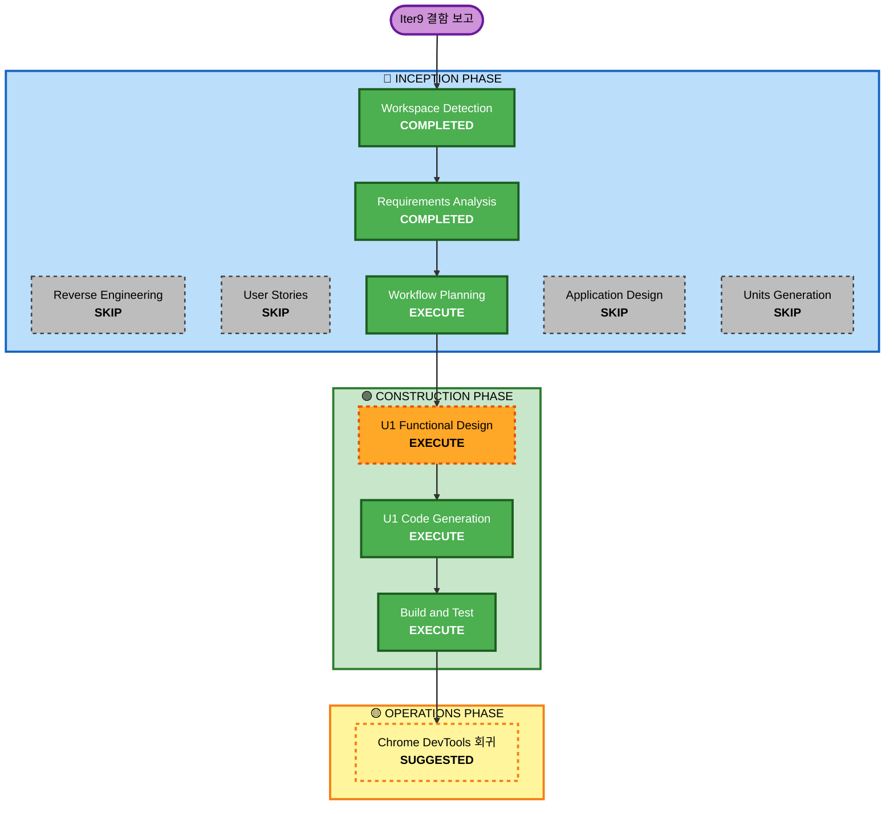

# Iteration 9 — 실행 계획 v1.0

| 항목 | 내용 |
|---|---|
| 작성 | 2026-04-30T00:45:00Z |
| 트리거 | 결함 보고 — 결과 발표 직후 EndScreen 즉시 전환 |
| 영향 단위 | U1 (실코드 변경) · U2/U3/U5 (회귀 테스트만) · U4 (변경 없음) |
| 작업 브랜치 | `worktree-fix+final-result` |

---

## 1. Detailed Analysis Summary

### 1.1 Change Impact Assessment
- **User-facing changes**: Yes — VOTE/NIGHT 결판 직후 EndScreen 전환 직전에 5초 결과 자막 노출.
- **Structural changes**: No — Phase 추가 없음. State 에 신규 옵셔널 필드 1건 (`PendingGameEnd`) 추가.
- **Data model changes**: 위 1건 (Go struct + 스냅샷 호환). 와이어/TS 측 변경 불필요 (서버 내부 전이 상태).
- **API changes**: 없음. WebSocket 프로토콜/REST 동일.
- **NFR impact**: 미미 — Tick 1 비교, 메모리 +24 byte/방 (deadline+winner+reason).

### 1.2 Component Relationships
- **Primary**: `internal/game/{types,end,tally,resolve_night,handlers_lifecycle,tick,state_clone}.go`
- **테스트만 영향 가능**: `internal/game/{end_test,tally_test,resolve_night_test,handlers_day_vote_test,handlers_lifecycle_test,scenario_test}.go` 등 시나리오 GameEnded 즉시 emission 가정 케이스
- **간접 영향 검증**: `internal/announce` 카탈로그(end.* cue 동작 그대로), `internal/transport/ws` (GameEnded 와이어 그대로), `web/src/context/reducer.ts` (GameEnded 처리 그대로)

### 1.3 Risk Assessment
- **Risk Level**: Low
- **Rollback Complexity**: Easy — `PendingGameEnd` nil 이면 기존 즉시 emit 동작과 동일 (역호환 절차 가능)
- **Testing Complexity**: Moderate — 다수 기존 시나리오 테스트가 GameEnded 즉시 emission 을 가정하므로 헬퍼 함수 1개 추가 + 케이스 5~6 종 보강

---

## 2. Workflow Visualization



---

## 3. 단위별 실행 결정 (Phases to Execute / Skip)

### 🔵 INCEPTION
- [x] Workspace Detection — COMPLETED
- [x] Reverse Engineering — SKIP (기존 산출물 활용)
- [x] Requirements Analysis — COMPLETED (`iteration9-fix-final-result-requirements.md` v1.0)
- [x] User Stories — SKIP (단일 결함 패치, 페르소나/스토리 변동 없음)
- [x] Workflow Planning — IN PROGRESS (본 문서)
- [ ] Application Design — **SKIP** — 컴포넌트/서비스 추가 없음, State 필드 1건 + 함수 1~2개만 추가
- [ ] Units Generation — **SKIP** — 5단위 구조 유지

### 🟢 CONSTRUCTION

#### U1 Game Core — EXECUTE 전체
- [ ] Functional Design Patch — `aidlc-docs/construction/u1-game-core/functional-design/iteration9-patch.md`
- [ ] NFR Requirements — SKIP (기존 NFR 충족, 신규 요구 없음)
- [ ] NFR Design — SKIP
- [ ] Infrastructure Design — SKIP
- [ ] Code Generation Plan — `aidlc-docs/construction/plans/iteration9-u1-code-generation-plan.md`
- [ ] Code Generation — Step A~F (아래 §5)

#### U2 Session/Persistence/Announce — SKIP
- [ ] 모든 단계 SKIP — 카탈로그 분기 변경 없음 (`Eliminated` / `DeathAnnounced` / `PeacefulNight` cue 그대로). `BuildPrivateView` 도 변경 없음 — `PendingGameEnd` 는 와이어로 노출 전제 X 이므로 view 마스킹 추가 불필요.

#### U3 Realtime Transport — SKIP
- [ ] 모든 단계 SKIP — `GameEnded` 와이어 직렬화 동일. `PendingGameEnd` 는 서버 내부 상태로 클라이언트 무관.

#### U4 HTTP Bootstrap — SKIP
- [ ] 모든 단계 SKIP — 변경 없음.

#### U5 Web Frontend — SKIP
- [ ] 모든 단계 SKIP — `GameEnded` 가 늦게 도착하므로 reducer 가 자연스럽게 늦게 phase=END 로 전환. SubtitleArea 는 마지막 announce 를 그대로 5초 더 표시 (기존 동작).

#### 공통
- [ ] Build and Test — `aidlc-docs/construction/build-and-test/iteration9-test-results.md` 작성

### 🟡 OPERATIONS
- [ ] Chrome DevTools MCP 회귀 권장 (호스트 + 4 player) — VOTE 결판 / NIGHT 결판 / Pause-Resume 시 EndScreen 지연 / HOST_FORCE_END 즉시 전환 4 시나리오. 사용자 트리거 권장.

---

## 4. U1 Functional Design Patch 개요 (Phase A 결정 사항)

### 4.1 신규 자료형
```go
// PendingGameEnd holds the deferred GameEnded payload while the engine
// keeps the previous phase visible for FR-2 (5s 결과 자막 노출).
//
// 비어있을 때(=nil) 엔진은 즉시-종료 모드로 동작 (HOST_FORCE_END 등). 
// scheduleGameEnd 가 호출되면 즉시 emit 대신 본 필드에 보관하고
// Tick 이 deadline 도달 시점에 endGame 을 발행한다.
type PendingGameEnd struct {
    Reason   EndReason `json:"reason"`
    Winner   *Team     `json:"winner,omitempty"` // HOST_FORCE_END 의 nil 도 포함
    Deadline time.Time `json:"deadline"`
}
```

### 4.2 State 변경
- `State.PendingGameEnd *PendingGameEnd `json:"pendingGameEnd,omitempty"`` 추가.
- `state_clone.go::Clone` 에서 PendingGameEnd 깊은 복사.

### 4.3 신규 상수
```go
const defaultFinalResultBufferSeconds = 5
```

### 4.4 신규 / 변경 함수
- **(신규)** `engine.scheduleGameEnd(reason EndReason, winner Team)` — `state.PendingGameEnd` 를 `{reason, winner, e.clock.Now() + buffer}` 로 채우고 빈 슬라이스 반환. State.Phase 는 호출 시점 그대로.
- **(변경)** `tally.applyElimination`: `checkEnd()` 가 true 면 `endEv` 를 그대로 append 하지 않고, `e.scheduleGameEnd(reason, winner)` 호출 후 `transitionVoteToNight` 호출도 생략 (Phase=VOTE/RECOUNT 유지). 단 `Eliminated` 이벤트는 그대로 emit.
  - 구현 디테일: `checkEnd` 의 시그니처를 유지하되 internal helper `e.evaluateEnd() (EndReason, Team, bool)` 를 추출하여 endGame 호출 없이 결과만 반환하게 한다 (또는 `tally`/`resolveNight` 가 직접 `LiveMafiaCount` 등으로 판정 후 schedule 호출). 가장 작은 변경: helper 추가.
- **(변경)** `resolve_night.resolveNight`: `checkEnd()` 가 true 면 동일하게 `scheduleGameEnd` 호출. Phase=DAY (이미 전이 완료) 유지. `Deadline` (DAY discussion deadline) 은 그대로 두지만, Tick 의 PendingGameEnd 처리가 먼저 발화된다.
- **(변경)** `tick.Tick`: `if e.state.Paused` 와 `if !now.After(LastTickAt)` 가드 다음 첫 분기로 `if e.state.PendingGameEnd != nil && !now.Before(e.state.PendingGameEnd.Deadline) { return e.firePendingEnd(now) }` 삽입.
- **(신규)** `engine.firePendingEnd(now)` — `endGame(reason, winner)` 호출 (State.Phase=PhaseEnd, Winner/EndReason 세팅, GameEnded emit), `state.PendingGameEnd = nil`, `state.LastTickAt = now`. HOST_FORCE_END 처럼 Winner 가 nil 인 경우 `endGame` 시그니처를 유지하기 위해 별도 `endGameForce` 또는 `endGameWithNilWinner` 분기 추가는 본 패치 범위 밖 (Q5=A — 강제 종료는 buffer 미적용이라 PendingGameEnd 에는 절대 force-end 가 들어오지 않음).
- **(변경)** `handlers_lifecycle.handleEndGame` (`HostEndGame`): 변경 없음 — 즉시 emit 동작 보존. 단, 호출 시 `state.PendingGameEnd = nil` 클리어 (자연 결판 직후 호스트가 force-end 한 corner case 대비).
- **(변경)** `handlers_lifecycle.canPause`: `PendingGameEnd != nil` 이면 phase 무관 true 반환.
- **(변경)** `handlers_lifecycle.handleResumeGame`: 기존 phase별 deadline shift 로직 직후, `if e.state.PendingGameEnd != nil { e.state.PendingGameEnd.Deadline = e.state.PendingGameEnd.Deadline.Add(shift) }` 추가.

### 4.5 동작 시퀀스 (예시: AC-1 시민 승리)

```
T+0.0s  player vote ... → all voted → tally
        events: VoteTallied(eliminated=mafia), Eliminated(mafia)
        scheduleGameEnd(CITIZEN_WIN, TeamCitizen) → state.PendingGameEnd.Deadline = T+5s
        (state.Phase 는 PhaseVote 그대로)
T+0.0s  client reducer: lastAnnounce = "○○○이(가) 마피아였습니다."
        audioCues: [eliminated.mafia]
T+0.5s  cue eliminated.mafia 재생 시작
T+3.0s  cue 재생 종료, 자막 유지
T+5.0s  서버 Tick(now=T+5.0s): PendingGameEnd.Deadline 도달 → firePendingEnd
        events: GameEnded(winner=CITIZEN, reason=CITIZEN_WIN, reveal=...)
        클라이언트: state.phase=END → EndScreen 노출, audioCues+=[end.citizen]
```

### 4.6 호환성 / 회귀 영향
- 기존 `internal/game/end_test.go::TestEngine_GameEndsWhenAllMafiaEliminated` 등은 단일 batch 에서 `Eliminated + GameEnded` 를 기대 → 신규 헬퍼 `tickFor(s)` (또는 `clock.Advance(5s); engine.Tick(...)`) 호출 1회 추가로 마이그레이션.
- `BuildPrivateView` 변경 없음 — `PendingGameEnd` 는 클라이언트가 무시.

---

## 5. U1 Code Generation Plan 개요 (Step A~F)

| Step | 작업 |
|---|---|
| A | `types.go` — `PendingGameEnd` struct + State 필드 추가 + `defaultFinalResultBufferSeconds = 5` 상수 |
| B | `state_clone.go` — Clone 깊은 복사 |
| C | `end.go` — `scheduleGameEnd(reason, winner)` 신규 + `firePendingEnd(now)` 신규. 기존 `checkEnd` 시그니처 유지하되 internal `evaluateEnd()` helper 분리(선택) |
| D | `tally.go` (`applyElimination`) — `checkEnd` true 분기를 `scheduleGameEnd` 로 치환 |
| E | `resolve_night.go` (`resolveNight`) — 동일하게 `scheduleGameEnd` 로 치환 |
| F | `tick.go` (`Tick`) — Paused/LastTickAt 가드 직후 `PendingGameEnd` 만료 체크 + `firePendingEnd` |
| G | `handlers_lifecycle.go` — `canPause` PendingGameEnd 분기, `handleResumeGame` deadline shift, `handleForceEnd` 의 PendingGameEnd 클리어 |
| H | 신규 `iteration9_test.go` — 6 케이스: Vote-end buffer, Night-end buffer (death), Night-end buffer (peaceful 가정), Pause/Resume mid-buffer, HOST_FORCE_END mid-buffer 클리어, Snapshot resume mid-buffer |
| I | 기존 시나리오 테스트 마이그레이션 — `end_test.go` / `scenario_test.go` 등 GameEnded 가 즉시 같은 batch 에 오기를 기대하는 케이스 4~6 건에 5초 advance + Tick 호출 추가 |

각 Step 완료 후 `go vet ./...` + `go test ./internal/game/... -race -count=1` 통과를 검증한다.

---

## 6. Build & Test (공통)

| 검증 | 도구 | 게이트 |
|---|---|---|
| Go 회귀 | `go test ./... -count=1 -race` | 6 패키지 PASS |
| Go 빌드 | `go build -o /tmp/mafia-game-iter9 ./cmd/mafia-game` | 성공 |
| Frontend | `npm test` | 66 PASS 유지 |
| Frontend 빌드 | `npm run build` | gzip 65.62 KB ± 노이즈 |
| 커버리지 | `go test ./internal/game/... -cover` | game 패키지 ≥ 91.8% (Iter8 baseline) |

`aidlc-docs/construction/build-and-test/iteration9-test-results.md` 에 FR-1~FR-8 추적 매트릭스, 패키지별 커버리지, 회귀 영향 분석, NFR 영향, AC-1~AC-6 검증 결과 기록 → 사용자 최종 승인 게이트.

---

## 7. Estimated Timeline / Success Criteria

- **Total Stages**: 4 (Workflow Planning · U1 Functional Design · U1 Code Generation · Build and Test)
- **Estimated Duration**: 1 세션 (Plan 5분 / FD 5분 / CodeGen 30분 / Build & Test 10분)
- **Success Criteria**:
  - AC-1~AC-6 모두 통과 (테스트로 검증)
  - 기존 67 Go 테스트 + 66 npm 테스트 PASS
  - `defaultFinalResultBufferSeconds = 5` 동작 일관성 확인
  - 호스트 PublicView 가 결과 자막을 5초 노출 후 EndScreen 전환 (수동 회귀로 OPERATIONS 단계에서 확인 권장)

---

## 8. 사용자 승인 게이트

본 plan 승인 시 → U1 Functional Design Patch 작성으로 진입.
