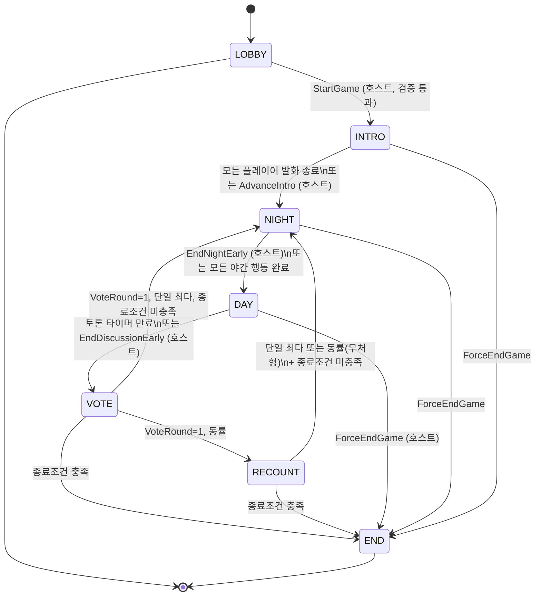

# Business Logic Model — U1 Game Core

**작성일**: 2026-04-26
**문서 버전**: 1.0
**참조**: `domain-entities.md`, `business-rules.md`

본 문서는 GameEngine의 상태 머신, Apply/Tick 알고리즘, 야간 행동 적용 알고리즘, 투표 집계 알고리즘, 종료 조건 판정을 정의합니다. 기술 비종속.

---

## 1. 상태 머신

### 1.1 단계 다이어그램 (Mermaid)



### 1.2 텍스트 대안

```
LOBBY ─StartGame─▶ INTRO ─자기소개완료─▶ NIGHT ─모든야간행동완료─▶ DAY ─토론종료─▶ VOTE
                                                                                  │
                                              ┌───────────────────────────────────┤
                                              │ 동률 → RECOUNT ─재투표결과─┐       │
                                              │                            │       │
                                              ▼                            ▼       ▼
                                       (재투표 결과 처리)        종료조건검사    단일최다
                                              │                            │       │
                                              └───────────────────────────┴───────┘
                                                                                   │
                                                                        종료조건 미충족
                                                                                   │
                                                                                  ▼
                                                                              NIGHT (Day++)

종료(END): 종료조건 충족 (마피아 0 / 마피아 ≥ 시민) 또는 ForceEndGame
```

### 1.3 단계 의미 요약

| Phase | 진입 조건 | 의미 | 종료 조건 (다음 단계 트리거) |
|---|---|---|---|
| `LOBBY` | 게임 생성 직후 | 플레이어 입장 대기 | `StartGame` (호스트) + 검증 통과 |
| `INTRO` | LOBBY → INTRO | 자기소개 (Day 1만) | 모든 플레이어 발화 종료 (자동, IntroSecondsPerPlayer × N) 또는 AdvanceIntro |
| `NIGHT` | INTRO → NIGHT 또는 (RE)COUNT → NIGHT | 마피아 살해, 의사 보호, 경찰 조사 | 모든 야간 행동 완료 또는 `EndNightEarly`(호스트) |
| `DAY` | NIGHT → DAY | 사망자 발표 + 토론 (DiscussionSeconds 카운트다운) | 타이머 만료 또는 `EndDiscussionEarly`(호스트) |
| `VOTE` | DAY → VOTE | 1차 투표 (살아있는 모두) | 모든 살아있는 플레이어 투표 완료 |
| `RECOUNT` | VOTE 동률 | 동률 후보자 대상 재투표 (Q-FD-U1-5=A) | 모든 살아있는 플레이어 재투표 완료 |
| `END` | 종료 조건 충족 | 게임 종료, 결과 공개 | (없음 — 종착) |

> **DAY 단계의 사망자 발표**: NIGHT → DAY 전이 시 즉시 `DeathAnnounced` 또는 `PeacefulNight` 이벤트 발행. 그 후 토론 타이머 시작.

---

## 2. Engine.Apply 의사 코드

```
function Apply(action) → (newState, events, error):
  1. 권한·사전조건 검증 (business-rules.md §1, §3 참조)
     ├─ 발신자 Alive? Phase 호환? 역할 일치?
     └─ 위반 → return error (상태 변경 없음)

  2. switch action.type:
     ├─ StartGame             → handleStartGame()
     ├─ AdvanceIntro          → handleAdvanceIntro()
     ├─ SubmitMafiaKill       → handleMafiaKill()
     ├─ SubmitDoctorHeal      → handleDoctorHeal()
     ├─ SubmitPoliceCheck     → handlePoliceCheck()
     ├─ EndNightEarly         → handleEndNightEarly()
     ├─ EndDiscussionEarly    → handleEndDiscussionEarly()
     ├─ SubmitVote            → handleVote()
     ├─ ToggleVoice           → handleToggleVoice()
     └─ ForceEndGame          → handleForceEnd()

  3. 단계 전이 검사 (post-action transition):
     ├─ NIGHT 중: 모든 야간 행동 완료 시 → DAY로 전이 (resolveNight() + DeathAnnounced/PeacefulNight)
     ├─ VOTE 중: 모든 살아있는 플레이어 투표 시 → tally()
     └─ RECOUNT 중: 모든 살아있는 플레이어 재투표 시 → tally()

  4. 종료 조건 검사 (post-transition):
     └─ checkEnd() → MAFIA_WIN / CITIZEN_WIN / 계속

  5. 영속화 책임은 U2 — 단, U1은 매 Apply 후 새 State를 반환하여 U2가 SaveSnapshot 호출

  return (newState, events, nil)
```

---

## 3. Engine.Tick 의사 코드

`Tick(now time.Time)`은 시간 기반 단계 진전. 1초 간격으로 호출됨 (U2의 백그라운드 ticker).
**멱등성**: 동일 `now`로 여러 번 호출되어도 안전.

```
function Tick(now) → (newState, events, error):
  switch state.Phase:
    case INTRO:
      elapsed := now − state.IntroSpeakerStartedAt
      if elapsed >= Settings.IntroSecondsPerPlayer:
        // 다음 발화자로 진행 또는 INTRO 종료
        if IntroSpeakerIdx < len(Players)−1:
          IntroSpeakerIdx++
          IntroSpeakerStartedAt = now
          emit IntroSpeakerChanged(playerID, secondsLeft = IntroSecondsPerPlayer)
        else:
          transition INTRO → NIGHT  (§4)

    case NIGHT:
      // Q-FD-U1-12=B — 야간 마감 없음. Tick은 NIGHT에서 단계 전이를 트리거하지 않음.
      // 모든 야간 행동이 완료되었거나 EndNightEarly가 들어왔을 때만 Apply에서 전이.
      no-op

    case DAY:
      remaining := state.Deadline − now
      if remaining <= 0:
        transition DAY → VOTE  (§5)
      else:
        // 30, 10, 0 임계 안내
        emit DiscussionTimerTick(secondsLeft = remaining) at thresholds

    case VOTE, RECOUNT, LOBBY, END:
      no-op (시간 기반 진전 없음)
```

> **참고**: `IntroSpeakerChanged`는 매 발화자 시작 시 1회 발행. 잔여 시간 카운트다운은 클라이언트(U5)가 deadline 기반으로 계산.

---

## 4. NIGHT → DAY 전이 알고리즘 (resolveNight)

NIGHT 단계에서 발생 조건:
- 마피아 대표자가 `SubmitMafiaKill` 발행 + 의사가 `SubmitDoctorHeal` 발행 + 경찰이 `SubmitPoliceCheck` 발행 (모두 완료)
- 또는 호스트 `EndNightEarly`

> ⚠️ Q-FD-U1-12=B — 자동 마감 없음. 따라서 한 명이라도 입력하지 않으면 호스트의 `EndNightEarly`가 필요. 그 시점에 Pending 값이 nil인 행동은 "행동 없음"으로 처리.

```
function resolveNight() → events:
  Day++

  // 1. 살해/보호 적용
  victim := nil
  if PendingMafiaTarget != nil:
    if PendingDoctorTarget != nil and *PendingDoctorTarget == *PendingMafiaTarget:
      // 보호 성공 → 살해 무효
      victim = nil
    else:
      victim = PendingMafiaTarget

  events := []
  if victim != nil:
    Players[victim].Alive = false
    events.append(DeathAnnounced{victim})

    // 마피아 대표자가 사망한 경우 즉시 재지정 (Q-FD-U1-4-FU2=A)
    if victim == MafiaRepresentativeID:
      remaining := liveMafia(excluding victim)
      if len(remaining) >= 1:
        newRep := pickRandom(remaining, rng)
        MafiaRepresentativeID = newRep
        events.append(MafiaRepresentativeReassigned{old: victim, new: newRep})
      else:
        // 마피아 전멸 → 종료 조건에서 잡힘
        MafiaRepresentativeID = ""
  else:
    events.append(PeacefulNight{})

  // 경찰 조사 결과는 PoliceResult로 별도 발행 (handlePoliceCheck에서 즉시 발행 — 본 함수에서 중복 발행 X)

  // 2. 야간 누적 초기화
  PendingMafiaTarget = nil
  PendingDoctorTarget = nil
  PendingPoliceTarget = nil
  PoliceCheckedThisNight = false

  // 3. 단계 전이
  Phase = DAY
  Deadline = now + Settings.DiscussionSeconds
  events.prepend(PhaseChanged{DAY, Day, Deadline})

  return events
```

---

## 5. DAY → VOTE 전이 + 투표 집계 알고리즘

```
function transitionToVote():
  Phase = VOTE
  Deadline = zero (투표는 시간 마감 없음 — 모두 입력 시 자동)
  Votes = {}
  VoteRound = 1
  VoteCandidates = []
  emit PhaseChanged{VOTE, Day, Deadline}

function handleVote(SubmitVote{voter, target}):
  if state.Phase not in {VOTE, RECOUNT}: error
  if !Players[voter].Alive: error
  if !Players[target].Alive: error
  if Phase == RECOUNT and target not in VoteCandidates: error
  Votes[voter] = target

  // 모든 살아있는 플레이어 투표 완료 검사
  if len(Votes) == liveCount():
    return tally()
  return []

function tally() → events:
  counts := count(Votes)            // map[PlayerID]int
  maxCount := max(counts.values)
  topCandidates := [pid for pid, c in counts if c == maxCount]
  events := [VoteTallied{counts, eliminated, recount}]

  if VoteRound == 1:
    if len(topCandidates) == 1:
      eliminated := topCandidates[0]
      Players[eliminated].Alive = false
      events.append(VoteTallied{counts, eliminated: &eliminated, recount: false})
      events.append(Eliminated{eliminated, role: Players[eliminated].Role})
      // 마피아 대표자 처형 → 재지정 (Q-FD-U1-4-FU2=A)
      if eliminated == MafiaRepresentativeID:
        reassignRepresentative(events)
      return transitionAfterElimination(events)
    else:
      // 동률 → RECOUNT
      Phase = RECOUNT
      VoteRound = 2
      VoteCandidates = topCandidates
      Votes = {}
      events.append(VoteTallied{counts, eliminated: nil, recount: true})
      events.append(PhaseChanged{RECOUNT, Day, zero})
      return events

  if VoteRound == 2:  // RECOUNT
    if len(topCandidates) == 1:
      eliminated := topCandidates[0]
      ... (동일 처리)
      return transitionAfterElimination(events)
    else:
      // 재투표도 동률 → 무처형
      events.append(VoteTallied{counts, eliminated: nil, recount: false})
      return transitionAfterNoElimination(events)

function transitionAfterElimination(events):
  if checkEnd(events):
    return events
  // 다음 NIGHT으로
  Phase = NIGHT
  events.append(PhaseChanged{NIGHT, Day, zero})  // Day는 NIGHT 진입 시 증가하지 않음 — resolveNight에서 증가
  return events

function transitionAfterNoElimination(events):
  if checkEnd(events):
    return events
  Phase = NIGHT
  events.append(PhaseChanged{NIGHT, Day, zero})
  return events
```

> 주의: Day는 NIGHT → DAY 전이 시 증가 (resolveNight). VOTE → NIGHT 전이 시 증가하지 않음 — "1일차 NIGHT"는 INTRO 직후, "2일차 NIGHT"는 첫 처형 후 등.

---

## 6. 종료 조건 판정 (checkEnd)

FR-5.1, FR-5.2.

```
function checkEnd(events) → bool:
  liveMafiaCount := count(Players where Alive=true and Role=MAFIA)
  liveCitizenSideCount := count(Players where Alive=true and Role in {CITIZEN, DOCTOR, POLICE})

  if liveMafiaCount == 0:
    Phase = END
    Winner = CITIZEN
    EndReason = CITIZEN_WIN
    events.append(GameEnded{Winner, EndReason, Reveal: Players})
    return true

  if liveMafiaCount >= liveCitizenSideCount:
    Phase = END
    Winner = MAFIA
    EndReason = MAFIA_WIN
    events.append(GameEnded{Winner, EndReason, Reveal: Players})
    return true

  return false
```

> `ForceEndGame`은 별도 분기에서 `Phase=END, EndReason=HOST_FORCE_END, Winner=nil` 처리.

---

## 7. 핸들러별 의사 코드 (요약)

### 7.1 handleStartGame

```
function handleStartGame(StartGame{HostID, Options}):
  if Phase != LOBBY: error
  if HostID != state.HostID: error
  if !validateOptions(Options): error  // §3 도메인 엔티티 검증

  state.Settings = Options
  state.AnnouncementVoiceOn = Options.AnnouncementVoiceOn

  assignments := RoleAssigner.Assign(Players.IDs, Options, rng)
  for pid, role in assignments.PlayerRoles:
    Players[pid].Role = role
    Players[pid].Keyword = assignments.PlayerKeywords[pid]
  state.MafiaRepresentativeID = assignments.Representative

  events := [GameStarted{state}]
  for each player p:
    events.append(RoleRevealedToPlayer{p.ID, p.Role, p.Keyword})  // 비공개
  events.append(MafiaCohortRevealed{assignments.MafiaIDs, state.MafiaRepresentativeID})  // 마피아 비공개

  // INTRO 진입
  Phase = INTRO
  Day = 1
  IntroSpeakerIdx = 0
  IntroSpeakerStartedAt = now
  events.append(PhaseChanged{INTRO, Day, deadline=zero})
  events.append(IntroSpeakerChanged{Players[0].ID, secondsLeft = Options.IntroSecondsPerPlayer})

  return events
```

### 7.2 handleMafiaKill

```
function handleMafiaKill(SubmitMafiaKill{Mafia, Target}):
  if Phase != NIGHT: error
  if Players[Mafia].Role != MAFIA: error
  if Mafia != state.MafiaRepresentativeID: error  // 대표자만 입력 가능
  if !Players[Mafia].Alive: error
  if !Players[Target].Alive: error
  if Players[Target].Role == MAFIA: error  // 마피아끼리 못 죽임 (전통 룰)

  state.PendingMafiaTarget = &Target
  events := [MafiaTargetSelected{representative: Mafia, target: Target}]  // 마피아 비공개

  // 모든 야간 행동 완료 시 NIGHT → DAY 전이는 Apply의 Step 3에서 검사
  if allNightActionsSubmitted():
    events.append(...resolveNight()...)

  return events
```

### 7.3 handleDoctorHeal

```
function handleDoctorHeal(SubmitDoctorHeal{Doctor, Target}):
  if Phase != NIGHT: error
  if Players[Doctor].Role != DOCTOR: error
  if !Players[Doctor].Alive: error
  if !Players[Target].Alive: error
  if Doctor == Target and !Settings.DoctorSelfHealAllowed: error  // Q-AD-8/Q-FD-U1-7

  state.PendingDoctorTarget = &Target
  // 의사의 선택은 본인만 보는 Pending — 다른 사람에게 이벤트 발행 안 함

  if allNightActionsSubmitted():
    events.append(...resolveNight()...)
  return events
```

### 7.4 handlePoliceCheck

```
function handlePoliceCheck(SubmitPoliceCheck{Police, Target}):
  if Phase != NIGHT: error
  if Players[Police].Role != POLICE: error
  if !Players[Police].Alive: error
  if !Players[Target].Alive: error
  if Police == Target: error  // 자기 조사 금지
  if state.PoliceCheckedThisNight: error  // 야간 1회 제한

  state.PendingPoliceTarget = &Target
  state.PoliceCheckedThisNight = true

  team := teamOf(Players[Target].Role)  // Q-FD-U1-6=A 진영만
  events := [PoliceResult{Police, Target, team}]  // 경찰 비공개

  if allNightActionsSubmitted():
    events.append(...resolveNight()...)
  return events
```

### 7.5 handleEndNightEarly / handleEndDiscussionEarly

```
function handleEndNightEarly(EndNightEarly{HostID}):
  if Phase != NIGHT: error
  if HostID != state.HostID: error
  return resolveNight()  // 미입력 항목은 nil로 유지

function handleEndDiscussionEarly(EndDiscussionEarly{HostID}):
  if Phase != DAY: error
  if HostID != state.HostID: error
  return transitionToVote()
```

### 7.6 handleAdvanceIntro

```
function handleAdvanceIntro(AdvanceIntro{HostID}):
  if Phase != INTRO: error
  if HostID != state.HostID: error
  // 강제로 다음 발화자 또는 NIGHT 진입
  if IntroSpeakerIdx < len(Players)−1:
    IntroSpeakerIdx++
    IntroSpeakerStartedAt = now
    return [IntroSpeakerChanged{Players[IntroSpeakerIdx].ID, secondsLeft = Settings.IntroSecondsPerPlayer}]
  else:
    Phase = NIGHT
    return [PhaseChanged{NIGHT, Day, zero}]
```

### 7.7 handleForceEnd

```
function handleForceEnd(ForceEndGame{HostID}):
  if HostID != state.HostID: error
  if Phase == END: error
  Phase = END
  EndReason = HOST_FORCE_END
  Winner = nil
  return [GameEnded{Winner: nil, EndReason: HOST_FORCE_END, Reveal: Players}]
```

### 7.8 handleToggleVoice

```
function handleToggleVoice(ToggleVoice{HostID, On}):
  if HostID != state.HostID: error
  state.Settings.AnnouncementVoiceOn = On
  return [VoiceToggled{On}]
```

---

## 8. allNightActionsSubmitted 헬퍼

```
function allNightActionsSubmitted() → bool:
  if PendingMafiaTarget == nil: return false
  if hasLivingDoctor() and PendingDoctorTarget == nil: return false
  if hasLivingPolice() and !PoliceCheckedThisNight: return false
  return true
```

> 의사·경찰이 사망한 상황에서는 그 입력을 기다리지 않음. 마피아가 전멸한 경우는 종료 조건에서 이미 잡힘.

---

## 9. Snapshot / Restore

```
function Snapshot() → State:
  return deep_copy(state)

function Restore(s State) → error:
  // 검증: GameID, Phase가 유효 enum, Players 배열 일관성
  if !validate(s): error
  state = s
  return nil
```

> 시간 기반 단계(INTRO, DAY)의 deadline은 그대로 보존됨. 재시작 후 첫 Tick이 호출되면 만료된 deadline은 즉시 다음 단계로 전이 (resolve catch-up).

---

## 10. 결정성 / 무작위성 정리

| 결정 | 결정성 | 시드 |
|---|---|---|
| 역할 배분 | 비결정적 | `crypto/rand` (Q-FD-U1-10=A) |
| 키워드 추출 | 비결정적 | 동일 |
| 마피아 대표자 선정 | 비결정적 | 동일 |
| 마피아 대표자 재지정 | 비결정적 | 동일 |

> 단위 테스트에서는 `Engine.New(assigner, clock, rng)`의 `rng io.Reader`를 시드 가능한 PRNG(`math/rand` 시드 reader)로 주입하여 결정적 시나리오 검증.
