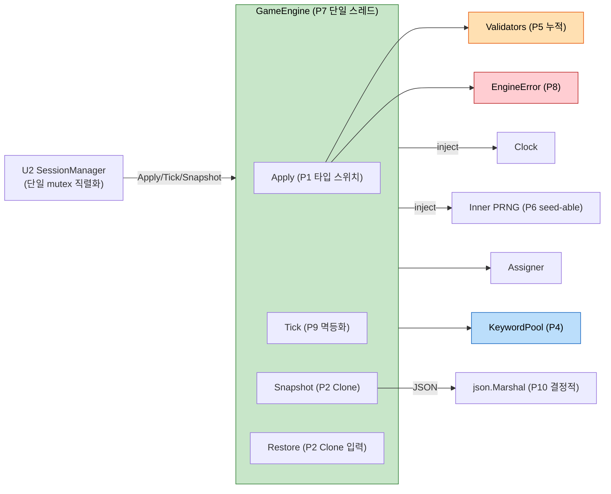

# NFR Design Patterns — U1 Game Core

**작성일**: 2026-04-26
**문서 버전**: 1.0
**참조**: `nfr-requirements.md`, `tech-stack-decisions.md`, `functional-design/*.md`

본 문서는 U1 Game Core가 NFR 한도(Reliability·Maintainability·Performance·Storage·Concurrency)를 만족하기 위해 채택하는 **설계 패턴**을 명시합니다.

> 사용자 응답 (2026-04-26): Q-NFRD-U1-1~5 모두 A.

---

## 1. 패턴 개요 (적용 영역 매핑)

| 패턴 ID | 패턴 | 적용 영역 | 주요 NFR | 출처 |
|---|---|---|---|---|
| P1 | 타입 스위치 dispatch | Apply 핸들러 분기 | Maintainability, Performance | Q-NFRD-U1-1=A |
| P2 | 수동 Clone 깊은 복사 | Snapshot/Restore | Reliability, Performance(P1<1ms) | Q-NFRD-U1-2=A |
| P3 | 생성자 주입 (Constructor Injection) | Clock, RNG, KeywordPool, RoleAssigner | Testability | Q-NFRD-U1-3=A |
| P4 | 컴파일 타임 임베드 풀 + 외부화 인터페이스 | KeywordPool 콘텐츠 | Maintainability, FR-7.1 | Q-NFRD-U1-4=A |
| P5 | 누적 에러 (Accumulating Validator) | Options 등 다중 규칙 검증 | Maintainability, UX | Q-NFRD-U1-5=A |
| P6 | 시드 가능 Inner PRNG | RoleAssigner, KeywordPool 무작위성 | Testability, Determinism | NFR-U1-M6, Q-FD-U1-10=A |
| P7 | 단일 스레드 가정 + race-free 테스트 | Engine 동시성 | Concurrency | Q-NFR-U1-9=A, NFR-U1-C2 |
| P8 | 타입드 에러 + Sentinel `Is/As` | EngineError | Reliability, Maintainability | Q-NFR-U1-8=A |
| P9 | 시간 기반 진전 멱등화 (Idempotent Tick) | Engine.Tick | Reliability(R3) | NFR-U1-R3 |
| P10 | 결정적 직렬화 | State JSON Marshal | Storage(S3) | NFR-U1-S3 |
| P11 | 테이블 드리븐 + 시나리오 + 속성 기반 테스트 | 모든 컴포넌트 | Maintainability(M7) | Q-NFR-U1-10=A |

---

## 2. 패턴 다이어그램



### 텍스트 대안

```
U2 SessionManager (직렬화) → GameEngine (단일 스레드 가정)
GameEngine 구성: Apply(타입스위치) / Tick(멱등) / Snapshot(Clone) / Restore(Clone)
주입: Clock, Inner PRNG(시드 가능), RoleAssigner, KeywordPool
Apply → Validators(누적) → EngineError(타입드)
Snapshot → json.Marshal(결정적)
```

---

## 3. 패턴 상세

### 3.1 P1 — 타입 스위치 dispatch (Q-NFRD-U1-1=A)

**의도**: Action 종류별 핸들러를 컴파일러가 정적 검사 가능한 형태로 분기.

**적용**:
```go
// engine.go
func (e *engine) Apply(action Action) (State, []Event, error) {
    switch a := action.(type) {
    case StartGame:
        return e.handleStartGame(a)
    case AdvanceIntro:
        return e.handleAdvanceIntro(a)
    case SubmitMafiaKill:
        return e.handleMafiaKill(a)
    // ... 8 cases
    default:
        return e.state, nil, &EngineError{Code: CodeValidation, Message: "unknown action type"}
    }
}
```

**근거**:
- 컴파일러가 타입 일치 검사 (오타·누락 액션 발견)
- reflect 미사용 → 성능 한도(P1 < 1ms) 안정적 만족
- 디버거에서 분기점 명확

**대안 거부**: B(reflect map)는 NFR-U1-P1 위협 + 외부 의존성 위험. C(Action.Apply 메서드)는 도메인 타입에 행위 결합 → 직렬화 시 메서드 손실 위험.

---

### 3.2 P2 — 수동 Clone 깊은 복사 (Q-NFRD-U1-2=A)

**의도**: Snapshot이 호출자의 변형으로부터 격리되도록 비공유 사본 반환.

**적용**:
```go
// state.go
func (s State) Clone() State {
    out := s
    out.Players = append([]Player(nil), s.Players...)
    out.Votes = make(map[PlayerID]PlayerID, len(s.Votes))
    for k, v := range s.Votes {
        out.Votes[k] = v
    }
    out.VoteCandidates = append([]PlayerID(nil), s.VoteCandidates...)
    if s.PendingMafiaTarget != nil {
        v := *s.PendingMafiaTarget
        out.PendingMafiaTarget = &v
    }
    if s.PendingDoctorTarget != nil { ... }
    if s.PendingPoliceTarget != nil { ... }
    if s.Winner != nil { ... }
    if s.EndReason != nil { ... }
    return out
}

func (e *engine) Snapshot() State { return e.state.Clone() }
func (e *engine) Restore(s State) error {
    if err := validateState(s); err != nil { return err }
    e.state = s.Clone()
    return nil
}
```

**근거**:
- JSON 라운드트립(B)은 `Time` 마이크로초 손실, 12명 기준 ~50–200μs — P1=1ms 한도의 5–20% 소비. Tick 1초당 호출이 많으면 비용 누적.
- 수동 Clone: ~5–20μs (12명 기준 추정)
- 필드 추가 시 갱신 누락 위험은 단위 테스트(`TestStateClone_DeepCopy`)로 검증 — 모든 슬라이스/맵/포인터를 변형 후 원본 무영향 확인

---

### 3.3 P3 — 생성자 주입 (Q-NFRD-U1-3=A)

**의도**: 외부 의존(시간, 무작위성, 키워드, 역할 배분)을 타입으로 명시 → 테스트 시 mock 주입.

**적용**:
```go
// engine.go
type Clock interface { Now() time.Time }

type engine struct {
    state    State
    clock    Clock
    rng      io.Reader  // 운영: crypto/rand.Reader, 테스트: bytes.NewReader(seed)
    assigner RoleAssigner
}

func New(assigner RoleAssigner, clock Clock, rng io.Reader) Engine {
    return &engine{clock: clock, rng: rng, assigner: assigner}
}

// 운영 헬퍼
func NewDefault(pool KeywordPool) Engine {
    return New(NewAssigner(pool), realClock{}, rand.Reader)
}
```

**근거**:
- 명시적 의존 (DI 컨테이너 불필요, 도메인 단위 적합)
- 글로벌 변수 회피 → 병렬 테스트 안전 (NFR-U1-C2)
- 함수 옵션 패턴(C)은 본 단위 의존 4개 한정이라 과한 추상화

---

### 3.4 P4 — 컴파일 타임 임베드 풀 + 외부화 인터페이스 (Q-NFRD-U1-4=A)

**의도**: 기본 키워드 풀은 외부 의존 0으로 임베드, 운영 시점 외부 파일 교체는 인터페이스로 가능.

**적용**:
```go
// keyword.go
type KeywordPool interface {
    Pick(role Role, rng io.Reader) string
}

// keyword_default.go (생성자 함수만)
func NewDefaultKeywordPool() KeywordPool {
    return mapKeywordPool{
        Mafia:    defaultMafiaWords,
        Citizen:  defaultCitizenWords,
        Doctor:   defaultDoctorWords,
        Police:   defaultPoliceWords,
    }
}

// keyword_pool_data.go — 데이터만, 가독성 유지
var defaultMafiaWords = []string{
    "그림자", "침묵", "가면", /* 40개 */
}
var defaultCitizenWords = []string{
    "햇살", "빵", /* 40개 */
}
// ... DOCTOR 30, POLICE 30
```

**FR-7.1 외부화** (별도 파일에 두되 본 단위에 포함):
```go
// keyword_loader.go
// Loads JSON from io.Reader (e.g., os.Open(path))
func LoadKeywordPool(r io.Reader) (KeywordPool, error) { ... }
```

**근거**:
- 외부 의존 0 (NFR-U1-M9)
- 운영자가 풀 교체 시 `LoadKeywordPool(file)` 호출 → SessionManager에서 주입
- 기본 풀은 코드 리뷰로 검수 (`go test`에서 풀 크기·중복 검증)

---

### 3.5 P5 — 누적 에러 (Q-NFRD-U1-5=A)

**의도**: Options 같은 다중 규칙 검증에서 모든 위반 사항을 한 번에 호출자에게 전달 → 호스트 UI가 N개 오류를 한 번에 표시 가능.

**적용**:
```go
// validate.go
type ValidationErrors []FieldError

type FieldError struct {
    Field string
    Code  ErrorCode
    Msg   string
}

func (e ValidationErrors) Error() string { /* 결합 */ }

func validateOptions(opts Options, playerCount int) ValidationErrors {
    var errs ValidationErrors
    if playerCount < 6 || playerCount > 12 {
        errs = append(errs, FieldError{Field: "PlayerCount", Code: CodeValidation, Msg: "must be 6..12"})
    }
    if opts.MafiaCount < 1 {
        errs = append(errs, FieldError{Field: "MafiaCount", Code: CodeValidation, Msg: "must be >= 1"})
    }
    if (playerCount - opts.MafiaCount) < (opts.MafiaCount + 1) {
        errs = append(errs, FieldError{Field: "MafiaCount", Code: CodeValidation, Msg: "citizen-side must exceed mafia by >= 1"})
    }
    if opts.IntroSecondsPerPlayer < 5 {
        errs = append(errs, FieldError{Field: "IntroSecondsPerPlayer", Code: CodeValidation, Msg: "must be >= 5"})
    }
    if opts.DiscussionSeconds < 30 {
        errs = append(errs, FieldError{Field: "DiscussionSeconds", Code: CodeValidation, Msg: "must be >= 30"})
    }
    if len(errs) == 0 { return nil }
    return errs
}
```

**근거**:
- 호스트가 한 번에 모든 입력 오류를 화면에서 확인 가능 (NFR-3 사용성)
- `errors.As(err, &ValidationErrors{})`로 호출자가 분리 가능
- 복잡도는 적당 — Options 검증 등 5~10건 규칙에 적합

> 권한 게이팅(`PermissionDenied`), 단계 위반(`WrongPhase`) 등 **단일 위반 분기**는 fail-fast (즉시 반환). P5는 다중 규칙 검증에 한정.

---

### 3.6 P6 — 시드 가능 Inner PRNG

**의도**: 운영은 `crypto/rand`(비결정), 테스트는 시드 PRNG(결정). NFR-U1-M6 + Q-FD-U1-10=A.

**적용**:
```go
// rand.go
// extractSeed64 reads 8 bytes from rng and returns int64 seed.
// Engine creates one inner *math/rand.Rand per Start() to keep deterministic
// sequence for assignment + keyword pick (under given outer rng/seed).
func extractSeed64(rng io.Reader) (int64, error) {
    var b [8]byte
    if _, err := io.ReadFull(rng, b[:]); err != nil { return 0, err }
    return int64(binary.LittleEndian.Uint64(b[:])), nil
}

// Engine.handleStartGame
seed, err := extractSeed64(e.rng)
inner := rand.New(rand.NewSource(seed))
e.assigner.Assign(playerIDs, opts, inner)
```

**근거**:
- 외부 `rng io.Reader`는 자유롭게 교체 가능
- inner PRNG는 게임 1판마다 새로 생성 — 게임 간 독립성
- 테스트는 `bytes.NewReader([]byte{0x01, 0x02, ...})` 같은 고정 시드 입력 → 결정적 시나리오

---

### 3.7 P7 — 단일 스레드 가정 (Q-NFR-U1-9=A)

**의도**: GameEngine 자체에 락 없음. 동시 호출 안전성은 호출자(U2)가 보장.

**적용**:
- godoc에 명시: `// Engine is NOT safe for concurrent use. Caller must serialize calls (e.g., U2 SessionManager single mutex).`
- `internal/game`에 `sync.Mutex` 미도입
- 테스트는 단일 고루틴, 단 `go test -race`로 데이터 레이스 0 확인

**근거**:
- 이중 잠금 회피 (성능, 명료성)
- BR-CONC-1과 일치

---

### 3.8 P8 — 타입드 에러 + Sentinel `Is/As`

**의도**: 호출자가 에러 종류 분기 가능. `errors.Is(err, ErrValidation)` 패턴.

**적용**:
```go
// error.go
type EngineError struct {
    Code    ErrorCode
    Message string
    Field   string // optional
    Want    any    // optional
    Got     any    // optional
}

func (e *EngineError) Error() string {
    if e.Field != "" { return fmt.Sprintf("%s: %s (field=%s)", e.Code, e.Message, e.Field) }
    return fmt.Sprintf("%s: %s", e.Code, e.Message)
}

// Sentinel for `errors.Is`
var (
    ErrValidation        = &EngineError{Code: CodeValidation}
    ErrWrongPhase        = &EngineError{Code: CodeWrongPhase}
    ErrPermissionDenied  = &EngineError{Code: CodePermissionDenied}
    ErrRoleMismatch      = &EngineError{Code: CodeRoleMismatch}
    ErrNotRepresentative = &EngineError{Code: CodeNotRepresentative}
    ErrDeadPlayer        = &EngineError{Code: CodeDeadPlayer}
    ErrAlreadyDone       = &EngineError{Code: CodeAlreadyDone}
    ErrInvalidTarget     = &EngineError{Code: CodeInvalidTarget}
    ErrUnknownPlayer     = &EngineError{Code: CodeUnknownPlayer}
)

func (e *EngineError) Is(target error) bool {
    t, ok := target.(*EngineError)
    if !ok { return false }
    return e.Code == t.Code
}
```

**호출자 사용**:
```go
_, _, err := engine.Apply(action)
if errors.Is(err, game.ErrPermissionDenied) {
    // ...
}
var ve game.ValidationErrors
if errors.As(err, &ve) {
    for _, fe := range ve { ... }
}
```

---

### 3.9 P9 — 시간 기반 진전 멱등화 (NFR-U1-R3)

**의도**: Tick은 동일 `now`로 N번 호출되어도 첫 호출 외 no-op.

**적용**:
```go
type engine struct {
    ...
    lastTickAt time.Time  // Tick 호출의 최근 처리 시각
}

func (e *engine) Tick(now time.Time) (State, []Event, error) {
    if !now.After(e.lastTickAt) {
        return e.state, nil, nil  // 멱등 no-op
    }
    e.lastTickAt = now

    // 단계별 시간 진전 처리...
}
```

**테스트**:
```go
// TestTick_Idempotent
engine.Tick(t1)
state1, evs1, _ := engine.Snapshot(), nil, nil
engine.Tick(t1)
state2, evs2, _ := engine.Snapshot(), nil, nil
require.Equal(t, state1, state2)
require.Empty(t, evs2)
```

---

### 3.10 P10 — 결정적 직렬화 (NFR-U1-S3)

**의도**: 동일 state에 대해 두 번 `json.Marshal` 시 바이트가 완전히 동일해야 함 (스냅샷 비교, 디버그 재현성).

**적용**:
- Go의 `encoding/json`은 struct 필드를 선언 순서대로 직렬화 → 결정적
- **map 필드는 키 정렬됨** (1.12+ `encoding/json`이 키 정렬 보장)
- `Votes map[PlayerID]PlayerID`는 자동 정렬 → 동일 결과

**테스트**:
```go
// TestState_JSONDeterminism
b1, _ := json.Marshal(s)
b2, _ := json.Marshal(s)
require.Equal(t, string(b1), string(b2))
```

---

### 3.11 P11 — 테스트 패턴 분포 (Q-NFR-U1-10=A)

| 종류 | 적용 영역 | 예시 |
|---|---|---|
| **테이블 드리븐** | Apply 핸들러별 정상/에러 케이스 | `TestApply_StartGame_ValidatesOptions` (table of 10+ rows) |
| **시나리오** | requirements §5 시나리오 1~7 일부 | `TestScenario_GameStart_To_FirstNight`, `TestScenario_TieRecount_NoElimination` |
| **속성 기반** (`testing/quick`) | 불변식 검증 | Tick 멱등성, Snapshot/Restore 라운드트립, 종료 조건 단조성 |

**예시 — 속성 기반**:
```go
func TestSnapshotRestore_RoundTrip(t *testing.T) {
    f := func(seed int64) bool {
        e := buildRandomEngine(seed)
        runRandomActions(e, 50, seed)
        s := e.Snapshot()
        e2 := newEngine()
        if err := e2.Restore(s); err != nil { return false }
        return reflect.DeepEqual(s, e2.Snapshot())
    }
    if err := quick.Check(f, &quick.Config{MaxCount: 200}); err != nil {
        t.Fatal(err)
    }
}
```

---

## 4. NFR-Req ↔ 패턴 매핑

| NFR Req | 만족시키는 패턴 |
|---|---|
| NFR-U1-R1 (규칙 정확성) | P1, P5, P11 |
| NFR-U1-R2 (에러 시 불변) | P5, 단위 테스트 (불변성 자체는 핸들러 구현 시 준수) |
| NFR-U1-R3 (Tick 멱등) | P9 |
| NFR-U1-R4 (END 종착) | P1 (default 분기에서 거부), 테이블 테스트 |
| NFR-U1-R5 (Snapshot/Restore) | P2, P11 (속성 기반) |
| NFR-U1-R6 (대표자 유효) | 핸들러 구현 + 테이블 테스트 |
| NFR-U1-R7 (전이 단조성) | P1 (Apply 1회 = 1단계 전이 한도) |
| NFR-U1-M1~M9 | P3, P4, P6, P11, P8 |
| NFR-U1-P1~P4 | P1, P2, P9 |
| NFR-U1-S1~S3 | P10 |
| NFR-U1-C1~C2 | P7 |

---

## 5. 안티패턴 (의식적 회피 목록)

- ❌ reflect 기반 dispatch (P1 회피 사유)
- ❌ JSON 라운드트립으로 Snapshot 구현 (P2 회피 사유 — 성능 한도)
- ❌ Engine 내부 mutex (P7 위반 — 이중 잠금)
- ❌ 글로벌 변수 (`var Now = time.Now`) — 병렬 테스트 위험
- ❌ 외부 lib 도입 (`gopter`, `go-cmp` 등) — NFR-U1-M9 위반
- ❌ Action interface에 `Apply` 메서드 추가 — P1 대안 거부 사유
