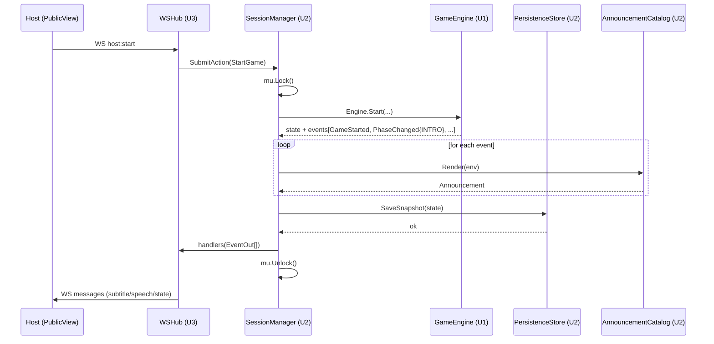

# Business Logic Model — U2 Session, Persistence & Announce

**작성일**: 2026-04-26
**문서 버전**: 1.0
**참조**: `domain-entities.md`, `business-rules.md`

본 문서는 SessionManager의 흐름(생성/입장/액션/Tick/스냅샷/복원/재연결), AnnouncementService 매핑, PersistenceStore 트랜잭션을 정의합니다.

---

## 1. 핵심 원칙 요약

| 원칙 | 적용 |
|---|---|
| 단일 GM 락 (Q-FD-U2-1=A) | 모든 SessionManager 공개 메서드가 `s.mu.Lock(); defer s.mu.Unlock()` |
| 동기 영속화 (Q-FD-U2-2=A) | 모든 PhaseChanged + 사망 이벤트 직후 SaveSnapshot 동기 호출 |
| 자동 복원 (Q-FD-U2-3=A) | 시작 시 `LoadActiveSnapshot` 발견 → Engine.Restore + Members 복원 |
| 토큰 식별 (Q-FD-U2-4=A) | JoinPlayer 시 32바이트 hex 토큰 발급. 단계 무관 ResumePlayer 허용 |
| 백그라운드 ticker (Q-FD-U2-5=A) | SessionManager가 1초 ticker 고루틴 보유. Close에서 graceful stop |

---

## 2. SessionManager 생성 (Composition Root에서 와이어링)

```
function NewSessionManager(persistence PersistenceStore, catalog AnnouncementCatalog,
                            engine game.Engine, opts SessionOpts) (SessionManager, error):

  s := &session{
    persistence: persistence,
    catalog:     catalog,
    engine:      engine,
    handlers:    nil,                    // Subscribe 등록자 목록
    stopCh:      make(chan struct{}),
  }

  // 자동 복원 (Q-FD-U2-3=A)
  if snap, found, err := persistence.LoadActiveSnapshot(ctx); err == nil && found:
    if err := engine.Restore(snap.State); err != nil:
      return nil, err
    s.session = Session{
      Engine:  engine,
      GameID:  snap.GameID,
      Members: indexMembers(snap.Members),
      HostID:  snap.HostID,
      Started: snap.State.Phase != PhaseLobby && snap.State.Phase != PhaseEnd,
    }

  // 백그라운드 ticker 기동
  go s.tickLoop()

  return s, nil
```

`SessionOpts`는 `TickInterval` (기본 1초), `EventLog` (events 테이블 기록 ON/OFF) 등 구성 옵션을 보유.

---

## 3. CreateSession 흐름 (호스트 신규 시작)

```
function CreateSession(ctx, hostName) (JoinResult, error):
  s.mu.Lock(); defer s.mu.Unlock()

  if s.session.Started:
    return error("game already in progress")

  if existingSnapshot := persistence.LoadActiveSnapshot; found:
    return error("active session exists; resume or end first")

  // 신규 호스트 생성
  hostID := newPlayerID()
  token := newToken()
  s.session = Session{
    GameID:  newGameID(),
    Members: {hostID: Member{ID: hostID, Name: hostName, Token: token, JoinedAt: now}},
    HostID:  hostID,
  }
  // LOBBY 단계는 Engine.Start 전이므로 state는 비어있음

  return JoinResult{PlayerID: hostID, Token: token, IsHost: true, CurrentState: emptyLobbyState()}
```

---

## 4. JoinPlayer 흐름 (LOBBY 단계만)

```
function JoinPlayer(ctx, name) (JoinResult, error):
  s.mu.Lock(); defer s.mu.Unlock()

  if s.session.Started:
    return error(WrongPhase, "joining requires LOBBY")
  if len(s.session.Members) >= 12:
    return error(Validation, "lobby is full (max 12)")
  if existsName(s.session.Members, name):
    return error(Validation, "name already taken")

  pid := newPlayerID()
  tok := newToken()
  s.session.Members[pid] = Member{ID: pid, Name: name, Token: tok, Connected: true, JoinedAt: now}

  return JoinResult{PlayerID: pid, Token: tok, IsHost: false, CurrentState: lobbyState()}
```

> 본 메서드는 사용자 변경(Members 추가)만 일으키고 Engine 상태는 변경하지 않으므로 SaveSnapshot 호출하지 않음 (LOBBY는 영속화 대상 아님 — 호스트가 게임을 시작해야 active_snapshot 발생).

---

## 5. ResumePlayer 흐름 (재연결, 단계 무관)

```
function ResumePlayer(ctx, token) (JoinResult, error):
  s.mu.Lock(); defer s.mu.Unlock()

  member := findMemberByToken(s.session.Members, token)
  if member == nil:
    return error(UnknownPlayer, "invalid token")

  member.Connected = true
  view := buildPrivateView(s.engine.Snapshot(), member.ID, s.session)
  return JoinResult{PlayerID: member.ID, Token: token, IsHost: member.ID == s.HostID, CurrentState: view.State}
```

> 토큰은 게임 1판 동안 불변. 게임 종료 후 새 LOBBY로 진입 시 재발급.

---

## 6. StartGame 흐름

```
function StartGame(ctx, hostID, opts) error:
  s.mu.Lock(); defer s.mu.Unlock()

  if hostID != s.session.HostID:
    return ErrPermissionDenied
  if s.session.Started:
    return ErrWrongPhase

  players := buildPlayerSlice(s.session.Members)  // []game.Player (Alive=true, Role/Keyword 빈값)
  state, envs, err := s.engine.Start(s.session.GameID, hostID, players, opts)
  if err != nil:
    return err

  s.session.Started = true

  // 동기 영속화 + 이벤트 디스패치
  s.persistAndDispatch(state, envs)
  return nil
```

---

## 7. SubmitAction 흐름

```
function SubmitAction(ctx, action) ([]EventOut, error):
  s.mu.Lock(); defer s.mu.Unlock()

  if !s.session.Started:
    return nil, ErrWrongPhase

  state, envs, err := s.engine.Apply(action)
  if err != nil:
    // 에러 시에도 안내 이벤트 한 건 발행 (호출자에게 표시 가능하도록)
    return []EventOut{ {Envelope: nil, Announcement: catalog.RenderError(err, sender(action))} }, err

  return s.persistAndDispatch(state, envs), nil
```

### persistAndDispatch (핵심 보조 함수)

```
function persistAndDispatch(state State, envs []EventEnvelope) []EventOut:
  // 1) 영속화 트리거 결정 (Q-FD-U2-2=A)
  shouldPersist := false
  for env in envs:
    switch env.Event.(type):
      case PhaseChanged, DeathAnnounced, Eliminated, GameEnded, MafiaRepresentativeReassigned:
        shouldPersist = true

  // 2) 카탈로그 매핑
  outs := make([]EventOut, 0, len(envs))
  for env in envs:
    ann := catalog.Render(env)
    outs = append(outs, EventOut{Envelope: env, Announcement: ann})

  // 3) 영속화
  if shouldPersist:
    snap := Snapshot{
      GameID:  s.session.GameID,
      State:   state,
      Members: membersSlice(s.session.Members),
      HostID:  s.session.HostID,
    }
    persistence.SaveSnapshot(ctx, snap)  // 동기

    // GameEnded → 결과 누적 + active_snapshot 삭제
    for env in envs:
      if g, ok := env.Event.(GameEnded); ok:
        result := buildGameResult(s.session, g)
        persistence.SaveResult(ctx, result)
        persistence.DeleteActiveSnapshot(ctx)
        s.session.Started = false   // 다음 LOBBY 진입 가능

  // 4) Subscribe 핸들러 호출 (WSHub 등)
  for handler in s.handlers:
    for out in outs:
      handler(out)   // 락 내부 호출 — 핸들러는 빠르게 반환해야 함

  return outs
```

---

## 8. Tick 흐름

```
function tickLoop():
  ticker := time.NewTicker(1 * time.Second)
  defer ticker.Stop()
  for:
    select:
      case <-stopCh: return
      case now := <-ticker.C:
        s.Tick(now)

function Tick(now time.Time):
  s.mu.Lock(); defer s.mu.Unlock()
  if !s.session.Started:
    return
  state, envs, err := s.engine.Tick(now)
  if err != nil:
    log.Error(err)
    return
  if len(envs) == 0:
    return
  s.persistAndDispatch(state, envs)
```

---

## 9. Close 흐름 (graceful shutdown)

```
function Close(ctx) error:
  close(s.stopCh)         // 백그라운드 ticker 정지 신호
  s.mu.Lock(); defer s.mu.Unlock()

  if s.session.Started:
    snap := Snapshot{...}
    persistence.SaveSnapshot(ctx, snap)   // 마지막 동기 저장

  return persistence.Close()
```

> SIGINT/SIGTERM에서 Composition Root가 Close를 호출. 마지막 스냅샷 안전 보장.

---

## 10. AnnouncementService — 카탈로그 매핑

```
type defaultCatalog struct{}

func (defaultCatalog) Render(env game.EventEnvelope) Announcement:
  switch e := env.Event.(type):
  case GameStarted:
    return Announcement{Subtitle: "마피아 게임이 시작됩니다…", Severity: EMPHASIS, ForPublicOnly: true}
  case PhaseChanged:
    switch e.Phase:
      case PhaseIntro:    return ann("각자 차례대로 자기소개를 진행하시오. 한 사람당 {n}초가 주어집니다.", ...)
      case PhaseNight:    return ann("이제 밤이 깊어졌습니다. 모두 눈을 감으시오.", EMPHASIS)
      case PhaseDay:      return ann("{day}일째 아침이 밝았습니다. 마을은 어떤 운명을 맞이했는가.", EMPHASIS)
      case PhaseVote:     return ann("토론은 끝났습니다. 이제 의심스러운 자에게 표를 던지시오.", EMPHASIS)
      case PhaseRecount:  return ann("결과가 같습니다. 마지막 한 번 더, 신중히 선택하시오.", WARN)
  case IntroSpeakerChanged: return ann("{name}, 발언하시오.", INFO)
  case DeathAnnounced:    return ann("{victim}이(가) 새벽에 발견되었습니다. 마을의 슬픔이 깊어집니다.", EMPHASIS)
  case PeacefulNight:     return ann("어젯밤은 평온하였습니다. 누구도 사라지지 않았습니다.", INFO)
  case Eliminated:        return ann("{name}이(가) 마을의 결정으로 처형되었습니다. 그의 정체는 {role_kr}이었습니다.", EMPHASIS)
  case DiscussionTimerTick:
    switch e.SecondsLeft:
      case 30: return ann("토론 종료까지 30초 남았습니다.", INFO)
      case 10: return ann("토론 종료까지 10초 남았습니다. 마음을 정하시오.", WARN)
      case 0:  return ann("토론이 종료되었습니다.", INFO)
  case VoteTallied:
    if e.Recount: return ann("득표가 동률입니다. 재투표를 진행합니다.", WARN)
    if e.Eliminated == nil: return ann("재투표 또한 동률이었습니다. 오늘은 처형이 없습니다.", INFO)
    return Announcement{}  // 무음 (Eliminated 이벤트가 별도로 옴)
  case GameEnded:
    switch e.EndReason:
      case EndMafiaWin:     return ann("마피아의 승리. 어둠이 마을을 삼켰습니다.", EMPHASIS)
      case EndCitizenWin:   return ann("시민의 승리. 정의가 어둠을 몰아냈습니다.", EMPHASIS)
      case EndHostForceEnd: return ann("진행자의 결정으로 게임이 종료되었습니다.", INFO)
  case VoiceToggled:
    if e.On: return ann("음성 안내가 활성화되었습니다.", INFO)
    return ann("음성 안내가 비활성화되었습니다.", INFO)
  default:
    // 비공개 이벤트(RoleRevealedToPlayer, MafiaCohortRevealed, MafiaTargetSelected,
    // PoliceResult, MafiaRepresentativeReassigned)는 안내 없음
    return Announcement{}  // ForPublicOnly=false, Subtitle="" → 안내 미발행
```

### 변수 보간 헬퍼

```
function lookupName(s Session, pid PlayerID) string:
  if m, ok := s.Members[pid]; ok: return m.Name
  return string(pid)

function roleKr(r Role) string:
  switch r:
    case MAFIA: return "마피아"
    case DOCTOR: return "의사"
    case POLICE: return "경찰"
    case CITIZEN: return "시민"
```

> Render 함수는 Session 컨텍스트를 인자로 받아 `{name}`, `{victim}` 같은 보간을 수행. 카탈로그 인터페이스는 `Render(env, ctx CatalogContext)`로 확장될 수 있음 (코드 단계 정의).

---

## 11. PrivateView 빌더

```
function buildPrivateView(state State, viewer PlayerID, session Session) PrivateView:
  view := state.Clone()
  // 모든 Players의 Role/Keyword를 빈 문자열로 마스킹
  for i in view.Players:
    view.Players[i].Role = ""
    view.Players[i].Keyword = ""

  out := PrivateView{State: view, IsHost: viewer == session.HostID}

  // 본인 정보 채우기
  if me, ok := state.FindPlayer(viewer):
    out.YourRole = me.Role
    out.YourKeyword = me.Keyword
    out.YourTeam = TeamOf(me.Role)
    if me.Role == MAFIA:
      // 마피아 동맹 식별: 마피아끼리는 다른 마피아의 Role를 알 수 있음
      cohort := []
      for _, p in state.Players:
        if p.Role == MAFIA:
          cohort = append(cohort, p.ID)
          // 같은 인덱스 view.Players의 Role을 다시 노출
          for j in view.Players:
            if view.Players[j].ID == p.ID:
              view.Players[j].Role = MAFIA
      out.MafiaCohort = cohort

  // 게임 종료 후엔 Reveal 정책 적용 (모든 플레이어 역할 공개)
  if state.Phase == PhaseEnd:
    for i, p in state.Players:
      view.Players[i].Role = p.Role

  return out
```

> 공용 화면(PublicView) 송신 시에는 viewer = "" (특수값)로 호출 → 본인 정보 미노출, 모든 마스킹 적용.

---

## 12. PersistenceStore 트랜잭션 패턴

### SaveSnapshot

```sql
BEGIN;
  INSERT OR REPLACE INTO active_snapshot (id, game_id, state_json, member_json, host_id, updated_at)
  VALUES (1, ?, ?, ?, ?, CURRENT_TIMESTAMP);
COMMIT;
```

### LoadActiveSnapshot

```sql
SELECT game_id, state_json, member_json, host_id FROM active_snapshot WHERE id = 1;
```

### SaveResult + DeleteActiveSnapshot (게임 종료)

```sql
BEGIN;
  INSERT INTO game_results (game_id, started_at, ended_at, winner, end_reason, options_json, members_json, reveal_json)
  VALUES (?, ?, ?, ?, ?, ?, ?, ?);
  DELETE FROM active_snapshot WHERE id = 1;
COMMIT;
```

### ListResults (FR-6.3)

```sql
SELECT game_id, started_at, ended_at, winner, end_reason, options_json, members_json, reveal_json
FROM game_results
ORDER BY ended_at DESC
LIMIT ?;
```

### AppendEvent (선택, EventLog ON 시)

```sql
INSERT INTO events (game_id, event_type, visibility, recipient_id, payload_json)
VALUES (?, ?, ?, ?, ?);
```

---

## 13. Restore 시퀀스 (복원 흐름)

```
function bootRestore(persistence, engine):
  snap, found, err := persistence.LoadActiveSnapshot(ctx)
  if err != nil: log.Fatal(err)
  if !found: return  // 새 LOBBY로 시작

  if err := engine.Restore(snap.State); err != nil:
    log.Error("restore failed, archiving snapshot:", err)
    persistence.archiveCorrupt(snap)  // 안전을 위해 별도 보관
    return

  session.Members = indexMembers(snap.Members)
  session.GameID = snap.GameID
  session.HostID = snap.HostID
  session.Started = isActivePhase(snap.State.Phase)

  // 호스트 화면에 "복원됨" 토스트 트리거 (U3가 호스트 클라이언트에 전달)
  emitSystemAnnouncement("이전 게임이 복원되었습니다. 같은 단계부터 이어집니다.")
```

---

## 14. 시퀀스 다이어그램 — 시나리오 1 (게임 시작)



---

## 15. 검증 체크리스트

- [x] 단일 GM 락 모든 공개 메서드에 적용 (§3~§9)
- [x] 동기 영속화 트리거 명확 (PhaseChanged + 사망 이벤트 — §7)
- [x] 자동 복원 시퀀스 (§13)
- [x] 토큰 발급/검증 (§4, §5, ResumePlayer)
- [x] 백그라운드 ticker 흐름 (§8) + Close graceful stop (§9)
- [x] AnnouncementCatalog 매핑 (§10) + 변수 보간 헬퍼
- [x] PrivateView 마스킹 빌더 (§11)
- [x] SQLite 트랜잭션 SQL 구체화 (§12)
- [x] 시나리오 1 시퀀스 다이어그램 (§14)
