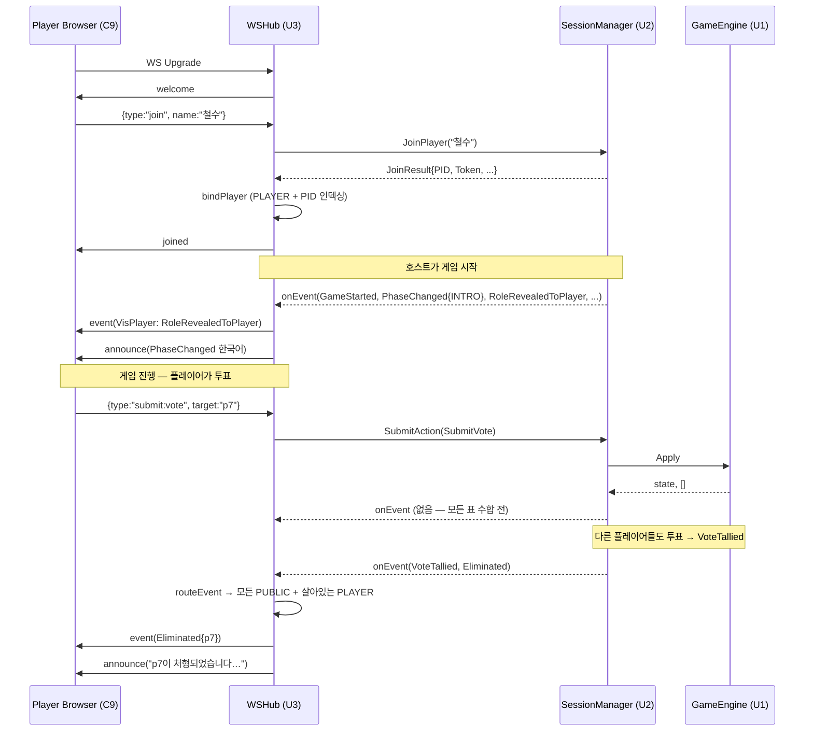
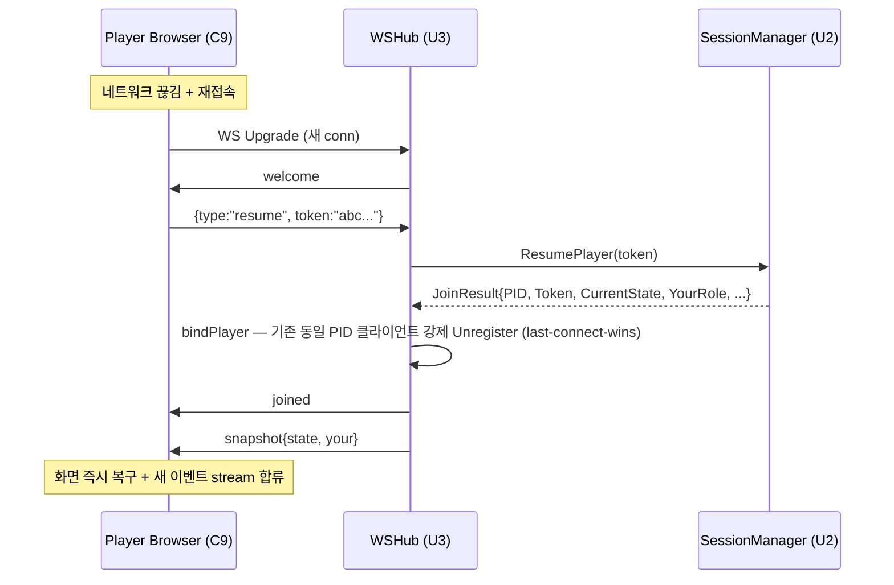

# Business Logic Model — U3 Realtime Transport

**작성일**: 2026-04-26
**문서 버전**: 1.0
**참조**: `domain-entities.md`, `business-rules.md`

본 문서는 Hub의 흐름(연결 등록, 메시지 read/write goroutine, SessionManager Subscribe 통합, 가시성 라우팅, ping/pong)을 정의합니다.

---

## 1. 핵심 원칙 요약

| 원칙 | 적용 |
|---|---|
| Subscribe 핸들러는 락 안에서 호출 (U2 BR-U2-LOCK-4) | 핸들러는 즉시 클라이언트 채널에 enqueue 후 반환. 동기 WS write 금지. |
| 클라이언트당 read goroutine 1 + write goroutine 1 | 표준 gorilla/websocket 패턴. write goroutine만 실제 conn write. |
| 가시성 라우팅 (Q-FD-U3-4=A) | U1 §8 가시성 표 그대로 — `VisPublic` → 모든 PUBLIC + 살아있는 PLAYER, `VisPlayer` → 대상 1인, `VisRoleMafia` → 살아있는 마피아 모두 |
| 송신 채널 백프레셔 (Q-FD-U3-7=A) | 채널 가득 → 해당 클라이언트 disconnect (Hub는 영향 없음) |
| 입력 디스패치 (Q-FD-U3-11=A) | Hub가 `type` → `game.Action` 매핑. 권한 체크는 SessionManager 단독 (Q-FD-U3-12=B) |

---

## 2. Hub 생성 (Composition Root에서 와이어링)

```
function New(upgrader, mgr, log) Hub:
  h := &hub{
    upgrader:  upgrader,
    mgr:       mgr,
    log:       log,
    registry:  newClientRegistry(),
    runDoneCh: make(chan struct{}),
  }

  // SessionManager 이벤트 구독 (Q-FD-U3-10=A)
  h.unsubscribe = mgr.Subscribe(h.onEvent)

  return h
```

`onEvent`는 SessionManager 락 안에서 호출되므로 매우 빠르게 반환해야 함. 실제 직렬화·송신은 write goroutine으로 위임.

---

## 3. Register 흐름 (HTTP 핸들러가 호출)

```
function Register(conn *websocket.Conn) (ClientID, error):
  client := &Client{
    ID:       newClientID(),     // 8-byte hex
    Kind:     PUBLIC,            // 초기값 — 첫 메시지에 따라 변경 가능
    Conn:     conn,
    Out:      make(chan []byte, 16),
    JoinedAt: time.Now(),
  }
  registry.add(client)

  // Read goroutine: 클라이언트 메시지 수신 + 핸드셰이크/입력 디스패치
  go h.readLoop(client)

  // Write goroutine: Out 채널 → conn write
  go h.writeLoop(client)

  // welcome 메시지 송신
  client.Out <- mustMarshal(WelcomeMsg{Type: "welcome", ClientID: client.ID, Kind: "PUBLIC", ProtocolVersion: "v1"})

  return client.ID, nil
```

> Kind는 PUBLIC으로 기본 시작 → 클라이언트가 `join`/`resume`을 보내면 PLAYER로 전환 + PlayerID 채워짐.

---

## 4. Read Goroutine (per-client)

```
function readLoop(c *Client):
  defer h.Unregister(c.ID)

  c.Conn.SetReadDeadline(time.Now().Add(30 * time.Second))  // Q-FD-U3-8=A
  c.Conn.SetPongHandler(func(string) error {
    c.LastPongAt = time.Now()
    c.Conn.SetReadDeadline(time.Now().Add(30 * time.Second))
    return nil
  })

  for:
    _, raw, err := c.Conn.ReadMessage()
    if err != nil:
      log.Debug("readLoop end", "client", c.ID, "err", err)
      return

    var env incomingEnvelope
    if err := json.Unmarshal(raw, &env); err != nil:
      sendError(c, "VALIDATION_ERROR", "invalid message")
      continue

    log.Debug("incoming", "client", c.ID, "type", env.Type)  // Q-FD-U3-14=A: type만
    h.handleIncoming(c, env)
```

---

## 5. handleIncoming — 메시지 라우팅

```
function handleIncoming(c *Client, env incomingEnvelope):
  switch env.Type:
    case "host:create-session":
      var p HostCreateSessionPayload
      json.Unmarshal(env.Raw, &p)
      jr, err := h.mgr.CreateSession(ctx, p.Name)
      if err != nil:
        sendError(c, errorCode(err), err.Error())
        return
      h.bindPlayer(c, jr)
      c.Out <- mustMarshal(JoinedMsg{Type: "joined", PlayerID: jr.PlayerID, Token: jr.Token, IsHost: true})

    case "join":
      var p JoinPayload
      json.Unmarshal(env.Raw, &p)
      jr, err := h.mgr.JoinPlayer(ctx, p.Name)
      if err != nil:
        sendError(c, errorCode(err), err.Error())
        return
      h.bindPlayer(c, jr)
      c.Out <- mustMarshal(JoinedMsg{...})

    case "resume":
      var p ResumePayload
      json.Unmarshal(env.Raw, &p)
      jr, err := h.mgr.ResumePlayer(ctx, p.Token)
      if err != nil:
        sendError(c, errorCode(err), err.Error())
        return
      h.bindPlayer(c, jr)
      c.Out <- mustMarshal(JoinedMsg{...})
      // Q-FD-U3-15=A: snapshot 즉시 push
      c.Out <- mustMarshal(SnapshotMsg{Type: "snapshot", State: jr.CurrentState, Your: ..., IsHost: jr.IsHost})

    case "host:start":
      var p HostStartPayload
      json.Unmarshal(env.Raw, &p)
      _, err := h.mgr.StartGame(ctx, c.PlayerID, p.Options)
      if err != nil:
        sendError(c, errorCode(err), err.Error())

    case "submit:advance-intro":
      _, err := h.mgr.SubmitAction(ctx, game.AdvanceIntro{HostID: c.PlayerID})
      if err != nil: sendError(c, ...)

    case "submit:mafia-kill":
      var p TargetPayload
      json.Unmarshal(env.Raw, &p)
      _, err := h.mgr.SubmitAction(ctx, game.SubmitMafiaKill{Mafia: c.PlayerID, Target: p.Target})
      if err != nil: sendError(c, ...)

    // ... (나머지 submit:doctor-heal, submit:police-check, submit:vote 등 동일 패턴)

    case "host:force-end":
      _, err := h.mgr.SubmitAction(ctx, game.ForceEndGame{HostID: c.PlayerID})
      if err != nil: sendError(c, ...)

    case "subscribe-public":
      // 이미 PUBLIC으로 등록됨 — no-op (확장 지점)

    default:
      sendError(c, "VALIDATION_ERROR", "unknown message type: " + env.Type)
```

### bindPlayer 보조 함수

```
function bindPlayer(c *Client, jr session.JoinResult):
  // 같은 PlayerID의 기존 클라이언트는 강제 종료 (Q-FD-U3-9=A)
  if existing := h.registry.byPlayerID(jr.PlayerID); existing != nil && existing.ID != c.ID:
    h.Unregister(existing.ID)

  c.Kind = PLAYER
  c.PlayerID = jr.PlayerID
  h.registry.indexPlayer(c)
```

---

## 6. Write Goroutine (per-client)

```
function writeLoop(c *Client):
  pingTicker := time.NewTicker(25 * time.Second)  // Q-FD-U3-8=A
  defer:
    pingTicker.Stop()
    c.Conn.Close()

  for:
    select:
      case msg, ok := <-c.Out:
        if !ok: return
        c.Conn.SetWriteDeadline(time.Now().Add(10 * time.Second))
        if err := c.Conn.WriteMessage(TextMessage, msg); err != nil:
          return  // disconnection — readLoop가 곧 감지

      case <-pingTicker.C:
        c.Conn.SetWriteDeadline(time.Now().Add(10 * time.Second))
        if err := c.Conn.WriteMessage(PingMessage, nil); err != nil:
          return
```

> 모든 conn.WriteMessage 호출은 writeLoop에서만 발생 — gorilla/websocket의 single-writer 요구사항 충족.

---

## 7. SessionManager Subscribe 핸들러 — onEvent

```
function onEvent(out session.EventOut):
  // 1) 이벤트 envelope wire 메시지 빌드
  if out.Envelope.Event != nil:
    eventMsg := buildEventMsg(out.Envelope)
    targets := h.routeEvent(out.Envelope)
    for _, c := range targets:
      enqueue(c, eventMsg)  // 채널 풀 차면 disconnect

  // 2) 안내(announce) wire 메시지 빌드
  if out.Announcement != nil && !out.Announcement.IsEmpty():
    announceMsg := mustMarshal(AnnounceMsg{
      Type:     "announce",
      Subtitle: out.Announcement.Subtitle,
      Speech:   out.Announcement.Speech,
      Severity: string(out.Announcement.Severity),
    })
    if out.Announcement.ForPublicOnly:
      // Q-FD-U3-6=A: PUBLIC만
      for _, c := range h.registry.allPublic():
        enqueue(c, announceMsg)
    else:
      // 에러 안내 — 별도 처리 (송신자 한정, sendError 경로)
      // SubmitAction 응답 시 직접 전송됨, 이 경로로는 도달하지 않음
```

### routeEvent — 가시성 → 대상 클라이언트 (Q-FD-U3-4=A)

```
function routeEvent(env game.EventEnvelope) []*Client:
  switch env.Visibility:
    case VisPublic:
      // PUBLIC 모두 + 살아있는 PLAYER 모두 (Q-FD-U3-5=A: 사망자도 받음)
      out := h.registry.allPublic()
      out = append(out, h.registry.allPlayers()...)
      return out

    case VisPlayer:
      // 단일 PlayerID 대상
      if c := h.registry.byPlayerID(env.PlayerID); c != nil:
        return []*Client{c}
      return nil

    case VisRoleMafia:
      // 살아있는 마피아 모두 — Player의 Role 정보는 SessionManager state에서 조회
      state := h.mgr.SnapshotForRouting()  // 락 보호된 read-only Snapshot
      out := []*Client{}
      for _, p := range state.Players:
        if p.Alive && p.Role == game.RoleMafia:
          if c := h.registry.byPlayerID(p.ID); c != nil:
            out = append(out, c)
      return out
```

> ⚠️ `mgr.SnapshotForRouting()`는 U2가 노출해야 하는 추가 메서드. 현재 `SessionManager` 인터페이스에 없으므로 코드 단계에서 추가 필요.
> 대안: Hub가 자체 마지막 GameStarted/Eliminated 이벤트를 추적해 살아있는 마피아 ID를 캐시. 권장 결정: U2 인터페이스에 `Snapshot() game.State` 추가 (`engine.Snapshot()`을 락 안에서 한 번 호출, 마스킹 없이 반환). NFR-4 비공개는 Hub가 라우팅에만 사용하므로 위반 없음.

### enqueue 보조 함수 (백프레셔, Q-FD-U3-7=A)

```
function enqueue(c *Client, msg []byte):
  select:
    case c.Out <- msg:
      // ok
    default:
      // 채널 가득 — 느린 클라이언트, disconnect
      log.Warn("client send buffer full; disconnecting", "client", c.ID)
      go h.Unregister(c.ID)  // 재진입 회피를 위해 별도 고루틴
```

---

## 8. Unregister 흐름

```
function Unregister(id ClientID):
  c := registry.remove(id)
  if c == nil: return
  if c.Closed: return
  c.Closed = true

  close(c.Out)         // writeLoop를 깨워 종료
  c.Conn.Close()       // readLoop도 곧 종료
  log.Debug("unregister", "client", id, "kind", c.Kind, "playerId", c.PlayerID)
```

> close(c.Out)이 writeLoop에 종료 신호. close 후 enqueue 시도는 panic이지만 그 전에 registry.remove로 더 이상 enqueue 대상이 안 됨 — race 가능성 있음. 코드 단계에서 mu.Lock 보호 + Closed 플래그로 enqueue 가드.

---

## 9. Run / Close 라이프사이클

```
function Run(ctx context.Context) error:
  <-ctx.Done()
  return h.Close()

function Close() error:
  h.unsubscribe()       // SessionManager에서 핸들러 해제
  for _, c := range h.registry.all():
    h.Unregister(c.ID)
  close(h.runDoneCh)
  return nil
```

> Run은 사실상 ctx 대기 + Close 위임. HTTP 서버의 컨텍스트와 함께 묶어 운영.

---

## 10. SubmitAction 에러 처리 (Q-FD-U3-11=A)

```
function dispatchSubmit(c *Client, action game.Action):
  outs, err := h.mgr.SubmitAction(ctx, action)

  if err != nil:
    // outs[0]에 RenderError 결과 포함될 수 있음 (U2 SubmitAction 시그니처)
    if len(outs) > 0 && outs[0].Announcement != nil:
      ann := outs[0].Announcement
      sendError(c, "ENGINE", ann.Subtitle)
    else:
      sendError(c, errorCode(err), err.Error())
    return

  // 성공 — outs는 onEvent로 이미 push됨 (handler가 등록되어 있으므로)
```

> SubmitAction은 두 경로로 결과를 송신:
> 1. 정상 처리 → SessionManager가 Subscribe 핸들러를 호출 → onEvent 라우팅 (모든 대상 클라이언트)
> 2. 에러 → SessionManager가 outs[0]에 에러 안내를 담아 반환 → Hub가 송신자 c에게만 sendError 송신
>
> 결국 호출자(Hub)가 outs를 다시 처리하지 않음 — Subscribe 경로가 단일 진실 소스.

---

## 11. sendError 보조 함수

```
function sendError(c *Client, code string, message string):
  msg := mustMarshal(ErrorMsg{Type: "error", Code: code, Message: message})
  enqueue(c, msg)
```

---

## 12. 시퀀스 다이어그램 — 시나리오 1: PLAYER 가입 + 액션 + 사망



---

## 13. 시퀀스 다이어그램 — 시나리오 2: 재연결



---

## 14. 검증 체크리스트

- [x] 단일 GM 락 안에서 호출되는 onEvent는 채널 enqueue만 수행
- [x] Read/Write goroutine 분리 (gorilla single-writer)
- [x] 가시성 라우팅 3종 + 사망 PLAYER 포함
- [x] ForPublicOnly 안내 자동 필터
- [x] 백프레셔 disconnect — 다른 클라이언트 영향 없음
- [x] last-connect-wins (재연결 친화)
- [x] ping/pong 25/30초
- [x] resume 후 snapshot 즉시 push
- [x] 에러 응답은 송신자에게만
- [x] Hub 인터페이스 4 메서드 (Register/Unregister/Run/Close)
- [x] Composition Root 와이어링: Hub가 SessionManager.Subscribe 한 번 호출
