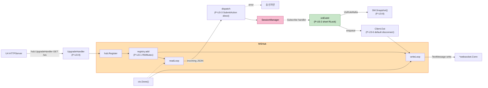

# NFR Design Patterns — U3 Realtime Transport

**작성일**: 2026-04-26
**문서 버전**: 1.0
**참조**: `nfr-requirements.md`, `tech-stack-decisions.md`, `functional-design/*.md`

---

## 1. 패턴 개요

| 패턴 ID | 패턴 | 적용 영역 | 주요 NFR | 출처 |
|---|---|---|---|---|
| P-U3-1 | ClientRegistry RWMutex (단일 락 + 두 인덱스 동기화) | 클라이언트 등록/해제/조회 | Concurrency, Reliability | Q-NFRD-U3-1=A |
| P-U3-2 | onEvent: 짧은 RLock + 즉시 enqueue (no I/O 안에서) | 가시성 라우팅 | Performance(P5<5ms) | Q-NFRD-U3-2=A |
| P-U3-3 | read goroutine이 SubmitAction을 직접 호출 + 에러 응답 송신 | 입력 디스패치 | Reliability + UX | Q-NFRD-U3-3=A |
| P-U3-4 | write goroutine ctx.Done() 종료 (chan close 미사용) | 종료 루프 | Concurrency 안전 | Q-NFRD-U3-4=C |
| P-U3-5 | onEvent panic recover | Hub 회복력 | Reliability(R5) | (FD §4) |
| P-U3-6 | 채널 default-branch enqueue (백프레셔 → disconnect) | 송신 큐 | Performance(P4) | FD BR-U3-QUEUE |
| P-U3-7 | last-connect-wins 강제 unregister | 재연결 | Reliability(R2) | Q-FD-U3-9=A |
| P-U3-8 | SessionManager.Snapshot()을 락 안에서 호출 — 마피아 라우팅 | VisRoleMafia | Security(S1) | Q-NFRD-U3-6=A |
| P-U3-9 | UpgradeHandler 메서드 노출 — U4와 캡슐화 경계 | 부트스트랩 | Maintainability | Q-NFRD-U3-7=A |
| P-U3-10 | net.Pipe + httptest in-memory 통합 테스트 | 검증 | Maintainability(M1) | Q-NFRD-U3-8=A |

---

## 2. 패턴 다이어그램



### 텍스트 대안

```
U4 → hub.UpgradeHandler → hub.Register → registry.add (RWMutex)
                                       ├─ readLoop  → handleIncoming → SubmitAction → SessionManager
                                       └─ writeLoop ← Out chan ← onEvent (Subscribe)
SessionManager 락 안에서 onEvent 실행
  → registry.RLock + 가시성에 따라 대상 조회
    (VisRoleMafia일 때 SM.Snapshot으로 마피아 ID 판별)
  → 각 Client.Out 채널에 select default-branch enqueue
    (가득 차면 해당 Client만 강제 disconnect)
ctx 취소 → writeLoop 종료 → conn close → readLoop 깨워 종료 → Unregister
```

---

## 3. 패턴 상세

### 3.1 P-U3-1 — ClientRegistry RWMutex (Q-NFRD-U3-1=A)

**의도**: byID + byPlayerID + publics 세 자료구조를 하나의 락으로 일관성 보장.

```go
type clientRegistry struct {
    mu         sync.RWMutex
    byID       map[ClientID]*Client
    byPlayerID map[game.PlayerID]*Client  // PLAYER만
    publics    map[ClientID]*Client       // PUBLIC만
}

func (r *clientRegistry) add(c *Client) {
    r.mu.Lock(); defer r.mu.Unlock()
    r.byID[c.ID] = c
    if c.Kind == ClientPublic {
        r.publics[c.ID] = c
    }
}

func (r *clientRegistry) bindPlayer(c *Client, pid game.PlayerID) (oldID ClientID, ok bool) {
    r.mu.Lock(); defer r.mu.Unlock()
    if existing, exists := r.byPlayerID[pid]; exists && existing.ID != c.ID {
        oldID, ok = existing.ID, true
    }
    delete(r.publics, c.ID)
    c.Kind = ClientPlayer
    c.PlayerID = pid
    r.byPlayerID[pid] = c
    return
}

func (r *clientRegistry) snapshotPublic() []*Client { /* RLock + slice copy */ }
func (r *clientRegistry) snapshotPlayers() []*Client { /* RLock + slice copy */ }
func (r *clientRegistry) byPlayerSafe(pid game.PlayerID) *Client { /* RLock */ }
```

**근거**: sync.Map은 두 인덱스 일관성을 자체 락 없이 보장하기 어려움. 단일 RWMutex가 가장 단순하고 정확.

### 3.2 P-U3-2 — 짧은 RLock onEvent (Q-NFRD-U3-2=A)

**의도**: SessionManager 락 안에서 호출되는 onEvent가 다른 Hub 작업을 차단하지 않도록 RLock을 짧게 유지.

```go
func (h *hub) onEvent(out session.EventOut) {
    targets := h.routeEvent(out.Envelope)  // RLock + slice copy + RUnlock
    msg := buildMessage(out)               // RLock 외부
    for _, c := range targets {
        h.enqueue(c, msg)                  // 채널 send만
    }
}
```

**근거**: SessionManager 락 → registry RLock 한 방향만 — 데드락 없음. registry → SessionManager 호출 경로 0.

### 3.3 P-U3-3 — SubmitAction 직접 호출 (Q-NFRD-U3-3=A)

**의도**: U2 SubmitAction 에러 시 `outs[0].Announcement`(announce.RenderError 결과)를 송신자에게 직접 push. 정상 경로의 push는 onEvent를 통해 모든 대상에 도달.

```go
func (h *hub) handleSubmit(c *Client, action game.Action) {
    outs, err := h.mgr.SubmitAction(ctx, action)
    if err != nil {
        // 한국어 안내 (있으면)
        if len(outs) > 0 && outs[0].Announcement != nil && !outs[0].Announcement.IsEmpty() {
            ann := outs[0].Announcement
            h.enqueue(c, mustMarshal(announceMsg{
                Type: "announce", Subtitle: ann.Subtitle, Speech: ann.Speech, Severity: string(ann.Severity),
            }))
        }
        // wire error
        h.enqueue(c, mustMarshal(errorMsg{
            Type: "error", Code: errorCodeOf(err), Message: err.Error(),
        }))
    }
    // 성공 → outs는 onEvent로 push됨, 여기선 무시
}
```

### 3.4 P-U3-4 — ctx.Done() 종료 (Q-NFRD-U3-4=C)

**의도**: `close(c.Out)`을 사용하면 enqueue race가 panic 위험. 대신 per-client cancel 함수 + ctx.Done() 패턴.

```go
type Client struct {
    // ...
    ctx    context.Context
    cancel context.CancelFunc
}

func (h *hub) writeLoop(c *Client) {
    defer c.Conn.Close()
    pingTicker := time.NewTicker(25 * time.Second)
    defer pingTicker.Stop()
    for {
        select {
        case <-c.ctx.Done():
            return
        case msg, ok := <-c.Out:
            if !ok { return }
            c.Conn.SetWriteDeadline(time.Now().Add(10 * time.Second))
            if err := c.Conn.WriteMessage(websocket.TextMessage, msg); err != nil { return }
        case <-pingTicker.C:
            c.Conn.SetWriteDeadline(time.Now().Add(10 * time.Second))
            if err := c.Conn.WriteMessage(websocket.PingMessage, nil); err != nil { return }
        }
    }
}

func (h *hub) Unregister(id ClientID) {
    c := h.registry.remove(id)
    if c == nil { return }
    c.cancel()      // ctx.Done() 발화 → writeLoop 종료
    c.Conn.Close()  // readLoop 종료 (ReadMessage err)
}
```

**enqueue는 ctx 확인 후 select**:

```go
func (h *hub) enqueue(c *Client, msg []byte) {
    select {
    case <-c.ctx.Done():
        return  // 이미 종료된 클라이언트, drop
    default:
    }
    select {
    case c.Out <- msg:
        // ok
    default:
        slog.Warn("client send buffer full; disconnecting", "client", c.ID)
        go h.Unregister(c.ID)
    }
}
```

**근거**: 채널 close 패턴은 close 후 send 시 panic. ctx.Done()은 멱등 + race-free.

### 3.5 P-U3-5 — onEvent panic recover

```go
func (h *hub) onEvent(out session.EventOut) {
    defer func() {
        if r := recover(); r != nil {
            slog.Error("onEvent panicked", "panic", r)
        }
    }()
    h.dispatchEvent(out)
}
```

**근거**: SessionManager 락 안에서 호출 — panic 전파 시 락 강제 해제 → 다음 호출 deadlock 위험. recover로 정상 unwind.

### 3.6 P-U3-6 — 채널 default-branch enqueue

이미 P-U3-4의 `enqueue`에 포함. 채널 가득 → disconnect.

### 3.7 P-U3-7 — last-connect-wins (Q-FD-U3-9=A)

```go
func (h *hub) bindPlayer(c *Client, jr session.JoinResult) {
    oldID, hadOld := h.registry.bindPlayer(c, jr.PlayerID)
    if hadOld {
        slog.Info("evicting prior client (last-connect-wins)", "old", oldID, "new", c.ID, "playerId", jr.PlayerID)
        h.Unregister(oldID)
    }
}
```

### 3.8 P-U3-8 — SessionManager.Snapshot for VisRoleMafia (Q-NFRD-U3-6=A)

**U2 인터페이스 확장 필요**:

```go
// 기존 SessionManager에 메서드 1개 추가:
type SessionManager interface {
    // ... 기존 메서드들 ...
    Snapshot() game.State  // 락 안에서 engine.Snapshot() 반환 (마스킹 없음)
}
```

**Hub의 routeEvent**:

```go
case game.VisRoleMafia:
    state := h.mgr.Snapshot()
    out := []*Client{}
    for _, p := range state.Players {
        if p.Alive && p.Role == game.RoleMafia {
            if c := h.registry.byPlayerSafe(p.ID); c != nil {
                out = append(out, c)
            }
        }
    }
    return out
```

**근거**: 단일 진실 소스 — Hub가 자체 캐시를 유지하면 동시성 위험·코드 복잡. Snapshot은 deep clone이므로 락 안에서 호출되어도 외부에서 mutation 안전.

### 3.9 P-U3-9 — UpgradeHandler 메서드 (Q-NFRD-U3-7=A)

```go
func (h *hub) UpgradeHandler() http.HandlerFunc {
    return func(w http.ResponseWriter, r *http.Request) {
        conn, err := h.upgrader.Upgrade(w, r, nil)
        if err != nil {
            slog.Warn("upgrade failed", "err", err)
            return
        }
        if _, err := h.Register(conn); err != nil {
            _ = conn.Close()
            return
        }
    }
}
```

**근거**: U4는 `mux.HandleFunc("/ws", hub.UpgradeHandler())` 한 줄로 끝. Upgrader 구현 세부는 U3 캡슐화.

### 3.10 P-U3-10 — net.Pipe 통합 테스트 (Q-NFRD-U3-8=A)

```go
// 헬퍼: 두 개의 *websocket.Conn (서버측 + 클라이언트측)을 in-memory로 페어링
func wsPair(t *testing.T, h Hub) (clientConn, serverConn *websocket.Conn) {
    server := httptest.NewServer(h.UpgradeHandler())
    t.Cleanup(server.Close)
    wsURL := "ws" + strings.TrimPrefix(server.URL, "http") + "/"
    conn, _, err := websocket.DefaultDialer.Dial(wsURL, nil)
    if err != nil { t.Fatal(err) }
    return conn, nil  // 서버측 conn은 Hub 내부 — 직접 접근 불필요
}
```

**근거**: 진짜 OS 소켓 사용 → CI flaky. httptest.NewServer + DefaultDialer는 표준 패턴 + race free.

---

## 4. NFR Req ↔ 패턴 매핑

| NFR Req | 만족시키는 패턴 |
|---|---|
| NFR-U3-R1 (끊김 감지) | FD ping/pong + writeLoop ctx.Done (P-U3-4) |
| NFR-U3-R2 (last-wins) | P-U3-7 |
| NFR-U3-R3 (snapshot push) | FD handleIncoming + JoinResult.CurrentState |
| NFR-U3-R4 (graceful shutdown) | P-U3-4 + Hub.Close (모든 cancel 호출) |
| NFR-U3-R5 (panic 격리) | P-U3-5 |
| NFR-U3-P1 (push 지연 < 200ms) | P-U3-2 (짧은 RLock) + P-U3-6 (정상 경로 대기 0) |
| NFR-U3-P2 (16 동접) | P-U3-1 (RWMutex 비경합) + P-U3-6 (느린 클라이언트 영향 격리) |
| NFR-U3-P5 (onEvent < 5ms) | P-U3-2 |
| NFR-U3-C1 (직렬화 위임) | P-U3-3 + P-U3-8 (자체 락 0) |
| NFR-U3-C2 (race-free) | P-U3-1 + P-U3-4 (chan close 미사용) |
| NFR-U3-C3 (single-writer) | P-U3-4 (writeLoop만 conn write) |
| NFR-U3-C4 (onEvent에서 conn write 금지) | P-U3-2 (enqueue만) |
| NFR-U3-S1 (비공개 라우팅) | P-U3-8 (Snapshot 단일 진실 소스) + P-U3-10 (검증 테스트) |
| NFR-U3-S3 (메시지 한도 64KiB) | gorilla `Conn.SetReadLimit` (FD readLoop 코드 단계) |
| NFR-U3-G2 (goroutine 누수 0) | P-U3-4 (ctx cancel로 명시 종료) |

---

## 5. 안티패턴 (의식적 회피)

- ❌ ClientRegistry에 sync.Map 사용 — 두 인덱스 일관성 보장 어려움
- ❌ onEvent 안에서 conn.WriteMessage 직접 호출 — single-writer 위반 + SessionManager 락 점유 시간 폭증
- ❌ close(c.Out)으로 writeLoop 종료 — enqueue race로 panic 가능
- ❌ Hub 자체 마피아 ID 캐시 — 동시성 + 일관성 위험
- ❌ 동기 WriteMessage in onEvent — NFR-U3-C4 위반 + LAN 지연 누적
- ❌ 모든 메시지 INFO 레벨 로그 — 토큰/역할 노출 (NFR-U3-S2 위반)
- ❌ 진짜 TCP 소켓 통합 테스트 — flaky + CI 시간 증가
- ❌ U2 SessionManager에 라우팅 책임 위임 — 단위 책임 경계 침범

---

## 6. 검증 체크리스트

- [x] 모든 NFR-U3-R/P/C/M/S/G 항목이 패턴으로 매핑됨 (§4)
- [x] 패턴마다 의도·코드 스니펫·근거 명시
- [x] 안티패턴 8종 명시 — 코드 리뷰 시 검증 항목
- [x] U2 SessionManager 인터페이스 확장(Snapshot) 명확히 식별 — Code Generation 단계 확정 사항
- [x] Mermaid 다이어그램 + 텍스트 대안 모두 포함
