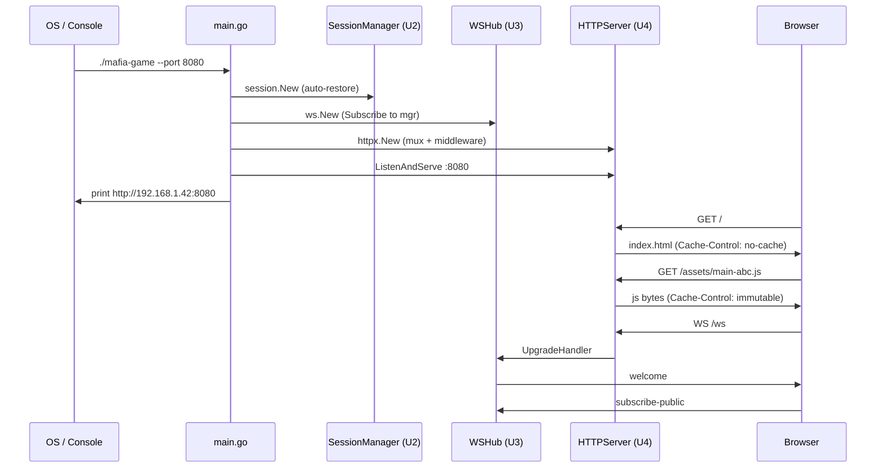
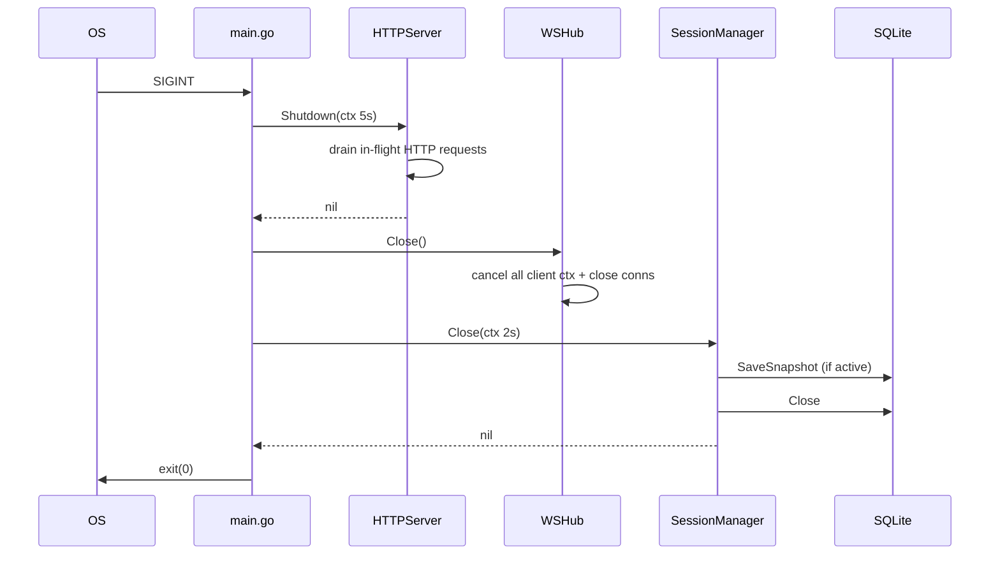

# Business Logic Model — U4 HTTP Bootstrap & Static

**작성일**: 2026-04-26
**문서 버전**: 1.0
**참조**: `domain-entities.md`, `business-rules.md`

본 문서는 main.go의 부팅 시퀀스, HTTP 핸들러 흐름(`/api/results`, SPA fallback, `/healthz`), graceful shutdown, LAN IP 출력을 정의합니다.

---

## 1. 핵심 원칙 요약

| 원칙 | 적용 |
|---|---|
| Composition Root는 main.go 단일 (Q-FD-U4-1~7=A) | 모든 단위(U1/U2/U3/persistence) 와이어링은 main.go에서만 |
| 표준 lib만 사용 (NFR-7) | net/http, embed, os, os/signal, flag, net |
| 표준 ServeMux 라우팅 (Q-FD-U4-1=A) | Go 1.22+ pattern matching |
| 정적 자산 embed (Q-FD-U4-2=A) | `//go:embed all:web/dist` |
| graceful shutdown 7초 budget (Q-FD-U4-9=A) | HTTP 5s + Hub.Close 즉시 + mgr 2s |

---

## 2. main.go 부팅 시퀀스

```
function main():
  // 1) CLI 플래그 + 환경변수 파싱
  flag.IntVar(&port, "port", envInt("MAFIA_PORT", 8080), "HTTP listen port")
  flag.StringVar(&dbPath, "db", envStr("MAFIA_DB_PATH", "./data/mafia.db"), "SQLite path")
  flag.StringVar(&logLevel, "log-level", envStr("MAFIA_LOG_LEVEL", "info"), "slog level")
  flag.Parse()

  // 2) slog 로거 초기화
  log := slog.New(slog.NewTextHandler(os.Stderr, &slog.HandlerOptions{Level: parseLevel(logLevel)}))
  slog.SetDefault(log)

  // 3) Persistence 오픈
  ctx := context.Background()
  store, err := persistence.OpenSqlite(ctx, dbPath)
  if err != nil { log.Error("OpenSqlite", "err", err); os.Exit(1) }

  // 4) Engine + Catalog
  engine := game.NewDefault(game.NewDefaultKeywordPool())
  catalog := announce.NewDefaultCatalog()

  // 5) SessionManager (자동 복원 포함)
  mgr, err := session.New(store, catalog, engine, nil, nil, session.SessionOpts{})
  if err != nil { log.Error("session.New", "err", err); os.Exit(1) }

  // 6) WSHub
  upgrader := websocket.Upgrader{
      CheckOrigin: func(r *http.Request) bool { return true },  // Q-FD-U4-11=A
  }
  hub := ws.New(upgrader, mgr, log)

  // 7) HTTPServer
  assets, _ := fs.Sub(webDist, "web/dist")
  srv, err := httpx.New(httpx.Config{
      Addr:   fmt.Sprintf("0.0.0.0:%d", port),
      Hub:    hub,
      Mgr:    mgr,
      Store:  store,
      Assets: assets,
      Logger: log,
  })
  if err != nil { log.Error("httpx.New", "err", err); os.Exit(1) }

  // 8) LAN IP 출력
  fmt.Printf("mafia-game listening on:\n")
  httpx.PrintLANAddresses(port)

  // 9) 시그널 핸들러 + ListenAndServe
  errCh := make(chan error, 1)
  go func() { errCh <- srv.ListenAndServe() }()

  sigCh := make(chan os.Signal, 1)
  signal.Notify(sigCh, syscall.SIGINT, syscall.SIGTERM)

  select:
    case err := <-errCh:
      if err != nil && !errors.Is(err, http.ErrServerClosed):
        log.Error("ListenAndServe", "err", err)
    case sig := <-sigCh:
      log.Info("signal received", "sig", sig)

  // 10) graceful shutdown (Q-FD-U4-9=A)
  shutdownCtx, cancel := context.WithTimeout(ctx, 7*time.Second)
  defer cancel()

  // ① HTTP — 5초
  httpCtx, httpCancel := context.WithTimeout(shutdownCtx, 5*time.Second)
  if err := srv.Shutdown(httpCtx); err != nil:
    log.Warn("http shutdown", "err", err)
  httpCancel()

  // ② Hub
  if err := hub.Close(); err != nil:
    log.Warn("hub close", "err", err)

  // ③ SessionManager — 2초
  mgrCtx, mgrCancel := context.WithTimeout(shutdownCtx, 2*time.Second)
  if err := mgr.Close(mgrCtx); err != nil:
    log.Warn("session close", "err", err)
  mgrCancel()

  log.Info("goodbye")
```

---

## 3. HTTP Server 생성 — `httpx.New`

```
function New(cfg Config) (Server, error):
  if cfg.Hub == nil || cfg.Mgr == nil || cfg.Store == nil || cfg.Assets == nil:
    return nil, errors.New("missing required config")

  log := cfg.Logger
  if log == nil:
    log = slog.Default()

  mux := http.NewServeMux()

  // /healthz
  mux.HandleFunc("GET /healthz", healthHandler)

  // /ws — Hub 위임
  mux.Handle("GET /ws", cfg.Hub.UpgradeHandler())

  // /api/results
  mux.Handle("GET /api/results", resultsHandler(cfg.Store, log))

  // /assets/* — 캐시 정책 적용 후 embed.FS
  mux.Handle("GET /assets/", assetsHandler(cfg.Assets))

  // SPA fallback — 모든 GET (위 패턴이 우선)
  mux.Handle("GET /", spaHandler(cfg.Assets))

  // Logging middleware
  handler := loggingMiddleware(log)(mux)

  s := &server{
    cfg: cfg,
    httpSrv: &http.Server{
      Addr:              cfg.Addr,
      Handler:           handler,
      ReadHeaderTimeout: 10 * time.Second,
      ReadTimeout:       30 * time.Second,
      WriteTimeout:      0,                  // WS 업그레이드 호환
      IdleTimeout:       60 * time.Second,
    },
    log: log,
  }
  return s, nil
```

---

## 4. /healthz 핸들러 (Q-FD-U4-5=A)

```
function healthHandler(w, r):
  w.Header().Set("Content-Type", "text/plain; charset=utf-8")
  w.WriteHeader(200)
  w.Write([]byte("ok"))
```

---

## 5. /api/results 핸들러 (Q-FD-U4-4=A)

```
function resultsHandler(store, log) http.HandlerFunc:
  return function(w, r):
    limit := 50
    if v := r.URL.Query().Get("limit"); v != "":
      n, err := strconv.Atoi(v)
      if err != nil || n < 1 || n > 500:
        http.Error(w, "invalid limit", 400)
        return
      limit = n

    results, err := store.ListResults(r.Context(), limit)
    if err != nil:
      log.Error("ListResults", "err", err)
      http.Error(w, "internal error", 500)
      return

    resp := resultsResponse{Results: make([]resultEntry, 0, len(results))}
    for _, r0 in results:
      var winner *string
      if r0.Winner != nil:
        s := string(*r0.Winner)
        winner = &s
      members := make([]memberEntry, 0, len(r0.Members))
      for _, m in r0.Members:
        members = append(members, memberEntry{
          ID: m.ID, Name: m.Name, JoinedAt: m.JoinedAt,
        })  // Token 의도적 누락 (NFR-4)
      resp.Results = append(resp.Results, resultEntry{
        GameID:    r0.GameID,
        StartedAt: r0.StartedAt,
        EndedAt:   r0.EndedAt,
        Winner:    winner,
        EndReason: string(r0.EndReason),
        Options:   r0.Options,
        Members:   members,
        Reveal:    r0.Reveal,
      })

    w.Header().Set("Content-Type", "application/json; charset=utf-8")
    w.Header().Set("Cache-Control", "no-store")
    json.NewEncoder(w).Encode(resp)
```

---

## 6. /assets/* 핸들러 (Q-FD-U4-12=A)

```
function assetsHandler(assets fs.FS) http.Handler:
  fileServer := http.FileServerFS(assets)  // Go 1.22+
  return http.HandlerFunc(function(w, r):
    // 강한 immutable 캐시 — Vite hash 파일명 가정
    w.Header().Set("Cache-Control", "public, max-age=31536000, immutable")
    fileServer.ServeHTTP(w, r)
  )
```

> 응답 데이터(`web/dist/assets/...`)는 표준 FileServerFS가 직접 스트림. MIME은 자동 판별.

---

## 7. SPA fallback 핸들러 (Q-FD-U4-3=B)

```
function spaHandler(assets fs.FS) http.Handler:
  return http.HandlerFunc(function(w, r):
    // /api/*, /ws, /healthz, /assets/*는 위에 등록되어 우선 매칭
    // 여기로 들어오는 모든 요청은 SPA index.html 반환

    f, err := assets.Open("index.html")
    if err != nil:
      http.Error(w, "frontend not built", 503)
      return
    defer f.Close()

    info, err := f.Stat()
    if err != nil:
      http.Error(w, "internal error", 500)
      return

    w.Header().Set("Content-Type", "text/html; charset=utf-8")
    w.Header().Set("Cache-Control", "no-cache")
    http.ServeContent(w, r, "index.html", info.ModTime(), f.(io.ReadSeeker))
  )
```

---

## 8. logging middleware (Q-FD-U4-13=A)

```
function loggingMiddleware(log) func(http.Handler) http.Handler:
  return function(next):
    return http.HandlerFunc(function(w, r):
      start := time.Now()
      rw := &statusRecorder{ResponseWriter: w, status: 200}
      next.ServeHTTP(rw, r)
      log.Info("http",
        "method", r.Method,
        "path", r.URL.Path,
        "status", rw.status,
        "duration_ms", time.Since(start).Milliseconds(),
      )
    )
```

> 페이로드(query param 값, body)는 기록하지 않음 — NFR-4 토큰/PII 보호.

---

## 9. PrintLANAddresses 흐름 (Q-FD-U4-8=A)

```
function PrintLANAddresses(port int):
  addrs, err := net.InterfaceAddrs()
  if err != nil:
    fmt.Printf("  (could not detect LAN: %v)\n", err)
    return

  found := 0
  for _, addr := range addrs:
    ipNet, ok := addr.(*net.IPNet)
    if !ok: continue
    ip := ipNet.IP.To4()
    if ip == nil: continue           // IPv6 제외
    if ip.IsLoopback(): continue     // 127/8 제외
    if !ip.IsPrivate(): continue     // RFC1918 only

    fmt.Printf("  http://%s:%d\n", ip.String(), port)
    found++

  if found == 0:
    fmt.Printf("  http://localhost:%d\n", port)
```

---

## 10. 시퀀스 다이어그램 — 시나리오 1: 부팅 + 첫 PUBLIC 클라이언트



---

## 11. 시퀀스 다이어그램 — 시나리오 2: graceful shutdown



---

## 12. 검증 체크리스트

- [x] main.go 10 단계 부팅 시퀀스
- [x] httpx.New가 ServeMux + 5 핸들러 등록
- [x] /api/results 페이로드에서 Token 의도적 제외 (NFR-4)
- [x] /assets/* immutable 캐시 vs index.html no-cache 정책
- [x] PrintLANAddresses RFC1918 IPv4 필터
- [x] graceful shutdown 3단계 시퀀스 (HTTP 5s → Hub → mgr 2s)
- [x] 표준 lib만 사용 (NFR-7)
- [x] 시퀀스 다이어그램 2종 (부팅, shutdown)
