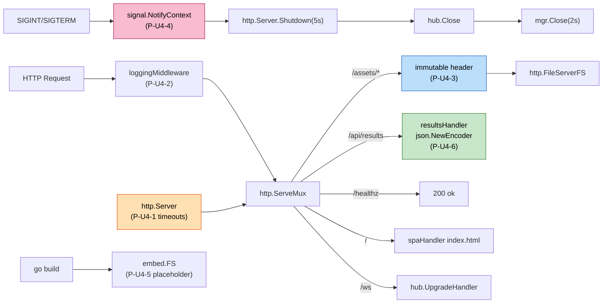

# NFR Design Patterns — U4 HTTP Bootstrap & Static

**작성일**: 2026-04-26
**문서 버전**: 1.0
**참조**: `nfr-requirements.md`, `tech-stack-decisions.md`, `functional-design/*.md`

---

## 1. 패턴 개요

| 패턴 ID | 패턴 | 적용 영역 | 주요 NFR |
|---|---|---|---|
| P-U4-1 | http.Server 타임아웃 (ReadHeader 10s, Read 30s, Write 0, Idle 60s) | http.Server 생성 | Reliability + WS 호환 |
| P-U4-2 | statusRecorder + logging middleware | 모든 HTTP 응답 | Maintainability(M2) |
| P-U4-3 | immutable Cache-Control on `/assets/*` | 정적 자산 미들웨어 | Performance(P2) |
| P-U4-4 | `signal.NotifyContext` 통합 종료 흐름 | main.go shutdown | Reliability(R1) |
| P-U4-5 | embed placeholder index.html | go build 보장 | Build(B3) |
| P-U4-6 | `json.NewEncoder(w).Encode` stream 인코딩 | /api/results | Performance(P1) |
| P-U4-7 | httptest.NewServer + ResponseRecorder 혼합 테스트 | 단위 테스트 | Maintainability(M1) |

---

## 2. 패턴 다이어그램



### 텍스트 대안

```
SIGINT/SIGTERM → signal.NotifyContext(ctx) → ctx.Done() →
  http.Server.Shutdown(5s) → hub.Close() → mgr.Close(2s) → exit

Request → loggingMiddleware(statusRecorder) → ServeMux →
  /assets/* (immutable cache) → FileServerFS
  /api/results → resultsHandler (json.NewEncoder stream)
  /healthz → 200 "ok"
  /ws → hub.UpgradeHandler
  / + SPA paths → spaHandler (index.html, no-cache)

go build → //go:embed all:web/dist (placeholder index.html ensures success)
```

---

## 3. 패턴 상세

### 3.1 P-U4-1 — http.Server 타임아웃 (Q-NFRD-U4-1=A)

```go
httpSrv := &http.Server{
    Addr:              cfg.Addr,
    Handler:           handler,
    ReadHeaderTimeout: 10 * time.Second,  // CWE-400 slowloris 방어
    ReadTimeout:       30 * time.Second,  // POST body 한도
    WriteTimeout:      0,                 // WS long-lived 호환 — 0=무제한
    IdleTimeout:       60 * time.Second,
}
```

**근거**: `WriteTimeout=0`은 일반 HTTP에는 위험하지만 WS 업그레이드 후 long-lived connection을 닫지 않기 위해 필요. 반면 `ReadHeaderTimeout=10s`는 slowloris 공격 방어.

### 3.2 P-U4-2 — logging middleware + statusRecorder (Q-NFRD-U4-2=A)

```go
type statusRecorder struct {
    http.ResponseWriter
    status int
}
func (r *statusRecorder) WriteHeader(code int) {
    r.status = code
    r.ResponseWriter.WriteHeader(code)
}

func loggingMiddleware(log *slog.Logger) func(http.Handler) http.Handler {
    return func(next http.Handler) http.Handler {
        return http.HandlerFunc(func(w http.ResponseWriter, r *http.Request) {
            start := time.Now()
            rec := &statusRecorder{ResponseWriter: w, status: http.StatusOK}
            next.ServeHTTP(rec, r)
            log.Info("http",
                "method", r.Method,
                "path", r.URL.Path,
                "status", rec.status,
                "duration_ms", time.Since(start).Milliseconds(),
            )
        })
    }
}
```

**근거**: 외부 lib 없이 표준 lib만 — NFR-U4-M4. 페이로드는 절대 미기록 — NFR-U4-S2.

### 3.3 P-U4-3 — immutable Cache-Control (Q-NFRD-U4-3=A)

```go
func assetsHandler(assets fs.FS) http.Handler {
    fileServer := http.FileServerFS(assets)
    return http.HandlerFunc(func(w http.ResponseWriter, r *http.Request) {
        w.Header().Set("Cache-Control", "public, max-age=31536000, immutable")
        fileServer.ServeHTTP(w, r)
    })
}
```

**근거**: Vite는 빌드 시 `main-{hash}.js` 형태로 fingerprint 파일명 생성 → immutable 안전. SPA index.html만 별도로 `no-cache` 설정.

### 3.4 P-U4-4 — signal.NotifyContext (Q-NFRD-U4-4=A)

```go
ctx, stop := signal.NotifyContext(context.Background(), os.Interrupt, syscall.SIGTERM)
defer stop()

go func() { errCh <- srv.ListenAndServe() }()

select {
case err := <-errCh:
    if err != nil && !errors.Is(err, http.ErrServerClosed) {
        log.Error("ListenAndServe", "err", err)
    }
case <-ctx.Done():
    log.Info("signal received")
}

// graceful shutdown
shutdownCtx, cancel := context.WithTimeout(context.Background(), 7*time.Second)
defer cancel()

httpCtx, _ := context.WithTimeout(shutdownCtx, 5*time.Second)
_ = srv.Shutdown(httpCtx)

_ = hub.Close()

mgrCtx, _ := context.WithTimeout(shutdownCtx, 2*time.Second)
_ = mgr.Close(mgrCtx)
```

**근거**: `signal.NotifyContext`(Go 1.16+)가 ctx + 시그널을 통합. 두 번째 시그널은 Go 표준 동작에 의해 즉시 프로세스 종료 (signal handler가 `stop()` 후 자동 해제됨).

### 3.5 P-U4-5 — embed placeholder (Q-NFRD-U4-5=A)

```go
//go:embed all:web/dist
var webDist embed.FS
```

**프로젝트 구조**:
```
web/dist/
├── index.html        # placeholder (commit) — npm run build이 덮어씀
└── (Vite 산출물 — gitignore)
```

**근거**: `//go:embed`는 빈 디렉터리를 거부함. placeholder를 1개 commit하면 항상 빌드 성공. Vite 빌드 후엔 정상 자산이 덮어씀. CI에서 `web/dist/index.html` 부재를 감지하면 빌드 자체 실패 → 명시적 에러로 누락 인지.

### 3.6 P-U4-6 — JSON stream encoding (Q-NFRD-U4-6=A)

```go
w.Header().Set("Content-Type", "application/json; charset=utf-8")
w.Header().Set("Cache-Control", "no-store")
if err := json.NewEncoder(w).Encode(resp); err != nil {
    log.Error("encode results", "err", err)
}
```

**근거**: `json.Marshal` + `w.Write`보다 메모리 적음. /api/results 같은 비교적 작은 응답에 차이는 미미하지만 일관성을 위해 stream encoding 사용.

### 3.7 P-U4-7 — 혼합 테스트 패턴 (Q-NFRD-U4-7=C)

**케이스별 전략**:

| 테스트 종류 | 패턴 |
|---|---|
| 단순 핸들러 (healthHandler) | `httptest.ResponseRecorder` + 직접 호출 |
| 라우팅 통합 (mux 등록 후 요청 흐름) | `httptest.NewServer` + `http.Get` |
| /api/results JSON 검증 | NewServer + 표준 client |
| graceful shutdown 시간 측정 | NewServer + Shutdown 호출 |

**Stub mock**: SessionManager / Hub / PersistenceStore는 패키지 내부에 stub 구현 (`testStore`, `testHub` 등).

```go
type testStore struct {
    persistence.PersistenceStore
    results []persistence.GameResult
}
func (s *testStore) ListResults(_ context.Context, _ int) ([]persistence.GameResult, error) {
    return s.results, nil
}
```

---

## 4. NFR Req ↔ 패턴 매핑

| NFR Req | 만족시키는 패턴 |
|---|---|
| NFR-U4-R1 (graceful shutdown) | P-U4-4 (NotifyContext) |
| NFR-U4-R3 (Shutdown 후 ErrServerClosed) | P-U4-1 (http.Server 표준) |
| NFR-U4-P1 (/api/results p99 < 50ms) | P-U4-6 (stream JSON) |
| NFR-U4-P2 (/assets p99 < 20ms) | P-U4-3 (immutable cache → 304 후속) |
| NFR-U4-M1 (커버리지 ≥ 85%) | P-U4-7 (혼합 테스트) |
| NFR-U4-M4 (외부 lib 0) | P-U4-2 (자체 statusRecorder) |
| NFR-U4-S2 (페이로드 미로그) | P-U4-2 (4필드만) |
| NFR-U4-B3 (placeholder 보장) | P-U4-5 |

---

## 5. 안티패턴 (의식적 회피)

- ❌ `WriteTimeout` 짧게 설정 — WS 업그레이드 끊어짐
- ❌ chi/mux 등 외부 라우터 도입 — NFR-U4-M4 위반
- ❌ Apache Combined Log — Query 값 기록 시 Token 노출
- ❌ embed에서 `web/dist`를 nil로 처리 — 런타임 503 빈도↑
- ❌ http.Server.Close (강제) — 요청 강제 단절, 데이터 손실
- ❌ 시그널 핸들러를 main 외부 패키지로 분리 — Composition Root 분산
- ❌ /api/results에 Token 필드 그대로 직렬화 — NFR-4 위반

---

## 6. 검증 체크리스트

- [x] 7개 패턴 모두 NFR Req에 매핑됨 (§4)
- [x] 안티패턴 7종 명시
- [x] 외부 lib 0 — 모든 패턴이 표준 lib로 구현
- [x] WS 업그레이드 호환 (WriteTimeout=0)
- [x] embed placeholder 정책 명확
