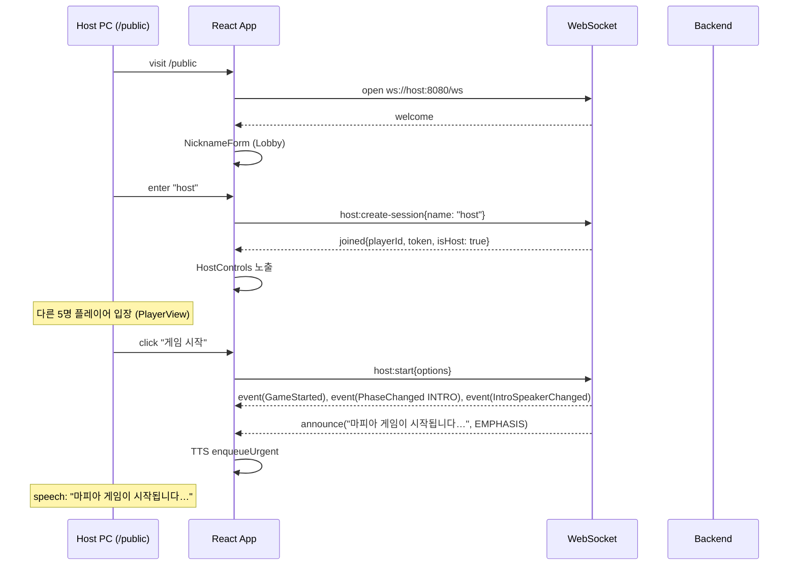
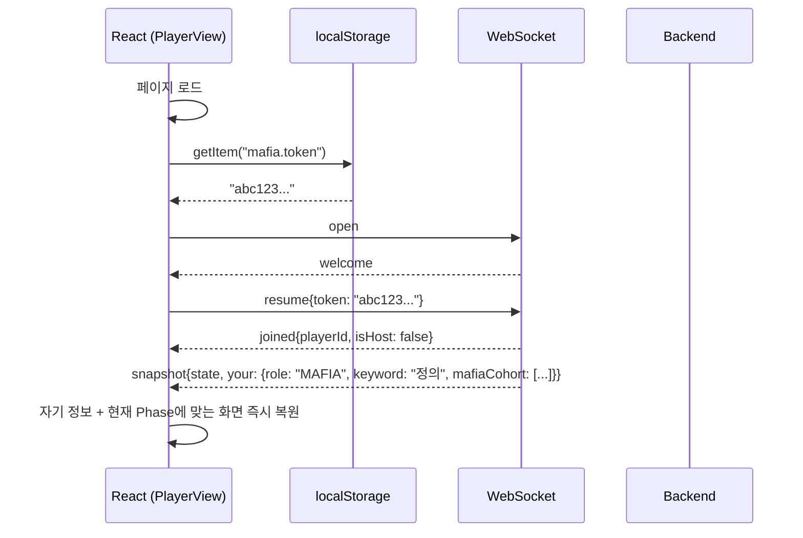

# Business Logic Model — U5 Web Frontend

**작성일**: 2026-04-26
**문서 버전**: 1.0
**참조**: `domain-entities.md`, `business-rules.md`

본 문서는 useWebSocket 훅, useTTSQueue 훅, 단계별 PlayerView 흐름, 호스트 컨트롤, 재연결 흐름을 정의합니다.

---

## 1. 핵심 원칙 요약

| 원칙 | 적용 |
|---|---|
| WebSocket 자동 재연결 + 지수 백오프 (Q-FD-U5-4=A) | 1s, 2s, 4s, 8s, 16s 상한 |
| 토큰 localStorage 영속 (Q-FD-U5-3=A) | resume 자동 호출 |
| TTS는 PublicView 한정 (FR-8.2) | PlayerView에서 발화 0 |
| announce 메시지의 ForPublicOnly 필터는 백엔드 책임 (BR-U3-VIS-4) | PlayerView로 도달하지 않음 |
| 단일 SPA, react-router-dom v6 (Q-FD-U5-1=A) | / → /play, /public, /play |

---

## 2. App 진입 시퀀스

```
function App():
  return (
    <GameProvider>
      <Router>
        <Routes>
          <Route path="/" element={<Navigate to="/play" />} />
          <Route path="/public" element={<PublicView />} />
          <Route path="/play" element={<PlayerView />} />
        </Routes>
      </Router>
    </GameProvider>
  )
```

`<GameProvider>`는 useReducer 초기 state + useWebSocket 훅 + useTTSQueue 훅 와이어링.

---

## 3. useWebSocket 훅 (재연결 포함)

```
hook useWebSocket({ url, onMessage, onOpen, onClose }):
  ref state: ws WebSocket | null, attempt 0, closed false

  function connect():
    ws = new WebSocket(url)

    ws.onopen = () => {
      attempt = 0
      onOpen()
      // 토큰이 있으면 자동 resume
      const token = localStorage.getItem("mafia.token")
      if (token):
        ws.send(JSON.stringify({type: "resume", token}))
    }

    ws.onmessage = (ev) => {
      try { onMessage(JSON.parse(ev.data)) }
      catch (e) { console.error("invalid wire msg", e) }
    }

    ws.onclose = () => {
      onClose()
      if (closed) return
      // 지수 백오프
      const delay = min(1000 * 2^attempt, 16000)
      attempt++
      setTimeout(connect, delay)
    }

    ws.onerror = (e) => console.warn("ws error", e)

  effect on mount: connect()
  effect on unmount: closed = true; ws?.close()

  return { send: (msg) => ws?.send(JSON.stringify(msg)) }
```

### 3.1 send 보장
- `ws === null || readyState !== OPEN` 일 때 send는 silent drop. 재연결 후 토큰으로 resume → snapshot 자동 수신.
- 사용자 액션 송신 실패는 `errors[]`에 enqueue 안 함 (사용자가 다시 클릭).

---

## 4. useTTSQueue 훅 (Q-FD-U5-5=A)

```
hook useTTSQueue(enabled):
  ref state: queue [], speaking false, available !!window.speechSynthesis

  function speak(text, opts):
    if (!available || !enabled) return
    const utt = new SpeechSynthesisUtterance(text)
    utt.lang = opts.lang ?? "ko-KR"
    utt.pitch = opts.pitch ?? 0.9
    utt.rate = opts.rate ?? 0.95
    utt.voice = pickKoreanVoice()
    utt.onend = () => { speaking = false; processQueue() }
    speaking = true
    window.speechSynthesis.speak(utt)

  function processQueue():
    if (speaking || queue.length === 0) return
    const next = queue.shift()
    speak(next.text, next.opts)

  function enqueue(text, opts):
    if (!enabled) return
    queue.push({text, opts})
    processQueue()

  function enqueueUrgent(text, opts):
    if (!enabled) return
    cancelAll()       // 즉시 인터럽트
    queue.length = 0
    speak(text, opts)

  function cancelAll():
    queue.length = 0
    if (available) window.speechSynthesis.cancel()
    speaking = false

  function pickKoreanVoice():
    const voices = window.speechSynthesis.getVoices()
    return voices.find(v => v.lang.startsWith("ko")) ?? null

  return { enqueue, enqueueUrgent, cancelAll, available }
```

### 4.1 dispatchAnnounce — Reducer가 호출

```
function dispatchAnnounce(msg, eventKind, queue):
  if isUrgent(eventKind):
    queue.enqueueUrgent(msg.speech, severityToOpts(msg.severity))
  else:
    queue.enqueue(msg.speech, severityToOpts(msg.severity))

function isUrgent(kind):
  return kind in {"PhaseChanged", "Eliminated", "DeathAnnounced", "GameEnded"}

function severityToOpts(sev):
  if sev === "EMPHASIS": return {pitch: 0.85, rate: 0.9}
  if sev === "WARN":     return {pitch: 0.95, rate: 1.0}
  return {pitch: 0.9, rate: 0.95}  // INFO
```

---

## 5. GameProvider — Reducer 의사 코드

```
function gameReducer(state, action):
  switch action.type:
    case "ws_open":
      return {...state, status: "connected", clientId: action.clientId}

    case "ws_message":
      const m = action.msg
      switch m.type:
        case "welcome":
          return {...state, clientId: m.clientId}
        case "joined":
          localStorage.setItem("mafia.token", m.token)
          return {...state, playerId: m.playerId, token: m.token, isHost: m.isHost}
        case "snapshot":
          return {...state, state: m.state, your: m.your, isHost: m.isHost}
        case "event":
          return applyEvent(state, m)
        case "announce":
          // 사이드 이펙트는 effect로 — pure reducer는 lastAnnounce만 갱신
          return {...state, lastAnnounce: {subtitle: m.subtitle, severity: m.severity, receivedAt: Date.now()}}
        case "error":
          return {...state, errors: [...state.errors, {code: m.code, message: m.message}]}

    case "ws_reconnecting":
      return {...state, status: "reconnecting"}

    case "ws_closed":
      return {...state, status: "closed"}

    case "set_voice":
      return {...state, voiceOn: action.on}

    case "tts_unavailable":
      return {...state, ttsAvailable: false}

    case "ack_error":
      const next = [...state.errors]
      next.splice(action.index, 1)
      return {...state, errors: next}
```

### 5.1 applyEvent (event kind별 부분 갱신)

```
function applyEvent(state, m):
  const ev = m.event
  switch ev.kind:
    case "GameStarted":
      // state.state는 이미 snapshot으로 받음 — 여기선 noop
      return state
    case "PhaseChanged":
      if !state.state: return state
      return {...state, state: {...state.state, phase: ev.phase, day: ev.day, deadline: msToISO(ev.deadlineMs)}}
    case "DeathAnnounced":
      if !state.state: return state
      const players = state.state.players.map(p =>
        p.id === ev.victim ? {...p, alive: false} : p)
      return {...state, state: {...state.state, players}}
    case "Eliminated":
      // 비슷 — players[victim].alive = false
      return updateAlive(state, ev.playerId, false, ev.role)
    case "RoleRevealedToPlayer":
      // 자기 정보 갱신 (PlayerView)
      return {...state, your: {...state.your, role: ev.role, keyword: ev.keyword, team: teamOf(ev.role)}}
    case "MafiaCohortRevealed":
      return {...state, your: {...state.your, mafiaCohort: ev.mafiaIds}}
    case "MafiaTargetSelected":
      // 마피아 viewer만 수신 — pendingMafiaTarget 갱신
      if !state.state: return state
      return {...state, state: {...state.state, pendingMafiaTarget: ev.target}}
    case "PoliceResult":
      // 경찰 viewer — your 화면에 표시할 추가 정보 (lastPoliceResult 같은 필드)
      return {...state, lastPoliceResult: {target: ev.target, team: ev.team}}
    case "GameEnded":
      return {...state, state: {...state.state, phase: "END", winner: ev.winner, endReason: ev.endReason, players: ev.reveal}}
    case "VoiceToggled":
      // 호스트가 백엔드에 토글 명령 → broadcast (BR 안내)
      return {...state, voiceOn: ev.on}
    default:
      return state
```

---

## 6. PublicView 흐름

```
component PublicView():
  const ctx = useGameContext()

  // PUBLIC 클라이언트 등록 (호스트 PC가 첫 번째면 host:create-session)
  effect once: ctx.send({type: "subscribe-public"})

  // TTS 사이드 이펙트
  effect [ctx.lastAnnounce]: 
    if (!ctx.ttsAvailable || !ctx.voiceOn) return
    const ev = ctx.lastEvent  // 마지막 event kind
    dispatchAnnounce(ctx.lastAnnounce, ev?.kind, ttsQueue)

  return (
    <div>
      <ConnectionBadge status={ctx.status} />
      {ctx.state ? (
        <>
          <PhaseHeader phase={ctx.state.phase} day={ctx.state.day} />
          <TimerBar deadline={ctx.state.deadline} />
          <Players players={ctx.state.players} />
          <SubtitleArea ann={ctx.lastAnnounce} />
        </>
      ) : (
        <Lobby onCreate={(name) => ctx.send({type: "host:create-session", name})} />
      )}
      {ctx.isHost && <HostControls />}
      <VoiceToggle on={ctx.voiceOn} onChange={ctx.toggleVoice} />
      {!ctx.ttsAvailable && <Toast>이 브라우저는 음성 안내를 지원하지 않습니다. 자막으로 대체합니다.</Toast>}
    </div>
  )
```

### 6.1 HostControls 의사 코드

```
component HostControls():
  return (
    <div className="host-controls">
      {ctx.state?.phase === "LOBBY" && (
        <button onClick={() => ctx.send({type: "host:start", options: defaultOptions(ctx.state.players.length)})}>
          게임 시작
        </button>
      )}
      {ctx.state?.phase === "INTRO" && (
        <button onClick={() => ctx.send({type: "submit:advance-intro"})}>다음 발언자</button>
      )}
      {ctx.state?.phase === "DAY" && (
        <button onClick={() => ctx.send({type: "submit:end-discussion"})}>토론 조기 종료</button>
      )}
      {ctx.state?.phase === "NIGHT" && (
        <button onClick={() => ctx.send({type: "submit:end-night"})}>야간 마감</button>
      )}
      <button onClick={() => ctx.send({type: "host:force-end"})} className="danger">강제 종료</button>
    </div>
  )
```

---

## 7. PlayerView 흐름

```
component PlayerView():
  const ctx = useGameContext()
  const token = localStorage.getItem("mafia.token")

  // 입장 폼 (미식별 상태)
  if (!ctx.playerId):
    return <NicknameForm onJoin={(name) => ctx.send({type: "join", name})} />

  return (
    <div>
      <ConnectionBadge status={ctx.status} />
      <YourInfo your={ctx.your} />
      <PhaseInputs />
    </div>
  )
```

### 7.1 PhaseInputs (Phase 분기)

```
component PhaseInputs():
  const ctx = useGameContext()
  if (!ctx.state) return <Lobby />
  switch (ctx.state.phase):
    case "LOBBY":
      return <LobbyView players={ctx.state.players} />
    case "INTRO":
      return <IntroView state={ctx.state} me={ctx.playerId} />
    case "NIGHT":
      return <NightInputs state={ctx.state} your={ctx.your} send={ctx.send} />
    case "DAY":
      return <DiscussionView state={ctx.state} />
    case "VOTE":
    case "RECOUNT":
      return <VoteForm state={ctx.state} me={ctx.playerId} send={ctx.send} />
    case "END":
      return <EndScreen state={ctx.state} />
```

### 7.2 NightInputs (역할별 분기)

```
component NightInputs({state, your, send}):
  const me = state.players.find(p => p.id === your.playerId)
  if (!me?.alive) return <p>당신은 사망했습니다.</p>

  switch (your.role):
    case "MAFIA":
      // 대표자만 활성화 (Q-AD-7) — 다른 마피아는 대기 + 대표자 선택 보기
      const isRep = state.mafiaRepresentativeId === your.playerId
      return (
        <>
          <p>마피아의 살해 대상을 선택하시오.</p>
          <PlayerPicker
            players={livingNonMafia(state, your.mafiaCohort)}
            disabled={!isRep}
            value={state.pendingMafiaTarget}
            onChange={(target) => send({type: "submit:mafia-kill", target})}
          />
          {!isRep && state.pendingMafiaTarget && (
            <p>대표자가 선택한 대상: {nameOf(state, state.pendingMafiaTarget)}</p>
          )}
        </>
      )
    case "DOCTOR":
      return <PlayerPicker
        players={livingPlayers(state, includeSelf=state.settings.doctorSelfHealAllowed ? your.playerId : null)}
        value={state.pendingDoctorTarget}
        onChange={(target) => send({type: "submit:doctor-heal", target})}
      />
    case "POLICE":
      // 한 번만 — state.policeCheckedThisNight 보고 disable
      return <PlayerPicker
        players={livingPlayersExcludingSelf(state, your.playerId)}
        disabled={state.policeCheckedThisNight}
        onChange={(target) => send({type: "submit:police-check", target})}
      />
    case "CITIZEN":
      return <p>밤이 지나가길 기다리시오.</p>
```

---

## 8. 시퀀스 다이어그램 — 시나리오 1: 호스트 부팅 + 게임 시작



---

## 9. 시퀀스 다이어그램 — 시나리오 2: 플레이어 재연결



---

## 10. 검증 체크리스트

- [x] App 라우터 진입 + GameProvider 와이어링
- [x] useWebSocket 훅 — 자동 재연결 + 지수 백오프
- [x] useTTSQueue 훅 — enqueue/enqueueUrgent/cancelAll + ko-KR 음성 선택
- [x] gameReducer + applyEvent — 15 event kind 모두 매핑
- [x] PublicView — HostControls + VoiceToggle + 폴백 토스트
- [x] PlayerView — Phase별 분기 + 역할별 NightInputs
- [x] 마피아 대표자 권한 분기 (Q-AD-7)
- [x] 시퀀스 다이어그램 2종 (게임 시작, 재연결)
