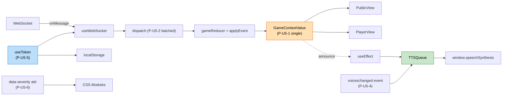

# NFR Design Patterns — U5 Web Frontend

**작성일**: 2026-04-26
**문서 버전**: 1.0
**참조**: `nfr-requirements.md`, `tech-stack-decisions.md`, `functional-design/*.md`

---

## 1. 패턴 개요

| 패턴 ID | 패턴 | 적용 영역 | 주요 NFR |
|---|---|---|---|
| P-U5-1 | 단일 GameContextValue | Context 설계 | Maintainability |
| P-U5-2 | useReducer + React 18 자동 batching | WS dispatch | Performance(P1) |
| P-U5-3 | React.memo + key=playerId | PlayerPicker 등 | Performance(P5) |
| P-U5-4 | voiceschanged + 즉시 호출 fallback | TTS 음성 사전 로드 | Reliability(R3) |
| P-U5-5 | useToken 훅 (localStorage 격리) | 토큰 read/write | Maintainability + Security |
| P-U5-6 | CSS Modules + `data-severity` 매처 | 안내 색상 | Usability + Maintainability |
| P-U5-7 | Vitest + Testing Library + jsdom + SpeechSynthesis mock | 단위 테스트 | Maintainability(M3) |

---

## 2. 패턴 다이어그램



### 텍스트 대안

```
WebSocket onMessage → useWebSocket → dispatch (React 18 batched)
  → gameReducer + applyEvent → GameContextValue (single)
  → PublicView / PlayerView 자동 리렌더

Context.lastAnnounce 변경 → useEffect → TTSQueue.enqueue/Urgent
  → window.speechSynthesis (voiceschanged + 즉시 호출 fallback)

useToken 훅이 localStorage read/write 격리 — useWebSocket이 호출
data-severity HTML 속성 → CSS Modules가 색상 매핑
```

---

## 3. 패턴 상세

### 3.1 P-U5-1 — 단일 GameContextValue (Q-NFRD-U5-1=A)

```tsx
// web/src/context/GameContext.tsx
const GameContext = createContext<GameContextValue | null>(null);

export function useGameContext(): GameContextValue {
  const ctx = useContext(GameContext);
  if (!ctx) throw new Error("useGameContext outside GameProvider");
  return ctx;
}

export function GameProvider({ children }: { children: ReactNode }) {
  const [state, dispatch] = useReducer(gameReducer, initialState);
  const tokenIO = useToken();
  const ws = useWebSocket({ url: `ws://${window.location.host}/ws`, dispatch, tokenIO });
  const tts = useTTSQueue(state.voiceOn);
  // ... announce → TTS effect ...
  const value: GameContextValue = useMemo(() => ({...state, send: ws.send, ...}), [state, ws]);
  return <GameContext.Provider value={value}>{children}</GameContext.Provider>;
}
```

**근거**: 작은 SPA(상태 ~20 필드)는 단일 Context의 리렌더 비용이 무시 가능. 분할은 복잡도만 증가.

### 3.2 P-U5-2 — Direct dispatch + React 18 batching (Q-NFRD-U5-2=A)

```tsx
// useWebSocket.ts
ws.onmessage = (ev) => {
  const msg = JSON.parse(ev.data) as IncomingMsg;
  dispatch({ type: "ws_message", msg });   // 동기 dispatch
};
```

**근거**: React 18은 자동으로 미세 단위 dispatch를 한 프레임에 batch. 별도 큐 불필요. 12 PLAYER 환경에서 한 프레임에 30~50 메시지 수신해도 단일 리렌더로 처리.

### 3.3 P-U5-3 — React.memo + 안정 key (Q-NFRD-U5-3=A)

```tsx
const PlayerPickerItem = React.memo(function PlayerPickerItem({
  player, selected, onSelect,
}: { player: Player; selected: boolean; onSelect: (id: PlayerID) => void }) {
  return <button onClick={() => onSelect(player.id)} aria-pressed={selected}>{player.name}</button>;
});

// 부모
{players.map(p => (
  <PlayerPickerItem key={p.id} player={p} selected={p.id === value} onSelect={onChange} />
))}
```

**근거**: 12명이면 React.memo로 충분. virtualization은 불필요.

### 3.4 P-U5-4 — voiceschanged + 즉시 호출 (Q-NFRD-U5-4=A)

```tsx
// useTTSQueue.ts
const [voices, setVoices] = useState<SpeechSynthesisVoice[]>([]);

useEffect(() => {
  const ss = window.speechSynthesis;
  if (!ss) return;
  const load = () => setVoices(ss.getVoices());
  load();                                 // Safari 동기
  ss.addEventListener("voiceschanged", load); // Chrome 비동기
  return () => ss.removeEventListener("voiceschanged", load);
}, []);

function pickKoreanVoice(): SpeechSynthesisVoice | null {
  return voices.find(v => v.lang.startsWith("ko")) ?? null;
}
```

**근거**: Chrome은 voices를 비동기 로드 (`getVoices()` 첫 호출 시 빈 배열). Safari는 동기. 두 케이스 모두 처리.

### 3.5 P-U5-5 — useToken 훅 (Q-NFRD-U5-5=B)

```tsx
// hooks/useToken.ts
const TOKEN_KEY = "mafia.token";

export interface TokenIO {
  get(): string | null;
  set(token: string): void;
  clear(): void;
}

export function useToken(): TokenIO {
  return useMemo<TokenIO>(() => ({
    get: () => safeLocalStorage()?.getItem(TOKEN_KEY) ?? null,
    set: (token) => safeLocalStorage()?.setItem(TOKEN_KEY, token),
    clear: () => safeLocalStorage()?.removeItem(TOKEN_KEY),
  }), []);
}

function safeLocalStorage(): Storage | null {
  try { return window.localStorage; } catch { return null; }
}
```

**근거**: 모든 토큰 read/write가 한 모듈. 단위 테스트는 `safeLocalStorage`만 mock하면 됨.

### 3.6 P-U5-6 — CSS Modules + data-severity (Q-NFRD-U5-6=A)

```tsx
// SubtitleArea.tsx
<div className={styles.subtitle} data-severity={ann.severity}>
  {ann.subtitle}
</div>
```

```css
/* SubtitleArea.module.css */
.subtitle {
  font-size: 32px;
  text-align: center;
}
.subtitle[data-severity="INFO"]     { color: var(--info); }
.subtitle[data-severity="EMPHASIS"] { color: var(--emphasis); }
.subtitle[data-severity="WARN"]     { color: var(--warn); animation: pulse 1s; }
```

**근거**: 인라인 style보다 재사용 가능. 테마 변경 시 CSS만 수정.

### 3.7 P-U5-7 — Vitest + jsdom + mocks (Q-NFRD-U5-7=A)

```ts
// vitest.config.ts
export default defineConfig({
  test: {
    environment: "jsdom",
    globals: true,
    setupFiles: ["./src/tests/setup.ts"],
  },
});
```

```ts
// src/tests/setup.ts
import "@testing-library/jest-dom";

// SpeechSynthesis mock
class FakeSpeechSynthesis implements SpeechSynthesis { /* ... */ }
beforeEach(() => {
  Object.defineProperty(window, "speechSynthesis", {
    configurable: true,
    value: new FakeSpeechSynthesis(),
  });
});
```

**근거**: jsdom에는 SpeechSynthesis가 없어 mock 필요. WebSocket도 동일하게 mock — 단위 테스트는 dispatch까지만 검증.

---

## 4. NFR Req ↔ 패턴 매핑

| NFR Req | 만족시키는 패턴 |
|---|---|
| NFR-U5-P1 (DOM 갱신 < 100ms) | P-U5-2 (batching) + P-U5-3 (memo) |
| NFR-U5-P2 (TTS < 200ms) | P-U5-4 (음성 사전 로드) |
| NFR-U5-R1 (WS 재연결) | useWebSocket (FD §3) + P-U5-5 (토큰) |
| NFR-U5-R2 (자동 resume) | P-U5-5 (useToken) |
| NFR-U5-R3 (TTS 폴백) | P-U5-4 (음성 미존재 분기) |
| NFR-U5-M3 (커버리지) | P-U5-7 (Vitest) |
| NFR-U5-M5 (wire 단일 진실) | types/wire.ts (FD §2) |
| NFR-U5-S1 (토큰 미노출) | P-U5-5 (useToken 격리) |
| NFR-U5-U2 (자막 폰트 ≥ 32px) | P-U5-6 (CSS Modules) |

---

## 5. 안티패턴 (의식적 회피)

- ❌ Redux/Zustand 도입 — 외부 lib 추가 (NFR-U5-M4 위반)
- ❌ 큰 useMemo로 모든 derived state 계산 — 작은 SPA에선 비용 > 이득
- ❌ window.speechSynthesis 직접 호출 (모듈 곳곳) — 테스트 어려움
- ❌ 인라인 스타일로 색상 분기 — 테마 변경 어려움
- ❌ 토큰을 컴포넌트 props로 전달 — DOM에 노출 위험
- ❌ react-window 같은 virtualization — 12명 한도면 과도
- ❌ Recoil/Jotai 등 "atomic" 라이브러리 — 외부 lib 추가

---

## 6. 검증 체크리스트

- [x] 7개 패턴 모두 NFR Req에 매핑됨 (§4)
- [x] 안티패턴 7종 명시
- [x] 외부 lib 추가 0
- [x] React 18 batching 활용
- [x] localStorage 격리 + 단위 테스트 가능
- [x] SpeechSynthesis mock 패턴 명시
