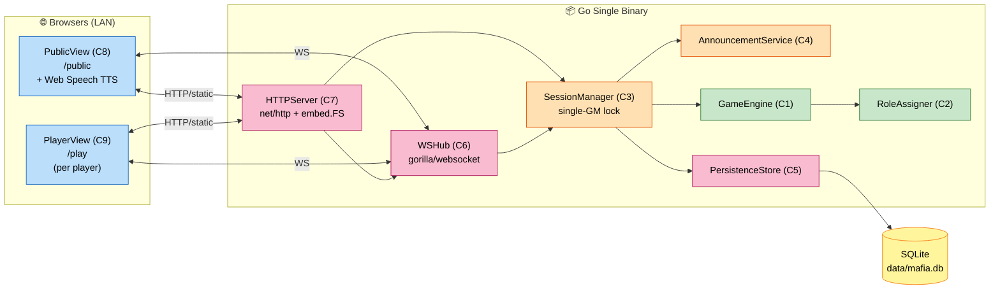

# Application Design — Mafia Game (Consolidated)

**작성일**: 2026-04-25
**문서 버전**: 1.0
**참조**: `requirements.md` v1.1, `execution-plan.md`, `application-design-plan.md`

본 문서는 Application Design 단계의 4개 산출물(`components.md`, `component-methods.md`, `services.md`, `component-dependency.md`)을 통합한 종합 설계 문서입니다. 자세한 내용은 각 개별 문서를 참고하세요.

---

## 1. 설계 원칙

| 원칙 | 적용 방식 |
|---|---|
| **안정성 최우선 (NFR-1)** | 단계 전이마다 SQLite 스냅샷 영속화 → 디스크가 진실의 원천. 클라이언트 단절·서버 재시작 시 자동 복원 |
| **단일 책임** | 도메인(C1·C2) 순수 Go, I/O 없음. 인프라(C5~C7)와 도메인 분리 |
| **단일 GM 락** | SessionManager에서 단일 mutex/액터로 모든 입력을 직렬 처리 |
| **운영 단순성 (NFR-7)** | 단일 Go 바이너리에 React 빌드 산출물(`embed.FS`)과 SQLite를 동봉 — 외부 서비스 0 |
| **확장 대비 (FR-7)** | 키워드 풀, 안내 카탈로그를 외부화 가능한 인터페이스로 추상화 |

---

## 2. 핵심 아키텍처 결정 (사용자 응답 반영)

| 항목 | 결정 | 출처 |
|---|---|---|
| 영속화 | SQLite (`modernc.org/sqlite`, 순수 Go) | Q-AD-1=A → AI 추천으로 동일 채택 |
| WebSocket | `github.com/gorilla/websocket` | Q-AD-2=A |
| 프론트엔드 | **React + Vite + TypeScript SPA** (단일 앱, `/public` `/play` 라우트) | Q-AD-3=C + 사용자 명시 "react" |
| 자기소개 진행 | 시간 기반 자동 진행 (1인당 N초) | Q-AD-4=B |
| 토론 종료 | 타이머 + 호스트 조기 종료 가능 | Q-AD-5=C |
| 호스트 권한 | 호스트도 플레이어 (공용 화면 운영 + 본인 폰에서 비공개 정보) | Q-AD-6=B |
| 마피아 합의 | 오프라인 협의 후 마피아 한 명이 자기 폰에서 선택 (마지막 입력 채택) | Q-AD-7 = Other |
| 의사 자가 보호 | 매 밤 허용 | Q-AD-8=A |

> **남은 미확정 디테일**(예: 마피아 입력 충돌 처리 정확한 규칙, 동률 시 시드 결정, 자기소개 1인 기본 N초 값)은 **Functional Design** 단계에서 확정.

---

## 3. 컴포넌트 개요 (요약)

| ID | 컴포넌트 | 계층 |
|---|---|---|
| C1 | GameEngine | Domain |
| C2 | RoleAssigner | Domain |
| C3 | SessionManager | Application (= 서비스 S1) |
| C4 | AnnouncementService | Application (= 서비스 S2) |
| C5 | PersistenceStore | Infrastructure |
| C6 | WSHub | Infrastructure |
| C7 | HTTPServer | Infrastructure |
| C8 | PublicView (React) | Presentation |
| C9 | PlayerView (React) | Presentation |

> 상세는 `components.md` 참고.

---

## 4. 시스템 다이어그램

### 텍스트 대안
- 브라우저(2종, LAN) → HTTP/Static + WebSocket → Go 바이너리
- Go 바이너리 내부: HTTPServer → WSHub → SessionManager → GameEngine(+RoleAssigner) / AnnouncementService / PersistenceStore
- PersistenceStore → SQLite 단일 파일

---

## 5. 핵심 흐름 시나리오

### 5.1 게임 시작 (호스트 트리거)
1. 호스트가 `/public`에서 "게임 시작" 클릭 → WS `host:start` 메시지 전송
2. `WSHub` → `SessionManager.SubmitAction(StartGame{HostID, Options})`
3. `GameEngine.Start(playerIDs, opts)` → 역할/키워드 무작위 배정 (RoleAssigner)
4. 이벤트 발생: `GameStarted`, `PhaseChanged{INTRO}`, `RoleRevealedToPlayer×N`(비공개)
5. `PersistenceStore.SaveSnapshot(state)` 동기 호출
6. `AnnouncementService.Render(events)` → `Announcement` 목록 생성
7. `WSHub.Dispatch`:
   - 공용: PublicView에 단계 변경 + TTS "마피아 게임이 시작됩니다…"
   - 비공개: 각 PlayerView에 본인 역할/키워드만

### 5.2 야간 진입 + 마피아 행동
1. 자기소개 마지막 발화자 종료 또는 호스트 강제 진행 → `Tick`/`HostControl`이 `PhaseChanged{NIGHT}` 트리거
2. AnnouncementService: "밤이 깊어졌습니다…" → "마피아는 살해할 대상을 지목하세요."
3. PlayerView (마피아): 후보 표시. **마피아 중 누구라도** 살해 대상 입력 가능
4. 마지막 입력이 채택 (Q-AD-7 잠정) → `SubmitMafiaKill` Apply → 의사·경찰 차례로 진행
5. 모든 야간 행동 완료 또는 야간 마감 시각 도달 시 `PhaseChanged{DAY}` + `DeathAnnounced` 또는 `PeacefulNight`

### 5.3 토론 → 투표 → 처형
1. `PhaseChanged{DAY}` 후 토론 타이머 시작 (옵션 N초)
2. 매 1초 `Tick`에서 잔여 시간 갱신 — 30초 남았을 때 `DiscussionTimerTick{30}` 이벤트
3. 호스트가 조기 종료(Q-AD-5=C) 또는 타이머 만료 시 `PhaseChanged{VOTE}`
4. 살아있는 모든 플레이어가 자기 폰에서 1명 선택 → `SubmitVote` Apply
5. 모든 투표 완료 또는 투표 마감 → `VoteTallied`
   - 단일 최다 → `Eliminated`
   - 동률 → `Recount=true` → `PhaseChanged{RECOUNT}` 1회 → 그래도 동률이면 무처형 후 NIGHT
6. 종료 조건 검사 → `GameEnded` 또는 NIGHT 진입

### 5.4 호스트 PC 재시작 후 복원
1. 바이너리 재시작
2. `PersistenceStore.LoadActiveSnapshot()` → 마지막 스냅샷 발견
3. `GameEngine.Restore(snapshot)` → 동일 단계로 복귀
4. 클라이언트가 자동 재연결 → 본인 화면 자동 복원 (시나리오 2/3)

---

## 6. 인터페이스/메서드 요약

> 자세한 메서드 시그니처는 `component-methods.md` 참고.

| 컴포넌트 | 핵심 메서드 |
|---|---|
| GameEngine | `Start`, `Apply`, `Tick`, `Snapshot`, `Restore` |
| RoleAssigner | `Assign` |
| SessionManager | `CreateSession`, `JoinPlayer`, `StartGame`, `SubmitAction`, `HostControl`, `Tick` |
| AnnouncementService | `Render` |
| PersistenceStore | `SaveSnapshot`, `LoadActiveSnapshot`, `SaveResult`, `ListResults` |
| WSHub | `Register`, `Unregister`, `Dispatch`, `OnAction` |
| HTTPServer | `NewRouter`, `PrintLANAddresses` |

---

## 7. 컴포넌트 의존성 요약

> 자세한 매트릭스/통신 패턴은 `component-dependency.md` 참고.

- **도메인(C1·C2)** ← 외부 의존 없음
- **C3 SessionManager** = 모든 협력자(C1/C4/C5/C6)의 단일 진입점 (퍼사드)
- **C7 HTTPServer** = 부팅 와이어링 + 정적 자산 + WebSocket 업그레이드 (비즈니스 로직 없음)
- **프론트엔드(C8/C9)** ↔ 백엔드: WebSocket + 일부 REST(`/api/results`)

---

## 8. 검증 체크리스트 (설계 완결성)

- [x] 모든 FR(FR-1~FR-8)이 컴포넌트 책임에 매핑됨 (FR-8 → C4 + C8)
- [x] 모든 NFR(특히 NFR-1 안정성)이 설계 원칙·데이터 흐름에 반영됨 (스냅샷 우선, 단일 GM 락, 자동 재연결, TTS 폴백)
- [x] 도메인-인프라 분리 (단위 테스트 가능성 확보)
- [x] 외부 의존성 명시 (gorilla/websocket, modernc.org/sqlite, React, Web Speech API)
- [x] 사용자 결정사항(Q-AD-1~8) 모두 반영
- [x] 점진적 확장 여지(키워드 풀 외부화, 안내 카탈로그 외부화) 고려
- [x] 미확정 디테일(예: 마피아 입력 충돌 정확한 규칙)을 Functional Design으로 명시 위임

---

## 9. Functional Design으로 위임된 결정 (참조)

다음 항목은 Application Design 범위를 벗어나는 비즈니스 디테일로, **Functional Design 단계에서 결정**합니다:
- 마피아 다수 입력 시 충돌 처리 정확한 규칙 (잠정: 마지막 입력 채택)
- 자기소개 1인당 기본 N초, 토론 기본 N초의 권장값
- 동률 재투표 무작위 시드 결정 방식
- 키워드 풀 초기 콘텐츠 (역할별 키워드 후보 목록)
- 안내 카탈로그 정확한 한국어 문구 (잠정안은 services.md에 제시)
- 경찰 조사 결과 표시 정책 (`MAFIA`/`CITIZEN` 단일 비트 vs 역할명 직접 노출 — 잠정: 진영만)
- 의사 자가 보호 시 시각적/안내 표현
