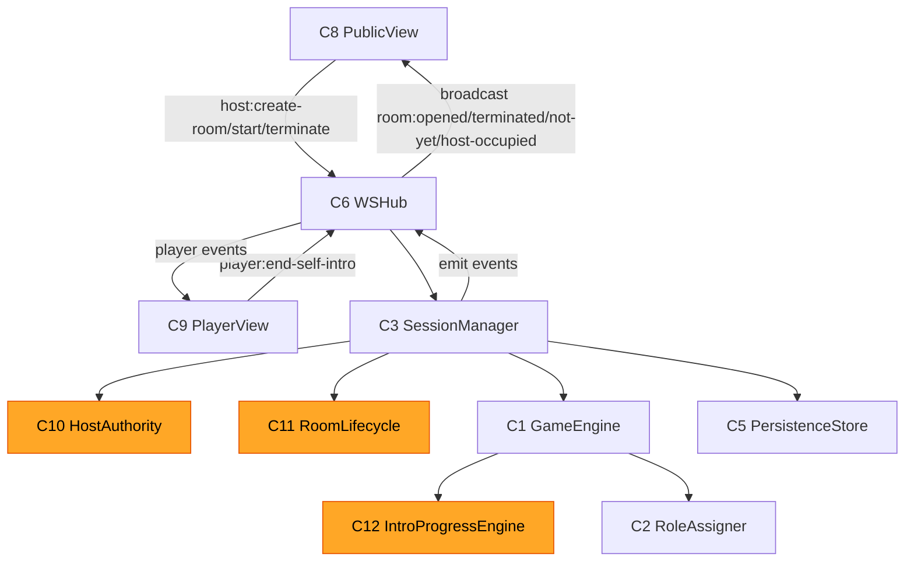

# Application Design — Iteration 2 Patch

**문서 버전**: 1.0
**작성일**: 2026-04-29
**기준 문서**: `application-design.md` v1, `components.md`, `component-methods.md`, `services.md`, `component-dependency.md` (모두 2026-04-25 작성)
**상위 변경 명세**: `requirements-iteration2-patch.md` v2.0-patch
**처리 방식**: v1 본문은 보존, 본 patch가 위에 얹는 변경분만 정의. 충돌 시 patch 우선.

---

## 0. 변경 요약 한눈에

| 변경 종류 | 컴포넌트 | 핵심 변경 |
|---|---|---|
| 신규 | **C10 HostAuthority** | 첫 `/public` 접속자에게 호스트 권한 부여 + 단일 방 락. (FR-9.2 / FR-10.2) |
| 신규 (개념) | **C11 RoomLifecycle** | 방 라이프사이클 상태머신 (Idle → Opened → Playing → Terminated). SessionManager 내부 상태로 구현 가능. (FR-1.1 / FR-10.1) |
| 신규 (개념) | **C12 IntroProgressEngine** | 자기소개 자동 라운드 로빈 정책. GameEngine 내부 정책으로 구현. (FR-12) |
| 변경 | **C1 GameEngine** | `Settings` 확장 (`MaxPlayers`, `MafiaCount`), `IntroAutoAdvance` 정책, `RoleAssigner`의 호스트 임의 마피아 수 입력 수용 |
| 변경 | **C3 SessionManager** | 호스트 인증 진입점 + Action 추가/삭제: `+CreateRoom`, `+ForceTerminate`, `+EndSelfIntro`, `~StartGame`(호스트 권한 검증으로 격상), `−AdvanceIntro` (자동화로 호출 경로 폐기 또는 호스트 강제 advance만) |
| 변경 | **C5 PersistenceStore** | `GameResult.Status` enum에 `forced_terminated` 추가 |
| 변경 | **C6 WSHub** | wire 메시지 6종 추가 + 1종 제거 |
| 변경 | **C8 PublicView** | 호스트 권한 화면 분기 + 방 개설 폼 + 게임 설정 폼 + 강제 종료. 사회자 톤 카피. 기존 "다음 발언자" 버튼 제거 |
| 변경 | **C9 PlayerView** | 방 미개설 게이트 화면, 자기소개 차례 시 "내 자기소개 종료" 버튼 |
| 불변 | C2 RoleAssigner, C4 AnnouncementService, C7 HTTPServer | (마이너 시그니처 조정만 — 자세한 사항은 단위 Functional Design에서) |

---

## 1. 신규 컴포넌트

### C10. HostAuthority

- **위치**: `internal/session/host_authority.go` (신규 파일 권장) 또는 `SessionManager` 내부 컴포넌트
- **목적**: `/public` 접속 시점에 호스트 권한을 부여 또는 거부하고, 단일 호스트만 존재하도록 락을 보장한다 (FR-9.2 / FR-10.2 / CR1-Q10=C).
- **주요 책임**:
  - 첫 `/public` 접속자에게 **HostToken**(불투명 식별자) 발급
  - 이미 토큰이 발급된 상태에서 두 번째 `/public` 접속은 거부 (`room:host-occupied`)
  - 호스트 연결이 끊어지면(WS 닫힘 + 일정 grace period) 토큰 회수 → 다음 `/public` 접속자가 호스트 가능
  - 호스트가 보낸 명령이 유효한 HostToken을 동반하는지 검증 게이트로 동작
- **인터페이스 (개념, 의사 코드)**:
  ```go
  type HostAuthority interface {
      // /public 접속 시: 첫 호출자에게 토큰 부여, 두 번째 이후는 ErrHostOccupied
      Claim(connID ConnID) (HostToken, error)
      // 액션 핸들러 게이트
      Verify(token HostToken) error
      // WS 연결 종료 등으로 호출
      Release(token HostToken)
      // 현재 호스트가 점유 중인지 (테스트/관측용)
      IsClaimed() bool
  }
  ```
- **에러**: `ErrHostOccupied` — 두 번째 호스트 차단용. WS 송신 시 `room:host-occupied` 메시지로 매핑.
- **의존**: 없음 (단순 mutex + 옵셔널 timer). 외부 라이브러리 추가 없음.

### C11. RoomLifecycle (개념)

- **위치**: `internal/session/manager.go` 내부 상태 또는 `internal/game/room_lifecycle.go`
- **목적**: 방 라이프사이클 상태머신. (FR-1.1 / FR-10.1 / FR-9.4)
- **상태**:
  - `Idle` — 호스트 권한 없음, 또는 호스트가 방 미개설
  - `Opened` — 호스트가 게임 설정 입력 + "방 개설" 클릭 완료, 플레이어 입장 허용 (게임 시작 전 LOBBY 단계 포함)
  - `Playing` — 게임 진행 중 (Phase ∈ {INTRO, NIGHT, DAY, VOTE, RECOUNT})
  - `Terminated` — 정상 종료 또는 강제 종료. 다음 호스트 진입 시 새 방 개설 가능
- **전이**:
  - Idle → Opened: `CreateRoom(settings)` (호스트만)
  - Opened → Playing: `StartGame()` (호스트만, 인원 충족)
  - Playing → Terminated(natural): GameEngine `GameEnded`
  - Playing → Terminated(forced): `ForceTerminate()` (호스트만)
  - Terminated → Idle: 다음 호스트 진입 시 자동 리셋 (HostAuthority Release/Claim 흐름)
- **노출**: 외부에서는 SessionManager가 RoomLifecycle 상태를 관찰자로 노출 (`room:opened`, `room:terminated` 이벤트로 wire에 전파).

### C12. IntroProgressEngine (개념)

- **위치**: `internal/game/intro_progress.go` 또는 GameEngine 내부 정책
- **목적**: 자기소개 단계의 발언자 자동 라운드 로빈 진행 정책. (FR-12)
- **주요 책임**:
  - 자기소개 진입 시 입장 순으로 첫 발언자 결정
  - "본인 종료" 트리거 수신 시 다음 발언자로 advance
  - 마지막 발언자 종료 시 자동으로 NIGHT 1 단계로 전환
  - 호스트의 강제 advance(폐기 가능, 별도 결정)는 AdvanceIntro 액션으로만 통과 (Out of Scope)
- **인터페이스 (개념)**:
  ```go
  type IntroProgress interface {
      Begin(orderedPlayers []PlayerID) (firstSpeaker PlayerID, deadline time.Time)
      EndCurrent(playerID PlayerID) (next *PlayerID, finished bool, err error) // err: not current speaker
  }
  ```

---

## 2. 변경 컴포넌트 (메서드 / 인터페이스 변동)

### C1. GameEngine — Settings 확장 + IntroAutoAdvance

```go
// 기존 Options를 확장 (필드 추가)
type Options struct {
    IntroSecondsPerPlayer int
    DiscussionSeconds     int
    DoctorSelfHealAllowed bool
    AnnouncementVoiceOn   bool
    // ===== Iteration 2 신규 =====
    MaxPlayers  int  // FR-11.2 호스트가 지정 (6~12)
    MafiaCount  int  // FR-11.2 호스트가 지정 (1 ~ MaxPlayers - 의사 1 - 경찰 1 - 시민 1)
}
```

- `Engine.Start(players, opts)` 는 `opts.MafiaCount` 를 우선 사용하여 RoleAssigner에 전달. opts.MafiaCount=0 인 경우만 v1.1 자동 테이블 사용 (backward 호환용 — v2 Frontend는 항상 명시 전송).
- `Engine.Tick(now)` 는 자기소개 단계에서 `IntroProgressEngine`을 통해 자동 진행할 수 있는 시점에서 자동 advance 이벤트를 산출. 본 반복에서는 본인 종료 트리거 기반이므로 Tick의 자동 시간 기반 advance는 OOS-4 로 보류, 단지 본인 종료 액션이 들어오면 다음 발언자 evt 산출.
- Action 추가/변경:
  - 신규: `EndSelfIntro{ PlayerID PlayerID }` — 자기소개 본인 종료
  - 폐기 후보: `AdvanceIntro{ HostID }` — 본 반복에서 호스트 클릭 경로 제거, 액션 자체는 호환을 위해 유지하되 wire에서는 노출 안 함 (호스트 강제 advance는 OOS)

### C3. SessionManager — 액션 게이팅 + 신규 액션

```go
type SessionManager interface {
    // 기존
    Join(name string, conn ConnID) (PlayerID, error)
    Apply(act Action) error
    Snapshot() State

    // ===== Iteration 2 신규/변경 =====
    // 호스트 권한 발급 — /public 접속 진입점에서 호출
    ClaimHost(conn ConnID) (HostToken, error)         // 두 번째 이후는 ErrHostOccupied
    ReleaseHost(token HostToken)                       // WS 종료 등
    
    // 호스트 전용 액션 (Verify(token) 후 dispatch)
    CreateRoom(token HostToken, settings game.Options) error    // Idle → Opened
    StartGame(token HostToken) error                            // Opened → Playing
    ForceTerminate(token HostToken) error                       // Playing → Terminated(forced)
    
    // 플레이어 액션 (방 Opened 또는 Playing 상태에서만 허용)
    EndSelfIntro(playerID PlayerID) error
}
```

- 모든 호스트 전용 액션은 `HostAuthority.Verify(token)` 게이트 통과 후 RoomLifecycle 상태와 일치하는지 추가 검증.
- `Join(name, conn)` 은 RoomLifecycle == Opened 상태에서만 성공. Idle 상태에서는 `ErrRoomNotYet` 반환 → wire `room:not-yet` 메시지로 매핑.
- 자기소개 단계 자동 advance: `EndSelfIntro` 처리 시 GameEngine의 `EndSelfIntro` 액션을 적용하고, 결과 이벤트(`IntroSpeakerChanged` 또는 `PhaseChanged`)를 WSHub에 전달.

### C5. PersistenceStore — 결과 상태 enum 확장

```go
type GameResult struct {
    GameID    string
    Status    GameStatus  // 기존: completed
    StartedAt time.Time
    EndedAt   time.Time
    Winner    Team        // forced_terminated 인 경우 NoTeam
    Players   []PlayerID
    // ... v1과 동일
}

type GameStatus string

const (
    StatusCompleted        GameStatus = "completed"          // v1
    StatusForcedTerminated GameStatus = "forced_terminated"  // ===== 신규 =====
)
```

- 기존 row(없는 status 값)는 default `completed` 로 매핑 (마이그레이션 불필요).

### C6. WSHub — Wire 메시지 변경

신규 인바운드 (클라이언트 → 서버):

| 메시지 | 발신 | 페이로드 | 핸들러 |
|---|---|---|---|
| `host:create-room` | 호스트(/public) | `{ settings: { maxPlayers, mafiaCount, ... } }` | `SessionManager.CreateRoom` |
| `host:start-game` | 호스트 | `{}` | `SessionManager.StartGame` |
| `host:terminate` | 호스트 | `{}` | `SessionManager.ForceTerminate` |
| `player:end-self-intro` | 발언 중인 플레이어(/play) | `{}` | `SessionManager.EndSelfIntro` |

신규 아웃바운드 (서버 → 클라이언트):

| 메시지 | 대상 | 페이로드 | 트리거 |
|---|---|---|---|
| `room:not-yet` | 단일 client(/play 신규 접속) | `{}` | RoomLifecycle == Idle 상태에서 /play WS 연결 |
| `room:host-occupied` | 단일 client(/public 신규 접속) | `{}` | 두 번째 /public WS 연결 |
| `room:opened` | 모든 client | `{ settings, hostName? }` | `CreateRoom` 성공 |
| `room:terminated` | 모든 client | `{ reason: "completed" \| "forced" }` | RoomLifecycle → Terminated |

제거 인바운드:

| 메시지 | 사유 |
|---|---|
| `host:next-speaker` | FR-12 자동 라운드 로빈 도입 — 호스트가 발언자 advance를 트리거하지 않음 |

(참고) `host:advance-intro` 류의 호스트 강제 advance는 wire에서 노출하지 않는다 (Out of Scope, 정체 시 `host:terminate` 만 가능).

### C8. PublicView — 화면 분기 추가

기존 `/public` 단일 화면이 호스트 권한 상태에 따라 분기:

```text
/public WS 연결
  ├─ 첫 접속 → HostToken 부여
  │    └─ RoomLifecycle == Idle → "방 개설" 폼 표시
  │         (게임 설정: MaxPlayers slider 6~12, MafiaCount slider 권장 ±1 + 임의값 + 경고)
  │         "방을 개설합니다" 버튼 → host:create-room
  │    └─ RoomLifecycle == Opened (LOBBY) → "참가자를 받습니다" + 플레이어 목록 + "게임 시작" (인원 충족 시 활성)
  │    └─ RoomLifecycle == Playing → 진행 단계 표시 + "강제 종료" 버튼 (사회자 톤 진행 안내)
  │    └─ RoomLifecycle == Terminated → 결과 요약 + "새 방 개설"
  └─ 두 번째 접속 → "이미 호스트가 방을 운영 중입니다" 안내 (room:host-occupied)
```

- **사회자 톤 카피** (CR1-Q11=B 적용): "방을 개설합니다", "참가자를 받습니다", "설정을 마쳤다면 게임을 시작합니다", "낮의 토론을 시작합니다", 등
- **기존 "다음 발언자" 버튼** 은 제거. 자기소개 단계에서는 "현재 발언자: {name}" 표시로 대체.

### C9. PlayerView — 게이트 화면 + 본인 종료 버튼

```text
/play WS 연결
  └─ RoomLifecycle == Idle → "방이 아직 없습니다. 호스트가 방을 개설할 때까지 기다려 주세요."
       └─ room:opened 수신 시 닉네임 입력 화면으로 자동 전환
  └─ RoomLifecycle == Opened → 닉네임 입력 → 대기실 진입
  └─ RoomLifecycle == Playing
       └─ Phase == INTRO + currentSpeaker == self → "내 자기소개 종료" 버튼 활성
       └─ Phase == INTRO + currentSpeaker != self → "현재 발언자: {name}" 표시 (본인 차례 안내)
       └─ Phase ∈ {NIGHT, DAY, VOTE, ...} → v1과 동일 (자기 역할별 입력 UI)
```

---

## 3. 갱신된 컴포넌트 매트릭스

| ID | 이름 | 계층 | 변경 종류 | 본 반복 핵심 변경 |
|---|---|---|---|---|
| C1 | GameEngine | 도메인 | 변경 | Options 확장 (MaxPlayers/MafiaCount), IntroProgressEngine 통합 |
| C2 | RoleAssigner | 도메인 | 미세 조정 | 호스트 임의 MafiaCount 수용 |
| C3 | SessionManager | 애플리케이션 | 변경 | ClaimHost/ReleaseHost + CreateRoom/StartGame/ForceTerminate/EndSelfIntro 액션 |
| C4 | AnnouncementService | 애플리케이션 | 미세 조정 | 사회자 톤 카탈로그 (v1.1 카피 → v2 카피) |
| C5 | PersistenceStore | 인프라 | 변경 | GameStatus enum 확장 |
| C6 | WSHub | 인프라 | 변경 | wire 메시지 추가 4 + 출력 4, 제거 1 |
| C7 | HTTPServer | 인프라 | 불변 | (라우팅·정적자산·업그레이드 그대로) |
| C8 | PublicView | 프레젠테이션 | 변경 | 호스트 분기 + 방 개설 폼 + 사회자 톤 카피 |
| C9 | PlayerView | 프레젠테이션 | 변경 | 방 게이트 + 자기소개 본인 종료 버튼 |
| **C10** | **HostAuthority** | 애플리케이션 | **신규** | 호스트 권한 발급/회수, 단일 방 락 |
| **C11** | **RoomLifecycle** | 애플리케이션 (개념) | **신규** | 방 상태머신 (Idle/Opened/Playing/Terminated) |
| **C12** | **IntroProgressEngine** | 도메인 (개념) | **신규** | 자기소개 자동 라운드 로빈 |

---

## 4. 갱신된 의존성 그래프 (변경 부분)



---

## 5. 단위(U1~U5) 매핑

| 컴포넌트 | 소속 단위 | Iteration 2 변경 영향 |
|---|---|---|
| C1 GameEngine, C2 RoleAssigner, C12 IntroProgress | **U1 Game Core** | High |
| C3 SessionManager, C4 AnnouncementService, C5 PersistenceStore, C10 HostAuthority, C11 RoomLifecycle | **U2 Session, Persistence & Announce** | High |
| C6 WSHub | **U3 Realtime Transport** | Medium |
| C7 HTTPServer | **U4 HTTP Bootstrap & Static** | Low (사실상 변경 없음) |
| C8 PublicView, C9 PlayerView | **U5 Web Frontend** | High |

---

## 6. 핵심 시퀀스 (Sequence) — 변경 흐름

### 6.1 호스트 방 개설 흐름

```text
HostBrowser    /public WS         WSHub          SessionManager       HostAuthority      RoomLifecycle
   |  (open)       |                |                  |                     |                |
   |───────────────▶|                |                  |                     |                |
   |                |───register────▶|                  |                     |                |
   |                |                |───ClaimHost(c)──▶|                     |                |
   |                |                |                  |───Claim()──────────▶|  (mutex)       |
   |                |                |                  |◀──HostToken─────────|                |
   |                |◀──host-token───|                  |                     |                |
   |                |                |                  |                     |                |
   |  (input settings, click "방 개설")                  |                     |                |
   |─host:create-room({settings})──▶|                  |                     |                |
   |                |───CreateRoom(token, settings)────▶|                     |                |
   |                |                |                  |───Verify(token)────▶|                |
   |                |                |                  |───Open(settings)──────────────────────▶|
   |                |                |                  |◀──Opened──────────────────────────────|
   |                |◀──room:opened (broadcast all)─────|                     |                |
```

### 6.2 두 번째 호스트 차단 흐름

```text
SecondHostBrowser  /public WS    WSHub        HostAuthority
        |  (open)      |           |               |
        |──────────────▶|           |               |
        |               |──Claim()──▶───            |
        |               |               (이미 점유)
        |               |◀──ErrHostOccupied─────────|
        |◀──room:host-occupied + close──|           |
```

### 6.3 자기소개 자동 진행 흐름

```text
Player(P1)   /play WS    WSHub      SessionManager     GameEngine         IntroProgress
   |  (자기 차례, "내 자기소개 종료" 클릭)
   |──player:end-self-intro──▶|         |                  |                     |
   |              |───────────▶───EndSelfIntro(P1)─────────▶|                     |
   |              |           |          |───Apply(EndSelfIntro)─────────────────▶|
   |              |           |          |                  |───EndCurrent(P1)──▶|
   |              |           |          |                  |◀──next=P2 / fin? ──|
   |              |           |          |◀──[IntroSpeakerChanged{P2}]────────────|
   |              |◀──intro:speaker (broadcast)──────────────|
   |              |           |          |  (또는 finished=true 면 PhaseChanged Night1 자동)
```

---

## 7. 본 반복에서 결정 / 미결정

### 7.1 본 patch에서 확정
- 신규 컴포넌트 3종 도입 (HostAuthority, RoomLifecycle, IntroProgressEngine — 후 2종은 단위 내부 구조로 구현 가능)
- Wire 메시지 6종 추가 + 1종 제거
- GameStatus enum 확장 (forced_terminated)
- Options 필드 확장 (MaxPlayers, MafiaCount)
- C8/C9 화면 분기 정의

### 7.2 단위별 Functional Design 단계로 이관
- HostAuthority의 connID 정의 (WS connection unique key — U2/U3 인터페이스 결정)
- HostAuthority Release grace period 길이 (현재 진행 중인 게임 보호용)
- RoomLifecycle 상태머신의 정확한 영속화 필드 (PersistenceStore Snapshot 대상)
- IntroProgressEngine의 정확한 진행 순서(입장 순 vs 무작위) — 본 patch는 입장 순 기본 가정
- 사회자 톤 카탈로그 정확한 한국어 문구 (AnnouncementService v2 카피)
- C8 게임 설정 UI의 권장 ±1 컨트롤 형태 (스피너? 슬라이더?)
- C9 게이트 화면의 정확한 자동 갱신 트리거 (room:opened 이벤트 외 reconnect 시 동작)

### 7.3 Out of Scope (Requirements OOS-1 ~ OOS-7 그대로 유지)
- 방 개설 후 설정 변경
- read-only 관전자
- 호스트 단일 PC GM+플레이어
- 자기소개 정체 자동 회복
- 호스트 권한 이양
- 강제 종료 시 키워드/역할 공개 디테일
- 호스트 인증 강화

---

## 8. v1 application-design 산출물과의 정합성

본 patch는 v1 의 다음 항목을 보완/대체합니다:

- v1 `components.md` C1~C9 → 본 patch §3에서 C10~C12 추가 + C1/C3/C5/C6/C8/C9 변경 명시
- v1 `component-methods.md` Engine/Manager 메서드 → 본 patch §2에서 Options 확장, SessionManager 메서드 추가
- v1 `services.md` SessionManager 오케스트레이션 → 본 patch §6 시퀀스에서 호스트/자기소개 흐름 갱신
- v1 `component-dependency.md` 의존성 매트릭스 → 본 patch §4 갱신 (C10/C11/C12 추가)

v1 본문은 그대로 유지되며, 본 patch가 변경분을 누적합니다. 단위 Functional Design 단계에서 본 patch §7.2 항목을 추가로 확정합니다.
