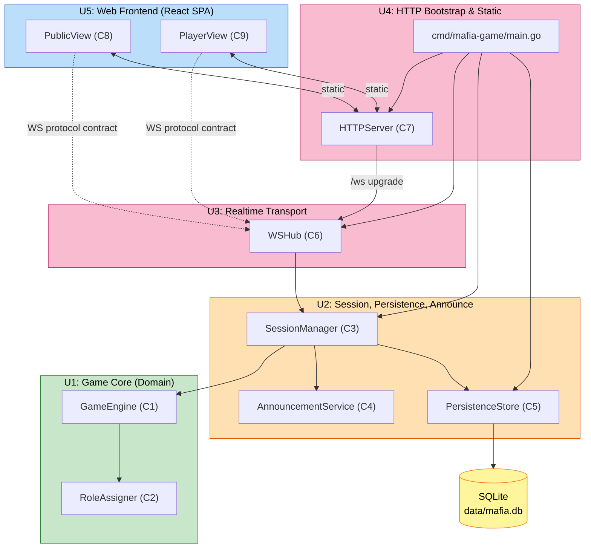

# Unit of Work — Dependency Matrix & Integration Sequence

**작성일**: 2026-04-26
**문서 버전**: 1.0
**참조**: `unit-of-work.md`, `application-design/component-dependency.md`

본 문서는 5개 개발 단위(U1~U5) 간 의존 관계와 부팅 시 통합 시퀀스를 정의합니다.

---

## 1. 의존 매트릭스

행(=의존 주체) → 열(=의존 대상). `●` = 직접 의존(import/호출), `◐` = 간접 의존(타입 공유), `–` = 무관계.

| 의존 주체 \ 대상 | U1 Game Core | U2 Session/Persist/Announce | U3 WS Transport | U4 HTTP Boot | U5 Web Frontend |
|---|:---:|:---:|:---:|:---:|:---:|
| **U1 Game Core** | — | – | – | – | – |
| **U2 Session/Persist/Announce** | ● (Engine, Types, Events) | — | – | – | – |
| **U3 WS Transport** | ◐ (Action/Event 직렬화) | ● (SubmitAction, Subscribe) | — | – | – |
| **U4 HTTP Boot** | – | ● (와이어링) | ● (`/ws` 업그레이드) | — | ● (정적 자산 동봉) |
| **U5 Web Frontend** | ◐ (와이어 타입) | ◐ (이벤트 의미) | ● (WS 와이어 프로토콜) | – | — |

### 핵심 관찰
- **U1은 어디에도 의존하지 않음** (도메인 순수성)
- **U4가 모든 백엔드 단위의 와이어링 책임자** (Composition Root)
- **U5는 직접 import 관계가 없는 별도 빌드 영역**이지만, U3의 와이어 프로토콜과 U2의 이벤트 의미를 **계약 수준**(◐)에서 공유
- 순환 의존 없음 ✅

---

## 2. 의존 다이어그램



### 텍스트 대안

```
U5 Web Frontend ──[WS 와이어 프로토콜 계약]──▶ U3 Realtime Transport
U5 Web Frontend ──[정적 자산 호스팅]──▶ U4 HTTP Bootstrap

U4 HTTP Bootstrap ──[/ws 업그레이드]──▶ U3 Realtime Transport
U4 HTTP Bootstrap ──[Composition Root 와이어링]──▶ U2 / U3 / Pers (생성·연결)

U3 Realtime Transport ──[SubmitAction/Subscribe]──▶ U2 SessionManager

U2 SessionManager ──[Engine 호출]──▶ U1 GameEngine
U2 SessionManager ──[이벤트→안내]──▶ U2 AnnouncementService (intra-unit)
U2 SessionManager ──[스냅샷·결과]──▶ U2 PersistenceStore (intra-unit)

U2 PersistenceStore ──▶ SQLite 파일
U1 GameEngine ──[배분]──▶ U1 RoleAssigner (intra-unit)
```

---

## 3. 단위 간 통합 인터페이스 요약

### 3.1 U2 ↔ U1
- **호출 방향**: U2 → U1
- **인터페이스**: `GameEngine.Start(playerIDs, opts)`, `Apply(action)`, `Tick(now)`, `Snapshot()`, `Restore(state)`, `RoleAssigner.Assign(playerIDs, seed)`
- **데이터**: 모두 U1이 정의한 도메인 타입(`State`, `Action`, `Event`, `PlayerID`, `Role`, `Phase`)
- **결합도**: 강함 (U1 타입을 U2가 직접 노출) — 의도적 (Q-UG-5=A)

### 3.2 U3 ↔ U2
- **호출 방향**: U3 → U2 (입력 위임), U2 → U3 (이벤트 디스패치, 콜백 형태)
- **인터페이스**:
  - `WSHub.Register(client, identity)`, `WSHub.Unregister(client)`
  - `WSHub.OnAction(handler func(action Action, identity Identity))` — SessionManager 등록
  - `WSHub.Dispatch(target, payload)` — SessionManager가 호출
- **데이터**: WS 와이어 프로토콜 (JSON 메시지) — `internal/transport/ws/protocol.go`
- **결합도**: 중간 (WSHub는 SessionManager를 인터페이스로 받음 → 단위 테스트 가능)

### 3.3 U4 ↔ (U2, U3, U5)
- **U4 → U2/U3**: Composition Root에서 인스턴스 생성 + 의존성 주입
- **U4 ↔ U5**: 빌드 타임 결합 — `web/dist/`를 `//go:embed`로 동봉
- **데이터**: 부팅 설정(포트, 데이터 파일 경로 등 환경변수/플래그)

### 3.4 U5 ↔ U3
- **호출 방향**: 양방향 (브라우저 ↔ 서버 WebSocket)
- **인터페이스**: WS JSON 메시지 — 백엔드의 `protocol.go`와 1:1 일치
- **데이터 동기화**: 수동 또는 codegen (Functional Design 단계에서 결정)

---

## 4. 부팅 통합 시퀀스 (Composition Root)

`cmd/mafia-game/main.go`에서 다음 순서로 와이어링:

```
1. Configuration 로드 (포트, 데이터 디렉터리, TTS 기본값 등)
2. PersistenceStore 초기화 (SQLite open + 스키마 마이그레이션)
   └─ ctx.Done() 시 정상 종료 훅 등록
3. AnnouncementService 초기화 (안내 카탈로그 로드)
4. GameEngine 인스턴스 생성 (RoleAssigner 포함)
5. SessionManager 생성 ← (Engine, AnnouncementService, PersistenceStore 주입)
   └─ LoadActiveSnapshot() 시도 → 있으면 Restore
6. WSHub 생성 ← (SessionManager.OnAction 등록, SessionManager.Subscribe 등록)
7. HTTPServer Router 빌드 ← (WSHub의 /ws 핸들러, embed.FS 정적 자산, /api/results)
8. http.ListenAndServe(...) 시작
9. PrintLANAddresses() — 콘솔에 LAN URL 출력 (FR-1.1)
10. SessionManager.Tick()을 1초 ticker로 호출하는 백그라운드 고루틴 기동
11. 시그널 핸들링 (SIGINT/SIGTERM) → graceful shutdown
    ├─ HTTP 서버 close
    ├─ WSHub close (열린 WS 연결 우아하게 종료)
    ├─ 마지막 스냅샷 저장
    └─ DB close
```

---

## 5. 단위 간 결합도 가이드라인

| 결합 형태 | 적용 위치 | 정당성 |
|---|---|---|
| **타입 직접 노출** | U2 → U1 (도메인 타입) | 도메인 타입은 단일 정의처(U1)이며 어댑터 비용이 가치보다 큼 (Q-UG-5=A) |
| **인터페이스 주입** | U3가 받는 SessionManager, U2가 받는 PersistenceStore | 단위 테스트 용이성 (mock 가능) |
| **콜백 등록** | WSHub.OnAction, SessionManager.Subscribe | 송신 측이 수신 측 인터페이스를 알 필요 없음 |
| **계약 수준 공유 (◐)** | U5의 와이어 타입 | Go ↔ TypeScript 경계 — 자동 codegen 또는 수동 동기화 (Functional Design 결정) |

---

## 6. 안티패턴 금지 목록

- ❌ **U1이 외부 라이브러리 import** (도메인 순수성 침해)
- ❌ **U2가 WSHub를 직접 import** (역방향 의존, U3가 U2를 주입받아야 함)
- ❌ **U5가 SessionManager 등 백엔드 타입을 직접 import** (별도 빌드 영역)
- ❌ **U4 main.go에 비즈니스 로직** (Composition Root만 — 와이어링 외 행위 금지)
- ❌ **순환 import** (Go 컴파일 단계에서 차단됨, 단 U2 내부 패키지(`session`/`announce`/`persistence`) 간에도 한 방향 유지)
