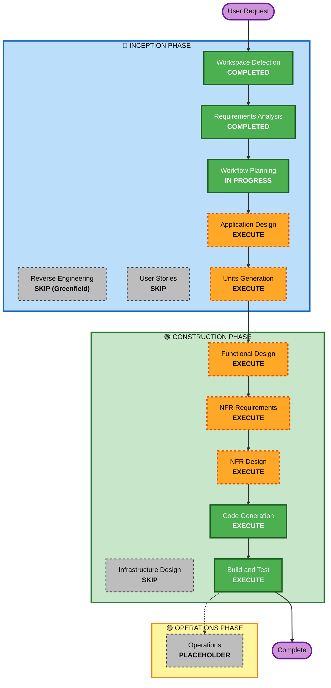

# Execution Plan — Mafia Game

**작성일**: 2026-04-25
**참조 요구사항**: `aidlc-docs/inception/requirements/requirements.md` v1.1

---

## 1. Detailed Analysis Summary

### 1.1 Project Type
- **Greenfield** 프로젝트 (기존 코드 없음)
- Reverse Engineering 적용 대상 아님 → 분석 기반은 `requirements.md` 단독

### 1.2 Change Impact Assessment

| 영역 | 영향 여부 | 설명 |
|---|---|---|
| **User-facing changes** | Yes | 신규 웹앱 (공용 화면 + 개인 화면 + 음성 안내) 전체 신설 |
| **Structural changes** | Yes | 시스템 아키텍처 신규 설계 (Go 단일 바이너리, 정적 자산 동봉) |
| **Data model changes** | Yes | 게임 상태/플레이어/역할/투표/결과 등 데이터 모델 신설 |
| **API changes** | Yes | WebSocket 메시지 프로토콜 + REST 엔드포인트 신규 정의 |
| **NFR impact** | Yes | 안정성/신뢰성 최우선 — 상태 영속화·재연결·폴백(TTS) 설계 필요 |

### 1.3 Risk Assessment

| 항목 | 평가 |
|---|---|
| **Risk Level** | **Low–Medium** |
| **Rollback Complexity** | Easy (사내 LAN 도구, 외부 의존성 없음, 단일 바이너리 재빌드/재배포 단순) |
| **Testing Complexity** | Moderate (멀티클라이언트 동시성·상태 머신·재연결 시나리오) |

**근거**:
- 사내망 한정 + Security Baseline 비활성화 → 보안 위험 낮음
- 일회성 게임 도구 → 장애 시 재시작으로 회복 용이
- 다만 **상태 머신·동시성·TTS 동기화** 영역은 결함 시 게임 흐름이 끊겨 사용자 경험 손상 → 안정성 NFR 보강 필요

---

## 2. Workflow Visualization

### 2.1 Mermaid Diagram



### 2.2 Text Alternative

```
🔵 INCEPTION PHASE
- Workspace Detection ........................... COMPLETED
- Reverse Engineering ........................... SKIP (Greenfield)
- Requirements Analysis ......................... COMPLETED (v1.1)
- User Stories .................................. SKIP
- Workflow Planning ............................. IN PROGRESS
- Application Design ............................ EXECUTE
- Units Generation .............................. EXECUTE

🟢 CONSTRUCTION PHASE  (per-unit loop, then Build & Test)
- Functional Design ............................. EXECUTE (per unit)
- NFR Requirements .............................. EXECUTE (per unit)
- NFR Design .................................... EXECUTE (per unit)
- Infrastructure Design ......................... SKIP (단일 바이너리, 인프라 없음)
- Code Generation ............................... EXECUTE (per unit, ALWAYS)
- Build and Test ................................ EXECUTE (ALWAYS)

🟡 OPERATIONS PHASE
- Operations .................................... PLACEHOLDER
```

---

## 3. Phases to Execute / Skip

### 🔵 INCEPTION PHASE

| 단계 | 결정 | 근거 |
|---|---|---|
| Workspace Detection | ✅ COMPLETED | 워크플로우 진입 시 자동 수행 |
| Reverse Engineering | ⛔ SKIP | Greenfield (기존 코드 없음) |
| Requirements Analysis | ✅ COMPLETED | requirements.md v1.1 사용자 승인 완료 |
| User Stories | ⛔ SKIP | 페르소나가 호스트/플레이어 단순 구조이고 인수 기준이 FR/NFR에 충분히 표현됨. 작은 사내 도구 규모상 추가 단계 가치 낮음. (사용자 별도 요청 시 포함 가능) |
| Workflow Planning | 🟢 IN PROGRESS | 본 문서 |
| **Application Design** | ✅ **EXECUTE** | 신규 컴포넌트(게임 엔진, 세션 매니저, WebSocket 허브, TTS 트리거, 영속화 어댑터, 공용/개인 뷰 등) 식별과 메서드 윤곽 정의 필요 |
| **Units Generation** | ✅ **EXECUTE** | 게임 진행 코어 / 영속화 / 웹 전송 계층 / 프론트엔드 등 다중 단위 분리가 자연스러움. 병렬 진행 가능성 + 책임 분리 위해 필요 |

### 🟢 CONSTRUCTION PHASE (per-unit loop)

| 단계 | 결정 | 근거 |
|---|---|---|
| **Functional Design** | ✅ **EXECUTE** | 게임 상태 머신(Day/Night/자기소개/투표/종료), 역할 행동 규칙, 동률 처리 등 비즈니스 로직 명시 필요 |
| **NFR Requirements** | ✅ **EXECUTE** | 안정성/신뢰성 최우선. 상태 복원 SLA, 재연결 RTO, 동시성 한도, TTS 폴백 등 정량/정성 NFR 명세 필요 |
| **NFR Design** | ✅ **EXECUTE** | 영속화 패턴(이벤트 소싱 vs 스냅샷), 단일 GM 락, WebSocket 재연결 백오프, 큐잉/인터럽션 등 패턴 적용 |
| **Infrastructure Design** | ⛔ SKIP | 단일 Go 바이너리로 호스트 PC에서 실행. VPC/로드밸런서/오토스케일 등 인프라 없음. 배포는 바이너리 복사 수준 |
| **Code Generation** | ✅ **EXECUTE** (per unit) | 항상 실행 |
| **Build and Test** | ✅ **EXECUTE** | 항상 실행 — 멀티클라이언트 동시성/재연결/상태 복원 통합 테스트 필요 |

### 🟡 OPERATIONS PHASE

| 단계 | 결정 | 근거 |
|---|---|---|
| Operations | 🟡 PLACEHOLDER | 향후 확장용 자리 표시자 (현재 워크플로우에서는 다루지 않음) |

---

## 4. 잠정 Units 분할 (Units Generation 단계에서 확정)

> 상세는 Units Generation 단계에서 확정. 아래는 **계획 단계의 후보안**으로 검토 편의를 위해 미리 제시:

| Unit | 책임 | 핵심 산출물 (예상) |
|---|---|---|
| **U1: Game Core** | 상태 머신, 역할/투표 규칙, 종료 판정, 키워드 부여 | `internal/game/*` 도메인 패키지 |
| **U2: Session & Persistence** | 게임방 단일 세션 관리, 디스크 영속화, 상태 복원 | `internal/session/*`, 임베디드 DB 어댑터 |
| **U3: Realtime Transport (WebSocket Hub)** | WebSocket 연결 관리, 메시지 라우팅, 재연결, 단일 GM 락 | `internal/transport/ws/*` |
| **U4: Public View (TTS + 자막)** | 공용 화면 렌더링, Web Speech API 연동, 큐잉/인터럽션, 토글 | `web/public/*` (정적 + 클라이언트 JS) |
| **U5: Player View** | 자기 역할/키워드/행동 입력 UI (반응형) | `web/player/*` |
| **U6: HTTP Bootstrap & Static Assets** | Go HTTP 서버, 라우팅, 정적 자산 동봉, 호스트 IP 노출 | `cmd/mafia-game/main.go` 등 |

> 위 분할은 잠정안이며 실제 분할은 Units Generation에서 의존성 분석 후 확정.

---

## 5. Estimated Timeline (개략)

| 단계 | 예상 |
|---|---|
| Application Design | 짧음 |
| Units Generation | 짧음 |
| Per-unit Functional + NFR Design (×Units) | 중간 |
| Code Generation (×Units) | 핵심 작업 — 가장 큼 |
| Build and Test | 중간 |

> 본 프로젝트는 사내 도구 PoC 성격이라 **시간 추정보다는 품질 게이트** (안정성 NFR 충족, 멀티클라이언트 통합 테스트 통과) 가 더 중요한 기준.

---

## 6. Success Criteria

### 6.1 Primary Goal
> 6–12명이 한 공간에 모여 사람 진행자 없이 안정적으로 마피아 게임 한 판을 끝까지 진행할 수 있는 웹앱을 만든다.

### 6.2 Key Deliverables
- Go 단일 바이너리 (정적 자산 동봉)
- 공용 화면 페이지 (TTS + 자막 + 단계 표시)
- 개인 화면 페이지 (역할/키워드/밤 행동/투표)
- 게임 결과 영속 저장 (로컬 임베디드 DB 또는 파일)
- 빌드/테스트 지침서 (`aidlc-docs/construction/build-and-test/*`)

### 6.3 Quality Gates
- ✅ 6명·8명·12명 인원 시나리오에서 게임이 끝까지 완주
- ✅ 임의 클라이언트 재연결 시 본인 화면 자동 복원
- ✅ 호스트 PC 재시작 후 진행 중 게임 상태 복원
- ✅ 한국어 TTS 음성 부재 환경에서 자막만으로 정상 진행
- ✅ 동률 투표·동시 사망 등 엣지 케이스 처리 검증

---

## 7. Package Change Sequence

해당 사항 없음 (Greenfield, 신규 단일 모듈에서 시작).

---

## 8. 사용자 의사결정 포인트 요약

본 계획에서 사용자 검토가 필요한 의도적 결정:

| 결정 | 본 계획의 선택 | 변경 가능성 |
|---|---|---|
| User Stories 포함 여부 | **SKIP** | 페르소나/인수 기준을 명시화하고 싶다면 INCLUDE로 전환 가능 |
| Application Design 포함 여부 | **EXECUTE** | 컴포넌트 정의 없이 바로 코드로 가고 싶다면 SKIP 가능 (비권장) |
| Units Generation 포함 여부 | **EXECUTE** | 작은 단일 모듈로 한 번에 가고 싶다면 SKIP 가능 |
| Functional Design 포함 여부 | **EXECUTE** | 상태 머신을 코드 단계에서만 다루고 싶다면 SKIP 가능 (비권장 — 안정성 가치와 충돌) |
| NFR Requirements + Design | **EXECUTE** | 안정성 최우선이라 권장 |
| Infrastructure Design | **SKIP** | 인프라가 없으므로 그대로 SKIP 권장 |
