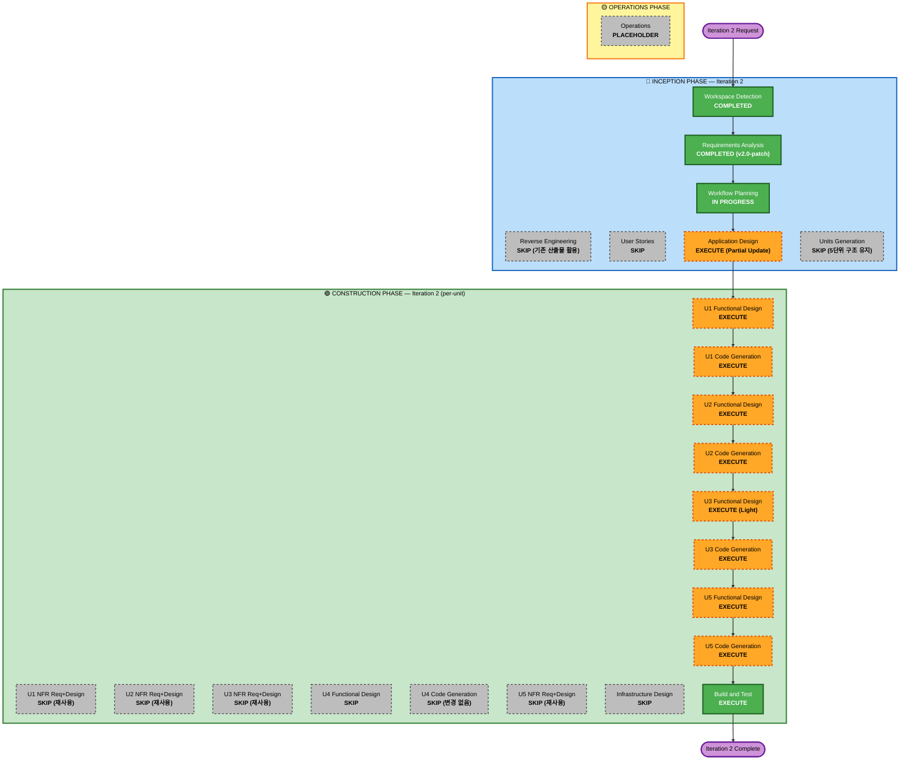

# Iteration 2 Execution Plan

**문서 버전**: 1.0
**작성일**: 2026-04-29
**기준 문서**: `requirements-iteration2-patch.md` v2.0-patch (사용자 승인 완료)
**프로젝트 유형**: Brownfield 변경 (Iteration 2)
**기존 워크플로우 산출물**: 풀세트 보유 (Application Design v1, Units U1~U5, U1~U5별 Functional/NFR 설계, Code, Build/Test 산출물)

---

## 1. Detailed Analysis Summary

### 1.1 Transformation Scope

| 항목 | 내용 |
|---|---|
| **Transformation Type** | Single project, multi-component change (단일 모놀리스 내 다수 패키지 변경) |
| **Primary Changes** | 호스트 권한 분리, 단일 방 라이프사이클 게이팅, 게임 설정 입력, 자기소개 자동 진행 + 본인 종료 |
| **Architectural Transformation** | 없음 — 기존 5단위(U1~U5) 구조 유지, 단위 간 의존성 변동 없음 |
| **Infrastructure Changes** | 없음 — 단일 바이너리, 인프라 비대상 |
| **Deployment Model Changes** | 없음 |

### 1.2 Change Impact Assessment

| 영역 | 영향 | 설명 |
|---|---|---|
| **User-facing changes** | Yes (대) | `/public` 신규 UI(방 개설/게임 설정/사회자 톤), `/play` "방 없음" 안내, 자기소개 본인 종료 버튼, 호스트 클릭 버튼 정리 |
| **Structural changes** | Yes (소) | Host=GM 분리 도메인 모델, 방 라이프사이클(idle → opened → playing → terminated) state machine, 자기소개 자동 라운드 로빈 엔진 |
| **Data model changes** | Yes (소) | `GameSettings{maxPlayers, mafiaCount}` 추가, 결과 저장에 `forced_terminated` 상태 |
| **API / Wire changes** | Yes (중) | 신규 wire 메시지 — `host:create-room`, `host:start-game`, `host:terminate`, `player:end-self-intro`, `room:not-yet`, `room:host-occupied`. 기존 `host:next-speaker` 등은 서버 자동 트리거로 대체되어 wire에서 제거 |
| **NFR impact** | Yes (소) | 단일 방 락 강화, 호스트 권한 발급 동시성, 사회자 톤 i18n |

### 1.3 Component Relationship Mapping

```text
[U1 Game Core (도메인)]
    ↑ 의존: 없음 (순수 도메인)
    │ 변경: GameSettings 모델, RoomLifecycle 상태머신, IntroAutoProgress 정책
    ↓ 영향: U2 (lifecycle dispatch), U3 (wire payload), U5 (UI state)

[U2 Session, Persistence & Announce]
    ↑ 의존: U1
    │ 변경: 호스트 권한 발급/회수, 단일 방 락, host:create-room/start/terminate 액션, player:end-self-intro 액션
    ↓ 영향: U3 (wire), U5 (state events)

[U3 Realtime Transport]
    ↑ 의존: U1, U2
    │ 변경: 신규 wire 메시지 6종, 기존 host:next-speaker 제거
    ↓ 영향: U5 (수신/발신)

[U4 HTTP Bootstrap & Static]
    ↑ 의존: U2, U3, U5(static)
    │ 변경: 거의 없음 — `/public` `/play` 라우트 동일, 정적 자산 갱신은 U5 빌드 산출
    ↓ 영향: 없음

[U5 Web Frontend]
    ↑ 의존: U3 wire 스펙
    │ 변경: 호스트 방 개설/설정 UI, /play 방 없음 화면, 자기소개 본인 종료, 사회자 톤 카피, 기존 다음 발언자 버튼 제거
    ↓ 영향: 사용자
```

| 컴포넌트 | 변경 종류 | 변경 사유 | 우선도 |
|---|---|---|---|
| U1 Game Core | Major (도메인 모델/규칙 추가) | FR-9/10/11/12 도메인 정의 출처 | Critical |
| U2 Session/Persistence | Major (권한·락·라이프사이클 추가) | FR-9/10 GM 권한·단일 방 시행, FR-12 자기소개 dispatch | Critical |
| U3 Realtime Transport | Minor (wire 메시지 추가/제거) | U1·U2 변경의 wire 노출 | Important |
| U4 HTTP Bootstrap | Configuration-only (사실상 변경 없음) | 라우팅 그대로 | Optional |
| U5 Web Frontend | Major (UI/카피/이벤트 처리 갱신) | 호스트 GM 화면 + /play 화면 + 사회자 톤 | Critical |

### 1.4 Risk Assessment

| 항목 | 평가 | 근거 |
|---|---|---|
| **Risk Level** | **Medium** | 동시성 위험(호스트 권한 발급, 단일 방 락) + 자동 자기소개 진행 엣지 케이스. 단, 도메인 변경은 격리되어 있고 범위 명확 |
| **Rollback Complexity** | Easy | 코드 베이스 단일 저장소, git revert 가능. 스토리지 스키마 변경은 신규 필드 추가만이라 backward-compatible |
| **Testing Complexity** | Moderate | 신규 wire 메시지 6종 + 호스트 권한 동시성 + 자기소개 라운드 로빈 진행 시나리오. Chrome DevTools MCP 다중 컨텍스트 테스트 필요 |
| **Backward Compatibility** | 부분 — wire 메시지 변경 (구 클라이언트와 신 서버 호환 안 함, 동시 갱신 필요) | U3·U5 동시 배포 필요 |
| **Operational Risk** | Low | 사내 LAN PoC, 다운타임 무관 |

### 1.5 Affected Files / 코드 위치 사전 식별

```
internal/game/         (U1) 도메인 — settings.go, room_lifecycle.go, intro_progress.go (신규)
internal/session/      (U2) 권한 — host_authority.go, room_singleton.go, action.go 갱신
internal/transport/    (U3) wire — protocol.go (event/command 케이스 추가/삭제)
internal/persistence/  (U2) 결과 상태 추가 — store.go의 result enum
cmd/mafia-game/        (U4) 거의 변경 없음
web/src/               (U5) UI/이벤트 핸들링 — public/, play/, lobby/, intro/, reducer.ts
```

---

## 2. Workflow Visualization

본 반복은 기존 INCEPTION 산출물(Application Design v1, Units U1~U5)을 활용하므로, 이번 반복에서는 **Application Design 부분 갱신**과 **Units Generation 생략**을 적용합니다.



---

## 3. Phases to Execute (Iteration 2)

### 🔵 INCEPTION PHASE

- [x] **Workspace Detection** (COMPLETED — 본 반복 시작 시 수행)
- [x] **Reverse Engineering** (SKIP)
  - **Rationale**: 기존 `aidlc-docs/inception/` 및 `aidlc-docs/construction/` 산출물이 As-Is 권위 문서 (Intake CR1=A 결정)
- [x] **Requirements Analysis** (COMPLETED v2.0-patch, 사용자 승인 완료)
- [x] **User Stories** (SKIP)
  - **Rationale**: 본 반복은 기존 시스템의 호스트 역할 분리/UX 변경. 페르소나 변동 없음(호스트 1명 + 플레이어 6~12명 동일), 시나리오는 patch 4장에 명시. 추가 스토리 가치 낮음
- [x] **Workflow Planning** (본 문서, 진행 중 → 사용자 승인 게이트)
- [ ] **Application Design** — **EXECUTE (Partial Update)**
  - **Rationale**: 신규 도메인 모델(GameSettings, RoomLifecycle), 신규 컴포넌트(HostAuthority, IntroProgressEngine), 변경된 컴포넌트 메서드(SessionManager 액션, Reducer 케이스)를 갱신해야 함. 기존 `aidlc-docs/inception/application-design/` 위에 **iteration2 patch 형식**으로 변경분만 추가
- [ ] **Units Generation** — **SKIP**
  - **Rationale**: 5단위(U1~U5) 구조와 단위 간 의존성 변동 없음. 단위 재정의 불필요

### 🟢 CONSTRUCTION PHASE (per-unit, 진행 순서: U1 → U2 → U3 → U5, U4 생략)

#### U1 Game Core
- [ ] **Functional Design** — **EXECUTE**
  - **Rationale**: GameSettings 모델, RoomLifecycle 상태머신, 자기소개 자동 진행 엔진 등 신규 도메인 로직. 본 반복 핵심
- [ ] **NFR Requirements** — **SKIP** | **NFR Design** — **SKIP**
  - **Rationale**: U1 NFR(메모리 안전·결정성·테스트성)은 v1.1과 동일. 신규 NFR 없음
- [ ] **Infrastructure Design** — SKIP
- [ ] **Code Generation** — **EXECUTE**

#### U2 Session, Persistence & Announce
- [ ] **Functional Design** — **EXECUTE**
  - **Rationale**: 호스트 권한 발급/회수, 단일 방 락, 신규 액션(create-room/start/terminate/end-self-intro), 자기소개 자동 dispatch 정책. 본 반복 핵심
- [ ] **NFR Requirements** — **SKIP** | **NFR Design** — **SKIP**
  - **Rationale**: 동시성 (단일 mutex 락 모델) 그대로 적용 가능. 영속성 스키마는 backward-compatible 추가만이라 NFR 변동 없음
- [ ] **Infrastructure Design** — SKIP
- [ ] **Code Generation** — **EXECUTE**

#### U3 Realtime Transport
- [ ] **Functional Design** — **EXECUTE (Light)**
  - **Rationale**: wire 메시지 추가/제거 매핑만. 트랜스포트 구조(WebSocket hub, idle disconnect 등) 변동 없음. 짧은 변경 명세
- [ ] **NFR Requirements** — **SKIP** | **NFR Design** — **SKIP**
  - **Rationale**: 지연·단절·재접속 NFR 동일
- [ ] **Infrastructure Design** — SKIP
- [ ] **Code Generation** — **EXECUTE**

#### U4 HTTP Bootstrap & Static
- [ ] **모든 단계 SKIP**
  - **Rationale**: 라우팅 (`/public`, `/play`) 그대로. 정적 자산 빌드 결과는 U5 코드 생성으로 자동 갱신 (서빙 로직 변동 없음). 단, 빌드 산출물 사이즈 변동 시 NFR 점검은 Build and Test에서 수행

#### U5 Web Frontend
- [ ] **Functional Design** — **EXECUTE**
  - **Rationale**: `/public` 신규 화면 (방 개설 폼, 게임 설정, 강제 종료), `/play` "방 없음" 화면, 자기소개 본인 종료 버튼, 사회자 톤 카피 일괄 변경. 본 반복 사용자 가시 변경 대부분이 여기 집중
- [ ] **NFR Requirements** — **SKIP** | **NFR Design** — **SKIP**
  - **Rationale**: gzip 사이즈/Lighthouse·접근성 NFR 그대로. 새 UI 추가가 한도(< 70KB gzip 등) 안에 들어오는지 Build and Test에서 검증
- [ ] **Code Generation** — **EXECUTE**

#### 공통
- [ ] **Build and Test** — **EXECUTE**
  - **Rationale**: 회귀 테스트 필수. 신규 통합 테스트(호스트 권한 동시성, 자기소개 자동 진행, /play 게이트, 단일 방 차단) 추가. Chrome DevTools MCP 다중 컨텍스트 골든패스 재검증

### 🟡 OPERATIONS PHASE
- [ ] **Operations** — PLACEHOLDER

---

## 4. Iteration 2 Per-Unit Change Sequence

각 단위는 의존성 순서로 진행하며, 단위 내부는 Functional Design → Code Generation → 단위별 검증(`go test ./internal/<pkg>/...` 또는 `npm test`).

```text
1. U1 Game Core           [Critical Path 시작]
     도메인 모델/상태머신/자기소개 엔진 정의 → 단위 테스트 + 90%+ 커버리지 유지
       ↓
2. U2 Session/Persist     [Critical Path]
     호스트 권한·단일 방 락·신규 액션 dispatch → 단위 테스트 + 회귀 테스트
       ↓
3. U3 Realtime Transport  [Critical Path]
     신규 wire 케이스 매핑·기존 케이스 정리 → wire 직렬화 테스트
       ↓
4. U5 Web Frontend        [Critical Path 종료, 사용자 가시 변경 적용]
     /public, /play 화면 갱신 + 사회자 톤 카피 + reducer 신규 케이스 → vitest + Lighthouse 점검
       ↓
5. Build and Test         [최종 게이트]
     `go test ./...` 전체 + `npm test` + `go build` + Chrome DevTools MCP 다중 컨텍스트
     골든패스 + 변경 시나리오(방 미개설 게이트, 두 번째 호스트 차단, 호스트 별도 기기 /play, 자기소개 자동 진행)
```

**Coordination Points**:
- U1 → U2: Domain 인터페이스 안정화 후 U2 진입 (U1 단위 테스트 PASS 시점)
- U2 → U3: Wire 메시지 스키마 확정 후 U3 진입 (U2의 신규 액션/이벤트 정의 기반)
- U3 → U5: Wire 페이로드 명세 확정 후 U5 reducer 작업 (U3 단위 테스트 PASS 시점)

**Parallelization 가능 구간**: U5의 카피/사회자 톤 작업은 U3 wire 안정 전에도 병행 가능 (정적 텍스트 변경). 단 reducer 변경은 U3 후로 순차.

---

## 5. Estimated Timeline

| 단계 | 산출물 | 추정 시간 |
|---|---|---|
| Application Design (Partial) | `application-design-iteration2-patch.md` | 30~45분 |
| U1 Functional Design + Code | functional-design.md (patch), 코드 + 테스트 | 60~90분 |
| U2 Functional Design + Code | functional-design.md (patch), 코드 + 테스트 | 60~90분 |
| U3 Functional Design + Code | functional-design.md (light), 코드 + 테스트 | 30~45분 |
| U5 Functional Design + Code | functional-design.md (patch), 코드 + 테스트 + 빌드 | 90~120분 |
| Build and Test | 통합 회귀 + Chrome DevTools MCP 검증 | 30~60분 |
| **합계 (대화 시간 기준)** | | **약 5~7시간 (사용자 승인 게이트 제외)** |

> 본 추정은 LLM 협업 시간 기준의 거친 가이드입니다. 실제 사람 검토/승인 시간은 별도.

---

## 6. Success Criteria

### 6.1 Primary Goal
호스트는 GM 역할에만 집중하고(클릭은 ㉠방 개설 / ㉡게임 시작 / ㉧강제 종료 셋뿐), 게임은 자기소개·밤·낮·투표·결과 모두 시스템 자동 전환으로 진행되며, 호스트가 게임 설정(인원·마피아 수)을 입력해 방을 1개만 운영할 수 있다.

### 6.2 Key Deliverables
- `aidlc-docs/inception/application-design/iteration2-patch.md` (Application Design 변경분)
- `aidlc-docs/construction/{U1|U2|U3|U5}/functional-design/iteration2-patch.md` (단위별 변경 명세)
- `aidlc-docs/construction/{U1|U2|U3|U5}/code/iteration2-summary.md` (단위별 코드 변경 요약)
- 코드 변경: `internal/game/`, `internal/session/`, `internal/transport/`, `internal/persistence/`, `web/src/` 영향 파일들
- `aidlc-docs/construction/build-and-test/iteration2-test-results.md` (회귀 + 신규 시나리오 결과)

### 6.3 Quality Gates
| Gate | 기준 |
|---|---|
| U1~U3 단위 테스트 | `go test ./internal/<pkg>/... -cover` PASS, 단위별 커버리지 v1 대비 동등 이상 |
| U5 단위 테스트 | `npm test` PASS, 핵심 모듈(reducer.ts) 커버리지 80%+ 유지 |
| 통합 회귀 | `go test ./...` 전체 PASS, `go build -o /tmp/mafia-game ./cmd/mafia-game` 성공 |
| Chrome DevTools MCP 시나리오 | 호스트 1명 + 플레이어 6명 골든패스 + 신규 4개 시나리오 (방 미개설 게이트 / 두 번째 호스트 차단 / 호스트 별도 기기 /play / 자기소개 자동 진행) 모두 PASS |
| 사회자 톤 일관성 | `/public` 신규 UI 카피가 patch CHG-10 정의 톤(예: "방을 개설합니다", "참가자를 받습니다") 으로 일관 |
| 백업 빌드 산출물 사이즈 | gzip 합계 < 70KB 유지 (현재 60.23KB 기준 + 신규 UI 약 5KB 이내 증가 예상) |

### 6.4 Integration Testing (Brownfield)
- 기존 골든패스(host=호스트도 플레이어로 참가)는 호환성 테스트에서 의도적으로 deprecated 처리. wire 메시지 수정 후 v1 클라이언트는 동작 안 함을 명시 (사내 도구라 동시 갱신).

---

## 7. v1 Inception 산출물 vs Iteration 2 처리 방식

| v1 산출물 | Iteration 2 처리 |
|---|---|
| `requirements.md` v1.1 | **유지** + `requirements-iteration2-patch.md` 가 위에 얹음 (충돌 시 patch 우선) |
| `application-design/` v1 | **유지** + `iteration2-patch.md` 추가 (변경 컴포넌트만) |
| `unit-of-work.md` 등 v1 | **유지 (변동 없음)** |
| 단위별 `functional-design.md` v1 | **유지** + `iteration2-patch.md` 추가 (변경분만) |
| 단위별 `nfr-requirements.md` / `nfr-design.md` v1 | **유지 (재사용)** |
| 단위별 `infrastructure-design.md` | 해당 없음 (애초 SKIP) |
| 단위별 코드 산출 요약 | **유지** + `iteration2-summary.md` 추가 |
| 통합 `build-and-test/` 산출물 | **유지 (참고)** + `iteration2-test-results.md` 추가 |

**원칙**: 본 반복은 v1 산출물을 통째로 다시 쓰지 않고 patch/iteration2 파일을 누적. v1 본문은 역사 기록으로 보존.

---

## 8. 호환성 / 마이그레이션 노트

| 항목 | 영향 | 처리 |
|---|---|---|
| **Wire 프로토콜 변경** (host:next-speaker 제거 등) | 클라이언트-서버 동시 갱신 필수 | U3 + U5 같은 빌드 산출물로 함께 배포 |
| **저장된 게임 결과 (이전 v1.1 schema)** | `forced_terminated` 신규 enum 값 추가 | 신규 enum 케이스만 추가, 기존 데이터 마이그레이션 불필요 (이미 정상 종료된 게임은 변경 없음) |
| **이전 워크플로우 Build and Test 산출물 5종** | 본 반복에서는 참조만 (Intake Q3=C 결정) | Iteration 2 결과로 무효화되는 항목은 본 반복 종료 시 별도 갱신 여부를 사용자에게 확인 |

---

## 9. 결정 / 미결정 사항 정리

### 9.1 본 반복에서 확정된 결정 (Requirements v2.0-patch에서 인용)
- 호스트=GM 분리, 별도 기기 /play 참여 가능
- 단일 방 하드 락 + 두 번째 호스트 차단
- 게임 설정 (최대 인원 6~12, 마피아 수 권장값 ±1 + 임의값 + 경고)
- 자기소개 본인 종료 + 자동 라운드 로빈
- 호스트 클릭 3개 (방 개설 / 게임 시작 / 강제 종료)
- 첫 /public 접속자 호스트, 사회자 톤
- Security Baseline 비활성화 유지

### 9.2 본 반복 Out of Scope (다음 반복 후보)
- 방 개설 후 게임 설정 재변경
- 두 번째 /public read-only 관전자 모드
- 호스트 단일 PC GM+플레이어 동시
- 자기소개 정체 자동 회복
- 호스트 권한 이양
- 강제 종료 시 키워드/역할 공개 디테일
- 호스트 인증 강화

이 항목들은 본 반복 코드/문서에는 반영하지 않으며, 발견 즉시 별도 plan으로 옮깁니다.

---

## 10. Approval

본 plan 승인 시 다음 단계는 **Application Design (Partial Update)** 입니다. 사용자 승인을 거친 후에 진행합니다.
